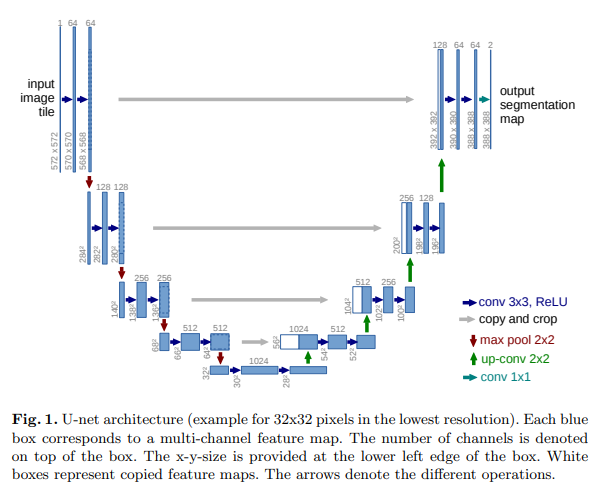
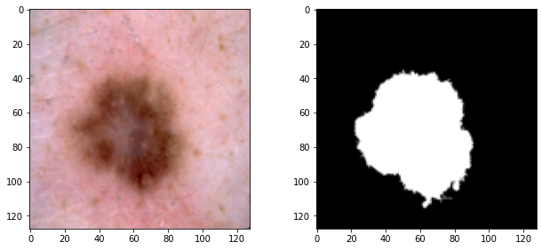
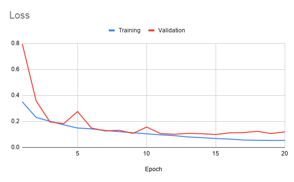
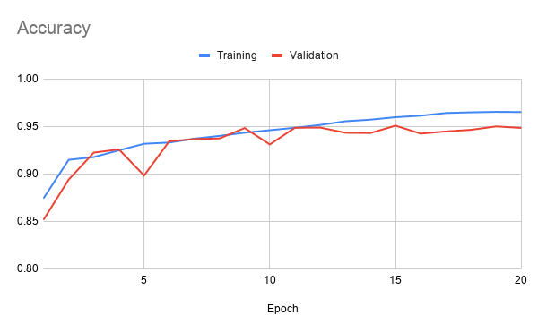

# Skin Cancer Image Segmentation using UNet in Keras
Jaydon Hansen, 2020

This directory contains a U-Net model for image segmentation of melanoma images. The dataset used was a list of pre-processed skin cancer images from the ISIC 2018 Challenge (https://challenge2018.isic-archive.com). The goal of this model is to efficiently detect lesions in skin images to enhance the rate of melanoma detection.

## Dependencies
***
* TensorFlow 2.3.0
* Numpy 1.18.5
* Matplotlib 3.3.2
* Pillow 8.0.1 (PIL fork)


## Model
***
### Inputs
The input data to train the model should be images of skin lesions with their corresponding annotated segmentations (grayscale images showing the distinction between lesion and skin).

### Structure
The basic structure of U-Net is outlined in [this paper](https://arxiv.org/pdf/1505.04597.pdf) by O Ronneberger as in the below image:



 The model is made up of the following layers:

 * 4x Contracting (downsampling) blocks consisting of:
   * 2x 3x3 convolutions, using ReLU activation and batch normalization
   * 1x 2x2 max pooling with stride 2
 * 1x Bottleneck block consisting of:
   * 2x 3x3 convolutions, using ReLU activation and batch normalization
 * 4x Expansive (upsampling) blocks consisting of:
   * 1x 2x2 upsampling layer
   * 2x 2x2 convolutions (Ronneberger describes them as "up-convolutions"), using ReLU activation and batch normalization
* 1x 1x1 Convolutional Output layer, to map the features to the desired classes 

## Training the Model

Input images need to be put in a `data` folder with this directory, within the following subdirectories:
  * `images` - Contains the raw images
  * `masks` - Contains the corresponding segmentations of the raw images.
  
**IMPORTANT: You must remove all other files from the input directories which are not training images.**

The filenames of the input images should correspond to their IDs and end in `.jpg`, and the filenames of the masks should be the same except with the addition of `_segmentation.png`. For example, for input image `IMG0001.jpg` the corresponding mask would be `IMG0001_segmentation.png`.

The dataset will be split by the training script into training, test and validation sets at a ratio of 80-10-10, and resized to 128x128 for segmentation. A ratio of 80-10-10 was chosen because the original dataset contains more than 2,500 images, for which 80% of the data is more than enough to reach a good training accuracy. 

You can execute the training script with the following command:

```
python train.py
```

The resulting model will be saved as `ISIC-UNet.h5`.

Note: For best results, copy the contents of `train.py` to a Juptyer notebook to visualise output images.

The model will output various information, including the model layers and results of each training epoch.


## Results
***
This model was trained using a batch size of 32 over 20 epochs. After training, the Dice similarity score was 0.8821 on the validation set. The total training time was 51 minutes using an Nvidia P100 GPU running on [Google Colab](https://colab.research.google.com).

Example output of the model can be seen below, with the input image on the left and its segmentation mask on the right.



### Accuracy and Metrics

A plot of the Loss, Accuracy and Dice Coefficient of the model over time can be seen below.




