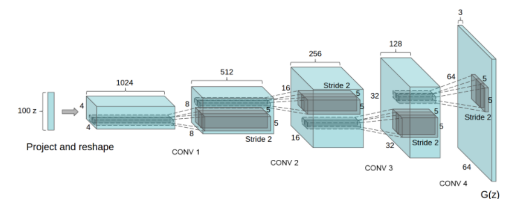
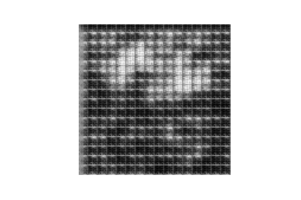
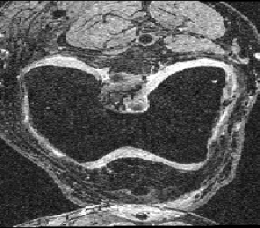

# DCGAN for knee image design

## Problem description
A DCGAN is presented with approximately 15.000 medical knee scans and is tasked to produce additional generated images on the basis of the learning material. The network attempts to learn the pattern in the training images with a **generator** network while in the same time improving the performance of a **discriminator** network which attempts to distinguish between *fake* and *real* images.

## Algorithm approach
The implemented algorithm to solve the problem follows the following steps:
1. Image reading
2. Image preprocessing
3. GAN network design
    1. Generator
    2. Discriminator
4.  Training loop

Lastly a image comparison is performed to check the quality of the algorithm.

## Image reading
Images are read from the provided *AKOA* data set folder.
## Image preprocessing
The training images are scaled towards 126x126 pixels to allow for easier network design. Additionally the pixel value are normalized to the range between -1 to 1 for better training performance and to match the *tanh* activation function in the generator.
## GAN network design
The sequential network is separeted into two networks:  Generator and Discriminator
In the generator the network produces new images resembling the training material while at the same time the discriminator attempts to determine if the image was produced by the generator.
### Generator
A typical network design for a generator approach is chosen whereby the design follows the image below.

The network is given a noise sample and applies several convolutional transpose layers to generate an image of the required size.
### Discriminator
The discriminator is implemented with 3 convolutional layers and a final neuron with the *sigmoid* activation function to match the output to 0 for fake and 1 for original image.

## Training loop
Two important steps train the network
1. In the first training step the generator firstly generates fake images. which are concatenated with real images in a 1:1 ratio. The discriminator is presented with that batch and learns to classify the small training set. As a result the performance of the discriminator improves. The generator is not trained.
2. In the second step the generator designs new images on a new noise sample. However, the discriminator is made believe that all images are original images via a given output set and the discriminator parameters are halted from learning. As a result the entire network pushes gradient from the discriminator to the generator in a case the discriminator marked a *fake* image. Subsequently the performance of the generator improves.

## Result
The training process is rather unstable with the network seemingly undoing its learned process sporadically. One can observe that it learns features of the knee images - however to a human eye the difference is obvious.

Generated            |  Target
:-------------------------:|:-------------------------:
 |  

Generation results for the celbrety images were quite acceptable, however for this task the network suffers from mode collapse yielding unrealistic images with diminished learning expectations.

