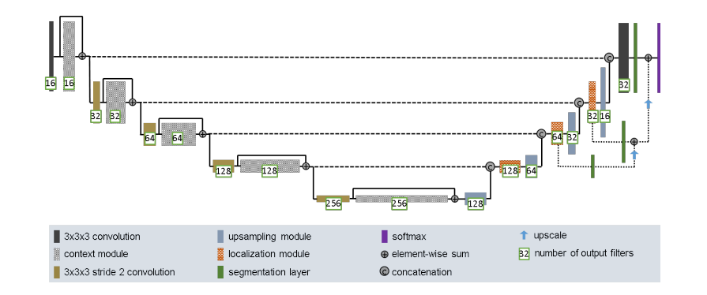
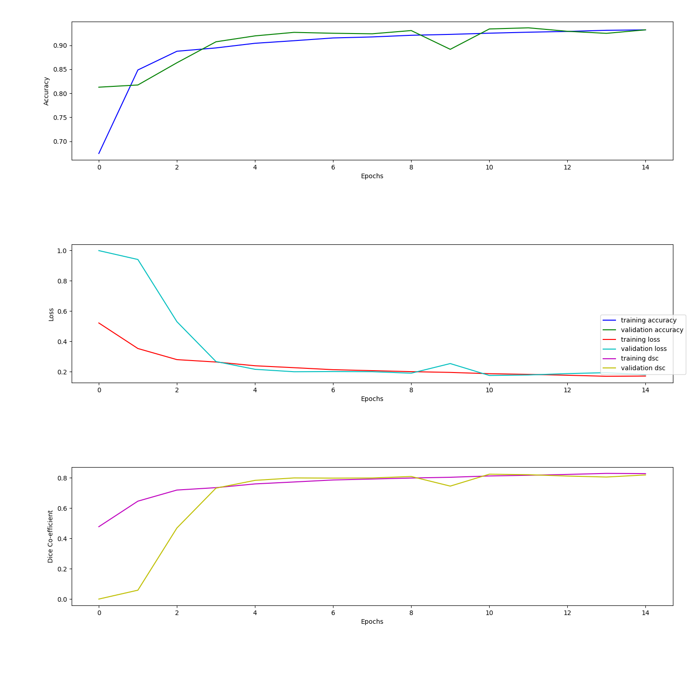
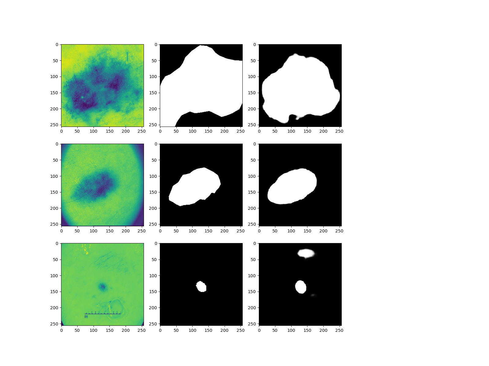

# Improved Unet on the 2018 ISIC dataset 
**Author:** Mark Coulon (45797954)

The ISIC dataset is a collection of images that contain Skin Lesions. This module was written to have better classification of those skin lesions. The model that was used to accomplish this task was an improved UNET, described [here](https://arxiv.org/abs/1802.10508v1). The loss of the model was the Dice-coefficient which is a measurement, described [here](https://en.wikipedia.org/wiki/S%C3%B8rensen%E2%80%93Dice_coefficient). This model had a dice score of above 80% as described in the task given.
The algorithm involves multiple layers of convolution and extra element-wise sums. These added residual connections make it the improved version of the Unet. This can be seen below:

## Dependencies
The model and all related files can be found in Mark_ISIC_UNET folder.
The following packages are required to use this. Only tensorflow is used in the model itself, the other packages are used for data preparation and displaying graphs and images.
- Tensorflow
- glob
- sklearn
- matplotlib

## File location
The ISIC image data must be saved in the same folder as the program. This folder must have 2 subdirectories (ISIC2018_Task1-2_Training_Input_x2, ISIC2018_Task1_Training_GroundTruth_x2). The image path can be changed in the driver file, and the subdirectories can be changed in the UnetData file.

## Usage
the driver file is the file that contains most of the logical flow and calls functions from the other 2 files, UnetData and ImprovedUnet. The UnetData handles the data preparation and the ImprovedUnet file is the model. To make the model, the driver file has to be run. Some important features that can be altered in the diver file is the batch size, the number of images used and the learning rate. All of these were altered until the dice co-efficient was above 80%.

The size of the images were also reshaped to be 256 by 256 pixels. 
The images were split, 60% into training, 20% into testing and 20% into validation, this split worked well and was also altered to get the maximum efficiency. 

## Example output
The screenshots below show the accuracy, loss and dice over the epochs. In the second screenshot it shows 3 examples of the model working. This was with a accuracy above 90% and a dice-coefficient score above 80%. The average dice score was: 0.7906469253699. This is just under 80% but if more epochs were done, then it would hava an average of 80%. It was only because of the low amount of epochs, however if more were done then the average would have been higher because the dice co-efficient would have continued to converged at above 80%. 

