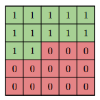

# OASIS Generative VQ-VAE
By Matthew Choy
> Creation of a generative model of the ADNI dataset using the VQVAE model ([paper](arxiv.org/abs/1711.00937))

# Files of Interest
What files to look at, and what purpose they serve.
- [modules.py](https://github.com/MattPChoy/PatternFlow/blob/topic-recognition/recognition/MattChoy-VQVAE/modules.py) Contains module definitions for the VQVAE (& Encoder, Decoder) as well as PixelCNN
- [train.py](https://github.com/MattPChoy/PatternFlow/blob/topic-recognition/recognition/MattChoy-VQVAE/train.py) Uses the modules defined in `modules.py` to train and save the VQVAE and PixelCNN models.
- [dataset.py](https://github.com/MattPChoy/PatternFlow/blob/topic-recognition/recognition/MattChoy-VQVAE/dataset.py) Loads and normalises dataset.
- [constants.py](https://github.com/MattPChoy/PatternFlow/blob/topic-recognition/recognition/MattChoy-VQVAE/constants.py) Defines constants and hyperparameters to ensure that this model can be adapted to other datasets more easily.
- [predict.py](https://github.com/MattPChoy/PatternFlow/blob/topic-recognition/recognition/MattChoy-VQVAE/predict.py) Loads the trained VQVAE and PixelCNN models located in `./vqvae` and `./pixel_cnn` respectively to generate OASIS-like brain scan images.
- [util.py](https://github.com/MattPChoy/PatternFlow/blob/topic-recognition/recognition/MattChoy-VQVAE/util.py) Defines helper methods for visualisation, data processing etc.

## Table of Contents
- [Algorithm Description](#description-of-algorithm)
- [How Does it Work?](#how-does-it-work)
- [Inputs, Outputs and Algorithm Performance](#inputs-outputs-and-algorithm-performance)
- [Implementation Details](#implementation-details)
  - [Dependencies](#dependencies)
- [Dataset](#dataset)
- [Data Pre-Processing](#data-pre-processing)
- [Training, Validation and Testing Splits](#training-validation-and-testing-splits)

# Description of Algorithm
## VQVAE
AutoEncoders are neural networks that transform inputs (in this case, images) into smaller dimensionality representations (such as the codes generated by this VQVAE) [[1]](#1). This VQVAE model contains an encoder, given by the equation $e(x)$ where $x$ is the input image. It transforms the image into a smaller, continuous representation in the latent space using a series of fully connected (dense), or convolutional layers [[4]](#4)

This continuous latent representation is then passed through the VectorQuantiser module, which transforms it into a discretised latent representation by "snapping" it to the most representative entry in the codebook <a href="#note1">[Note 1]</a>. Let $e_i$ represent the $i$th entry in the codebook, which is closest entry found.

<p align="center">
  
</p>
<p align="center">Figure 1: AutoEncoder, from <a href="https://towardsdatascience.com/understanding-variational-autoencoders-vaes-f70510919f73">TowardsDataScience</a></p>

This value can then be passed through the decoder module, represented by the equation $d(e)$ which takes a code as input, and outputs a reconstructed image. If the latent representation sufficiently describes key characteristics of the image, then the reconstructed image $\hat{x}$ should have high structural similiarity to the original image $x$. That is why the loss function that we're trying to optimise when training the VQVAE is the `reconstruction loss` and is given by the following equation. [[2]](#2)
$$\mathcal{L}(x, \hat{x})=|x-\hat{x}|$$

<a id="note1" name="note1">[Note 1]</a> Conceptually, we perform an $\text{argmin}$ operation in which we try to minimise the sum of differences between each entry in the latent representation, and the particular entry in the codebook.

## PixelCNN
Proposed by Oord et al in 2016, PixelCNN is model which generates images from an input vector. The contents of the input vector are sampled from a probability distribution of `prior elements`. PixelCNNs generate images pixel-by-pixel iteration by iteration. Referencing previous pixels, the PixelCNN module generates images from top-down, and left to right [[5](#5), [6](#6)].

When the model is trained, it learns the conditional distribution of each pixel, from left-to-right and top-down directions. It uses this conditional distribution to predict the next pixel. Repeating this process for each $(r, c)$ combination allows us to generate an image [[7]](#7)

<p align="center">
</img>
</p>
<p align="center">Figure 2: PixelCNN Mask Kernel, from <a href="https://proceedings.neurips.cc/paper/2016/file/b1301141feffabac455e1f90a7de2054-Paper.pdf">Oord et al, 2016</a></p>
This left-to-right generation is achieved through the use of a kernel which masks off pixels to the right, and below - this ensures that the data used for generation is strictly from the priors, and the pixels to the left, and above the pixel being generated. [6](#6).

## Inputs, Outputs and Algorithm Performance
### VQVAE
Through the training process, I have logged the reconstruction loss, given by the difference between the original image from the dataset, $x$ and the reconstructed image which has been passed through the encoder, decoder and vector quantiser modules $\hat{x}=d(e(x))$. At the end of training, the reconstruction loss of the model is minimal, at $0.05%$ on the validation set.
$$\mathcal{L}(x, \hat{x})=|x-\hat{x}|$$
<p align="center">
  
</p>

Images fed into the model are of dimensionality $(\text{batchsize}, 256, 256, 1)$ and are taken from the OASIS brain dataset. Some sample images include those shown below:
<p align="center">
  
</p>

The VQVAE's `Encoder` and `VectorQuantiser` module transform the input $x$ into a codebook sample $e_i$, as shown below.
<p align="center">
  
</p>

Following this, the codebook samples are fed through the decoder to reconstruct the image - Since the reproductions are structurally similar to the original images, this proves that the codes generated by the `Encoder` and `VectorQuantiser` modules are accurate representations of the input data, at smaller dimensionality.

Furthermore, we compute the structural similarity between the original image and the images reconstructed by the VQVAE model.

<p align="center">
  
</p>

### PixelCNN
We can then feed these latent representations through the trained PixelCNN module to generate novel images.

<p align="center">
  
</p>

## Implementation Details
### Dependencies
This project leverages a few non-standard libraries, including TensorFlow. Their versions are listed here:
```bash
tensorflow==2.9.1
tensorflow-probability==0.16.0
numpy==1.23.1
matplotlib==3.5.2
keras==2.9.0
Pillow==9.2.0
```

### Dataset
- The dataset used for this task was downloaded from BlackBoard and pre-processed into folders. It is available for easy download via my GitHub repository [https://github.com/MattPChoy/OASIS](https://github.com/MattPChoy/OASIS)
### Data Pre-Processing
- The data was unzipped from the above .zip file, and moved into the project's root folder (PatternFlow/recognition/MattChoy-VQVAE/data/OASIS)
- Upon loading the data, it is normalised via dividing by 255.0 such that each pixel value is in the range $[0, 1]$.

### Training, Validation and Testing Splits
- I have used the test/train/validation split from the original dataset provided, which contains the following counts:

|                   | Train       | Validate     | Test     |
| ----------------- | ----------- | ------------ | -------- |
| Number of Samples | 9,664 (86%) | 1,120  (10%) | 544 (4%) |

# References
<a name="1" id="1">[1]</a> J. Rocca, “Understanding variational autoencoders (VAES),” *Medium*, 12-Mar-2021. [Online]. Available: https://towardsdatascience.com/understanding-variational-autoencoders-vaes-f70510919f73. [Accessed: 21-Oct-2022].

<a name="2" id="2">[2]</a> A. BRITAL, “Autoencoders Explained,” *Medium*, 20-Nov-2021. [Online]. Available: https://medium.com/@AnasBrital98/autoencoders-explained-da131e60e02a. [Accessed: 15-Oct-2022].

<a name="3" id="3">[3]</a> W. Badr, “Auto-encoder: What is it? and what is it used for?,” *Medium*, 01-Jul-2019. [Online]. Available: https://towardsdatascience.com/auto-encoder-what-is-it-and-what-is-it-used-for-part-1-3e5c6f017726. [Accessed: 21-Oct-2022].

<a name="4" id="4">[4]</a> Variational Autoencoders. *[YouTube](https://www.youtube.com/watch?v=9zKuYvjFFS8)*, 2018.

<a name="5" id="5">[5]</a> "PixelCNN", *Keras.io*, 26-May-2020. [Online] Available: https://keras.io/examples/generative/pixelcnn/. [Accessed: 17-Oct-2020].

<a name="6" id="6">[6]</a> O. van den Aaron, K. Nal, V. Oriol, E. Lasse, G. Alex, and K. Koray, “Conditional Image Generation with PixelCNN Decoders,” Computer Vision and Pattern recognition, Jun. 2016. Available: https://arxiv.org/abs/1606.05328

<a name="7" id="7">[7]</a> J. Dafflon, “PIXELCNN's blind spot,” *Medium*, 10-Sep-2021. [Online]. Available: https://towardsdatascience.com/pixelcnns-blind-spot-84e19a3797b9. [Accessed: 21-Oct-2022].
