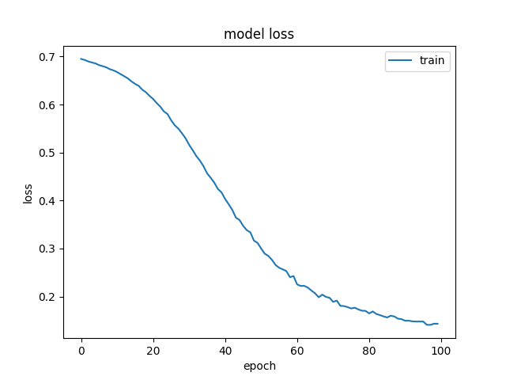
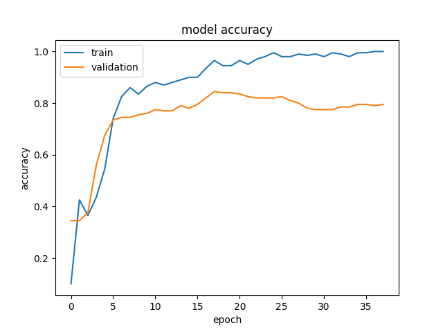
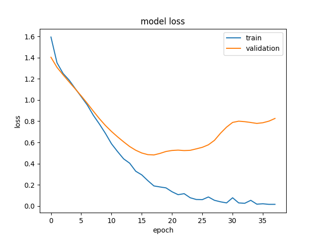
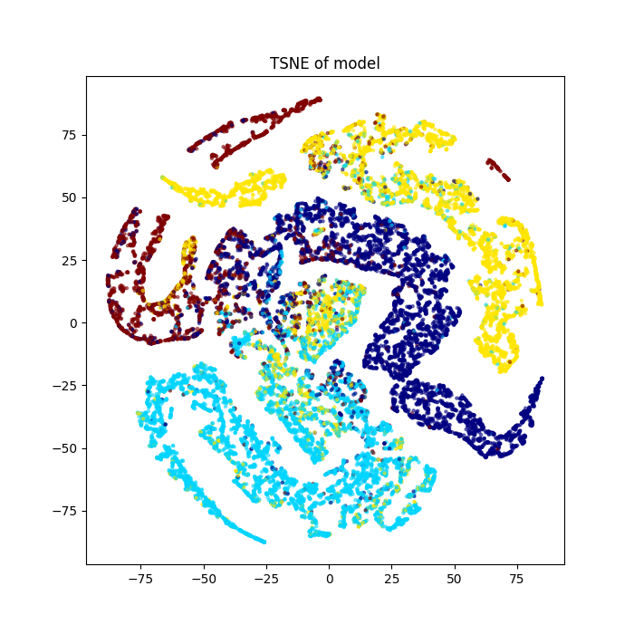

# README (SongYuan Wang, 45802791)
## Multi-layer GCN model
### Objective
The code provide a trained model 
that is tested with the [facebook 
dataset](https://snap.stanford.edu/data/facebook_large.zip) to predict and classify
classes in the dataset (government, 
politics, tv show,company) using
a multi-layered semisupervised
GCN method. 
### Solution
The dataset is converted
to nodes and edges using `networkx`
to be processed with `stellargraph`.
The model will first be trained 
against shuffled features to identify
and reduce loss.
#### Loss Graph

The model is then trained to classify
each of the 4 classes using the 
given features.
#### Final Accuracy Graph

#### Final Loss Graph

### Result
The resulting model is capable of 
predicting facebook classes with
an accuracy of 80%.The prediction
of the facebook classes and the
real answer can be found in a csv
file called `Prediction_vs_Real.csv`.
The final TSNE plot which classifies 
the features and classes is shown 
to be:
#### TSNE Plot

## Dependencies
* Python version 3.6 or 3.7 needed
for stellargraph functions
## References
[Node classification with Graph Convolutional Network (GCN)](https://stellargraph.readthedocs.io/en/stable/demos/node-classification/gcn-node-classification.html)

[Semi-supervised node classification via GCN, Deep Graph Infomax and fine-tuning](https://stellargraph.readthedocs.io/en/stable/demos/node-classification/gcn-deep-graph-infomax-fine-tuning-node-classification.html)

[Node Classification with Graph Neural Networks](https://colab.research.google.com/github/keras-team/keras-io/blob/master/examples/graph/ipynb/gnn_citations.ipynb#scrollTo=M3UdKqQHPdAh)

[MUSAE Facebook Example](https://www.kaggle.com/code/rozemberczki/musae-facebook-example/notebook)

[GraphCNN](https://vermamachinelearning.github.io/keras-deep-graph-learning/Layers/Convolution/graph_conv_layer/)

[Graph Convolutional Networks](https://antonsruberts.github.io/graph/gcn/)

