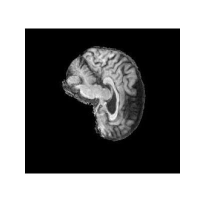
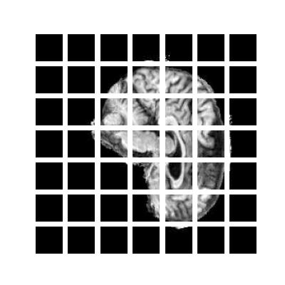
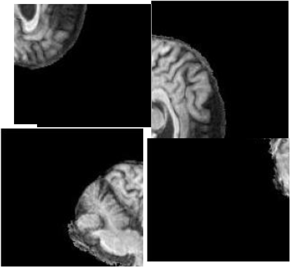
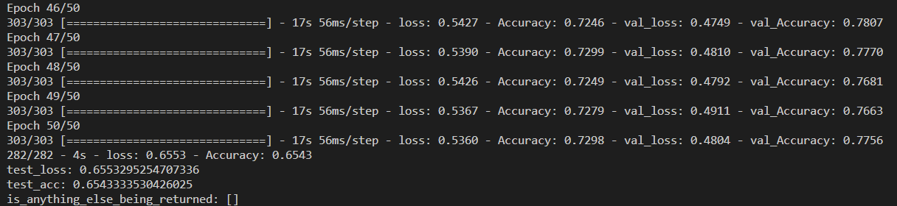
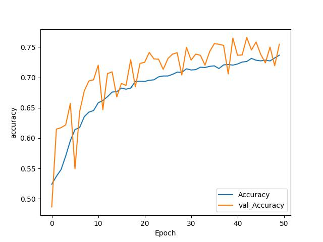
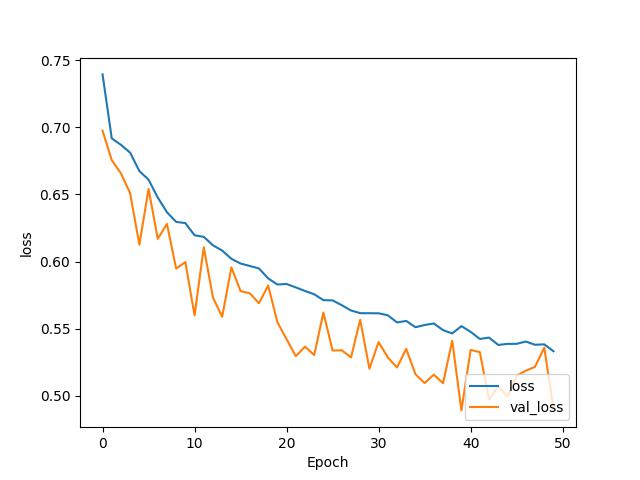

# Classification of Alzhimers Disease
This is an example of a Vision Transformer used to classify a person who has AD (Alzhimers Disease) or NC (Normal). Vision transformers are an image classification model that ustilises a transformer type architecture on patches of an image. This is achieved in 4 main steps [2].
  
## How the model works

### Step 1: Creating image patches

 
 

In this step images that are created into patches and flattened in a linear sequence (Positional Embedding). By doing so the transformer is able to remember the ordering of each patch. This is important because an image could have the same patches but they aren't in the right order. An example of this is shown below.

 

 

### Step 2: Patch Encoding
Patch encoding can be done in various different ways depending on the architecture of the transformer. In this case a multilayer perceptron is used along with a sigmoid classification layer at the end. These help the vision transformer do the image classification (AD or NC).
  

### Step 3: Training
In this step the model created from the mlp and transformer layers is trained till a satisfactory va_accuracy is reached. A AdamW optimizer alongside with a BinaryCrossEntropy loss function is used in this process to improve the model. 
  
### Step 4: Testing
In this final step the data collected from the training model is plotted into loss and accuracy graphs. In addition, the model is finally tested on testing data which outputs the final accuracy of it

 
 

# How the model performs
Currently, the model performs approximately at 65% accuracy with a loss and accuracy graph as shown below.
 
 

 
 

 
 

While such a low accuracy is not ideal, the following methods were done in an attempt to improve the accuracy

 
 

## Method 1: Increasing Epochs and reducing image size
The cluster provided to train has a limited gpu allocation. Therefore, if the training model used surpasses that limit, the training will immediately halt. This was one of the biggest limitations of the task. As such to avoid exceeding this limit one startegy used was to decrease the image size. By doing so the quality of the image is lowered thereby making it easier for it to train the model. However, by doing so one limitation of this is more epochs are required to get higher val_accuracy's. This strategy was implimented using two different loss functions SparseCategoricalCrossentropy and BinaryCrossentropy. By doing so I aimed to figure out which loss function worked best. Overall, no drastic difffernces were observed both loss functions outputed an accuracy of 63% +- 1%.

 

## Method 2: Decreasing Epochs and increasing image size
Similar to the method earlier in this method the image size is increased by doing so the model is able to capture more detail about each classification. However, the limitation of using this method is that the number of epochs the cluster can run is reduced (due to the higher image resolution). This strategy was also implimented using two different loss functions SparseCategoricalCrossentropy and BinaryCrossentropy. Overall, no drastic difffernces were observed both loss functions outputed an accuracy of 63% +- 1%.

 

## Method 3: Normalizing the data
In this method each image that is passed through the transformer is normalised. By doing so, I aimed to increase the accuracy of the model [4]. By implimenting this technique no observable changes in accuracy was made. This strategy was also implimented using two different loss functions SparseCategoricalCrossentropy and BinaryCrossentropy. The final test accuracy after doing so was 63% +- 1% in both cases.

 

## Method 4: Adding a softmax/sigmoid activation in the last layer 
In this method a softmax layer was added in as it was what Source [1] reccomended using for the final layer. By doing so the models accuracy hit a maximum of 48%. Therefore, this layer was not used in the final model. A sigmoid layer as suggested by a tutor was later used and did improove the accuracy by 2% resulting in an average accuracy of 65%.

 

## Method 5: Adjusting the parameters of the vision transformer:
The vision transformer has other parameter that can be used to fine tune the model such as 

- Patch size
- Projection dimensions
- Number of heads
- Transformer units

According to Source [2] by increasing these values it is possible to increase the accuracy of the transformer. Therefore, they were increased/decreased in different variations. However, no combination that I have tried so far has resulted in a better testing accuracy.

 

## Method 6: Adding a convolusion layer in the multi layer perceptron:
This method did not have any reasoning behind it. It was simply a random idea that I decided to impliment as a last resort. However, no improovements in the model were observed. As such I did not use it

 

# Preprocessing and testing/training/validation dataset

## testing/training/validation
For the testing and validation a 90:10 split was used as it was a commonly used splt in most datasets for machine learning [5]. The testing set was provided seperately in the data set therefore, no additinal splits were required for it.
 

## Pre-processing
To pre-process the data a data augmentation method was used as it was present in source [2] and also reccomended by sources online such as [6] and [7]. By implimenting this method variations of the images passed through are created. This therefore, increase the variety of different images (usefull when there is not a lot of training data given). In this preprocessing model the images undergo a normalaization, Resizing, RandomFlip, RandomRotation, and RandomZoom.

While not a lot of research was done on this section from my part I believe that to improove the model further reasearch could be done in this space to potentially improve the accuracy of the vision transformer.

 

# Dependencies
To run this model a few dependencies need to be used namely
- tensorflow
- numpy
- os
- cv2 (install opencv)
- random
- matplotlib
- keras/keras.layers
- matplotlib.pyplot
- tensorflow_addons

Further to run the model the ADNI data set needs to be downloaded from https://adni.loni.usc.edu/. After downloading the dataset, load it into the solution folder and ensure that the path DATADIR in dataset.py is updated for both training and testing functions.

After doing so the command: srun -p test -G1 python3 modules.py can be used to run the model.

 

# Sources
[1] https://www.youtube.com/watch?v=j-3vuBynnOE
 
[2] https://www.youtube.com/watch?v=i2_zJ0ANrw0
 
[3] https://keras.io/examples/vision/image_classification_with_vision_transformer/
 
[4] https://towardsdatascience.com/data-normalization-in-machine-learning-395fdec69d02#:~:text=The%20short%20answer%20is%20%E2%80%94%20it,because%20they%20are%20bigger%20numbers.
 
[5] https://www.v7labs.com/blog/train-validation-test-set#:~:text=In%20general%2C%20putting%2080%25%20of,dimension%20of%20the%20data%2C%20etc.
 
[6] https://nanonets.com/blog/data-augmentation-how-to-use-deep-learning-when-you-have-limited-data-part-2/
 
[7] https://journalofbigdata.springeropen.com/articles/10.1186/s40537-019-0197-0

# Note for tutor
For my git logs I have had the problem of pushing my algorithm from the cluster. Therefore, I have instead for my solution created a local copy of it and created git logs that I backtracked based on my previous commits. As such most commits done are all done in the span of 2 days.

I have provided screenshots as proof for this

 

 

