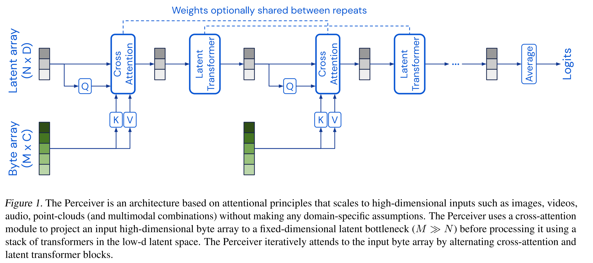

# Implementation of the Perceiver Model in Tensorflow
### Author: Jason Bolton
### Description
The following code implements the Perceiver Model described in [Perceiver: General Perception with Iterative Attention](https://arxiv.org/abs/2103.03206)
and includes an example of using the model to classify laterality (Left or Right) knee image data from the OAI AKOA dataset. The perceiver model 
aims to solve the O(M^2) compute and memory bottleneck which occurs when using transformers. The perceiver handles this by using
a cross-attention module to project the input data into a fixed-dimensional latent bottleneck, N (N << M), and uses a stack of transformers
to process the latent data. The perceiver iteratively attends to the input data M by alternating cross-attention O() and latent 
transformer blocks. Not only does this solve the compute and memory constraints, but due to the generalised
architecture of the model, the perceiver is able to process any form of high-dimensional data such as images, videos, audio etc.

### How to Use
There are two files included:  
* Perceiver.py - The model implemented using tensorflow/keras functions.  
* driver.py - Driver script which showcases how to use Perceiver.py to classify the OAI AKOA dataset.  

In order to construct the model, several parameters need to be defined which determine the network architecture and driver.py
showcases an example of parameter selection. After the model is constructed, the compile_and_fit(train, val, epochs) method can be called
be called to compile the model (using LAMB optimizer and a learning rate scheduler and sparse categorical cross entropy
loss) and train the model using the given training and validation datasets. This method will return the training history which
can be plotted to showcase the learning process. Once the model is trained, you can use any of the keras methods to evaluate
the performance of the model or make predictions.

### Data Loading and Splitting
The driver.py file contains a load_data() function which will load the images in the specified directory and 
requires that the images relating to each class (Left Knee vs Right Knee) are in a separate sub-directory where the 
name of the sub-directory dictates the class label. 

By default, this function will normalise the pixel data into a [0,1] domain and will split the images such that 
70% of the images are used for training, 15% for validation and 15% for testing. Each of these splits are 
returned as a tensorflow dataset object such that they are configured to a batch size of 22 and are shuffled and utilise
tensorflow prefetching for performance optimization.

### Dependencies
* tensorflow 
* tensorflow_addons
* matplotlib (Optional - Only used in driver code to plot training cycle)

### Example Training Cycle Plot
