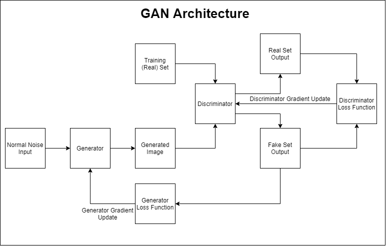
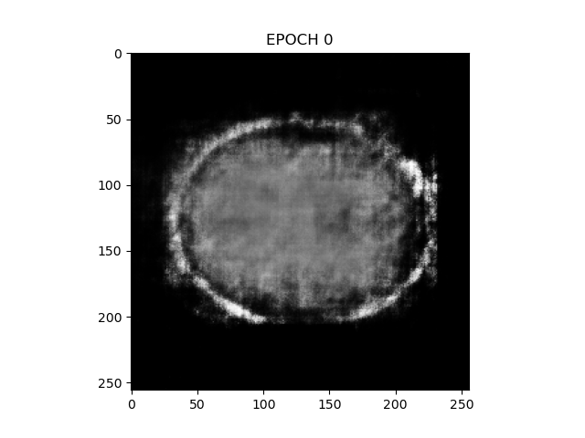
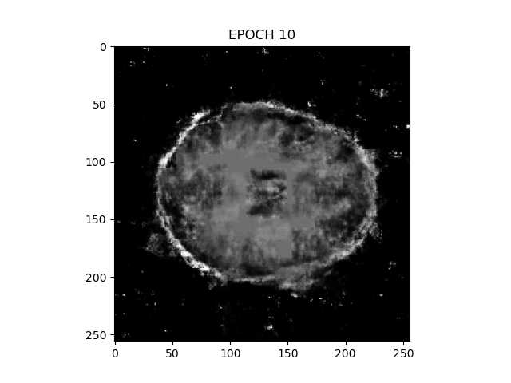
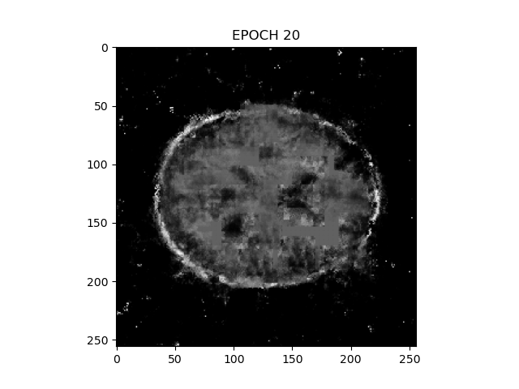

# Deep Generative Adversarial Network (DCGAN)
_Author_ : _Arun Harish Balasubramonian_

_Student No_ : _44340326_

_Dataset_ : _OASIS Brain_

_Email_ : s4434032@student.uq.edu.au _or_ a.balasubramonian@uq.net.au

## Description DCGAN

     
<i>Figure 1: Explaining the general GAN Architecture</i>

DCGAN model encompasses two neural networks called the Generator, and the Discriminator. Both of these models compete with each other, having the intention to fool their opposition. The generator has the intention to produce images that would trick the discriminator in believing it as real. 

The discriminator being trained with real dataset would compete in identifying the fake images produced by the generator. The model is said to have succeded if both the neural networks reach an equilibrium with 50% of the generator dataset being identified as fake by the discriminator: the image produced by the generator resembles the features found in original dataset. 

The model works by inputting random noise dataset to the generator, that __upsamples__ them using transposed convolution to produce images. These images are evaluated by the discriminator by __downsampling__ the input dataset updating its internal weights. and its output on real and fake dataset is used by the generator to produce loss, eventually updating its internal weights. GAN models have their primary application in photo editing, text to image translation and 3D Object generation [1].
DCGAN is a variant of GAN, according to the paper : [Unsupervised Representation Learning with Deep Convolutional Generative Adversarial Networks](https://arxiv.org/pdf/1511.06434.pdf), there are certain heuristics on the Deep learning models of GAN that gives optimal / stable result, suggesting the following architecture:
* Replacing pooling layers such as Max pooling with strided convolution for the discriminator and fractional-strided (Convolution Transpose strides) for the generator.
* Using Batch Normalisation on both generator and discriminator neural networks.
* Using ReLU activation for all generator layers except for the output layer using Tanh
* Using LeakReLU activation for all discriminator layers.

## Dependencies

To install dependencies from conda, assuming the environment is set  
* `conda install tensorflow-gpu`
* `conda install matplotlib`

See the provided `requirements.txt` containing all the dependencies used.

## Test Script 
The test script is named *driver_test_script.py*, which must be executed to run the training. It contains two modes: training mode and generator mode

### Training Mode
In this mode, the driver script loads the image and initialises to train the model and outputs the image generated for every fifth epoch. The following table describes the command line options accepted and its description.

| command | description |
| ------- | ----------- |
| `--train-dataset` | Describes the location of training dataset. Must be relative to driver script
|`--train-epoch` | Total Epoch to be used in training
| `--train-image-size` | The total image training size to be used

> __Note__: If `--generate-image` option is set above training options are omitted and proceeds to run the generator mode below

### Generator mode
The generator mode is responsible for generating images from the pre-trained model placed in the `output` folder from root. If no `output` folder is found then it throws an error. The output folder must contain the `generator` folder containing the saved model.

____

In summary, the driver script follows the grammar:

`
python driver_test_script.py [--generate-image] --train-dataset=<directoryPath> --train-epoch=<epochValue> --train-image-size=<trainingSize>
`

## Result
The entire image dataset in `keras_png_slices_train` was used for 20 epochs and generated the image on every tenth epoch:

    
    
    

 

## References
[1]:    J. Brownlee, "18 Impressive Applications of Generative Adversarial Networks (GANs)", Machine Learning Mastery, 2020. [Online]. Available: https://machinelearningmastery.com/impressive-applications-of-generative-adversarial-networks/. [Accessed: 05- Nov- 2020].