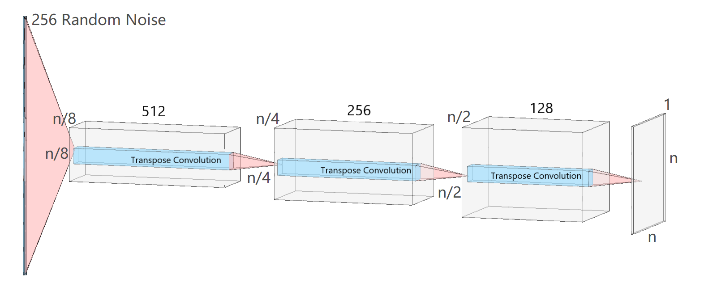

# DCGAN On OASIS - Ziyan Wang
This project is an assignment of [COMP3710](https://my.uq.edu.au/programs-courses/course.html?course_code=comp3710) from 
The University of Queensland. The whole readme will contains 5 parts.

## Algorithms
In this part, I will introduce the algorithm structure used in the project. 
### GAN
Before the introduction of DCGAN, I'd like to introduce GAN firstly. The GAN is made up of two parts of models, 
generator and discriminator. In the case given in the course, GAN is used for picture generating. The generator model
is responsible for generator a fake image, and discriminator is responsible for the determination of fake output and
real output.


### DCGAN
However, the traditional GAN structure has problems on stability on solving image generation problems. To achieve this,
DCGAN applies extra constraints on the layers of generator and discriminator. 
1. Replace any pooling layers with strided convolutions (discriminator) and fractional-strided convolutions (generator).
2. Use batchnorm in both the generator and the discriminator.
3. Remove fully connected hidden layers for deeper architectures.
4. Use ReLU activation in generator for all layers except for the output, which uses Tanh.
5. Use LeakyReLU activation in the discriminator for all layers.

To achieve the experiment aims and reasonable computation cost, in my solution, the architecture of my DCGAN is responsive. 
The relationship between output shape (n) and middle layers shapes of the generator is as the following plot. 



### SSIM
To evaluate the DCGAN model. SSIM is a good choice which is basically calculate the similarity between fake images and
real images (bigger SSIM means higher similarity) [SSIM](https://en.wikipedia.org/wiki/Structural_similarity)

## Problems
The main problems of the project is to create and train a DCGAN model based on the OASIS brain dataset, which can generate
reasonably clear image and SSIM over 0.6.

## Implementation
This part will introduce the implementation of the project. Firstly, I will briefly introduce the relationship and structure
of classes. In the project I implemented two classes:
1. ImgLoader: This class is responsible for the load the dataset from image files and transfer to tensor object.
2. DCGAN: This class is responsible for the model creation, model training based on ImgLoader, and SSIM/evaluation.

### SSIM Test on real image.
Before training model, I chose to do an experiment on the SSIM test on 256 random chosen real images. The purpose of 
these series of experiments are:
1. Know the relationship between SSIM and image size
2. Know the relationship between SSIM and specific part of dataset.
#### SSIM / Image Size
As the following plot shows, the SSIM is increasing with the image size.


#### SSIM / Specific slices
As the following plots shows, when using 64 * 64 and 128 * 128 output size on all combinations of five continuous slices 
(0-5,1-6,...) the SSIM is decreasing with the slice moving back on both of models.


#### Model Training
Considering the computation cost, and the study above, the model training will focus on the 64 * 64 and 128 * 128 outputs.
When using sliced dataset, the SSIM is the mean value of 256 fake images and 256 real random chosen images. When using whole
dataset, hte SSIM is the maximum value of 256 fake images and 256 real random chosen images. To achieve a “reasonably 
clear image”, the model will train at least 1000 epochs then starts SSIM test. The following codes are example of a 
64 * 64 DCGAN training on sliced data.
```python
# Parameters
IMG_SIZE = 64
TARGET_SLICE = list(range(5,10))

# Load dataset
img_loader = ImgLoader("D:\Datasets\keras_png_slices_data\keras_png_slices_train")
train_dataset = img_loader.load_to_tensor(target_slice=TARGET_SLICE,img_size=IMG_SIZE)

# Construct model
dcgan = DCGAN(IMG_SIZE,TARGET_SLICE)

# When the SSIM meet requirement three consecutive times after 1000 epochs. The model training will stop.
hist_ssim = dcgan.train(train_dataset,10000,patience=3)
```

##### 64 * 64 Sliced Dataset
This experiment will train a DCGAN whose output is 64*64, and the training dataset is using specific slice (5-10) dataset
based on the study of SSIM_Test. The result shows that the DCGAN can achieve mean SSIM between 256 fake and real images
above 0.6 three consecutive times after 1000 epochs.


##### 64 * 64 Whole Dataset
This experiment will train a DCGAN whose output is 64*64, and the training dataset is using whole dataset. The reuslt 
shows that the DCGAN can achieve max SSIM between 256 fake and real images above 0.6 stably after 200 epochs.

