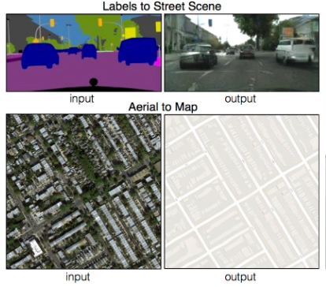
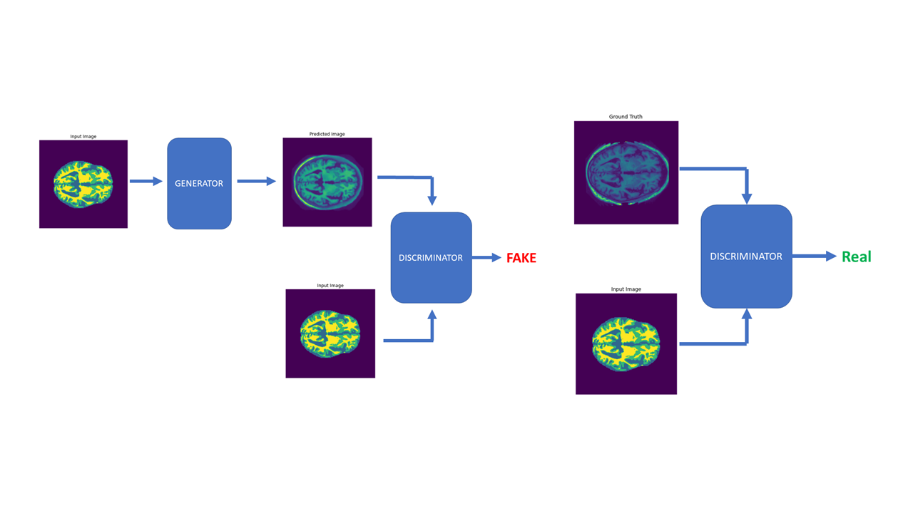
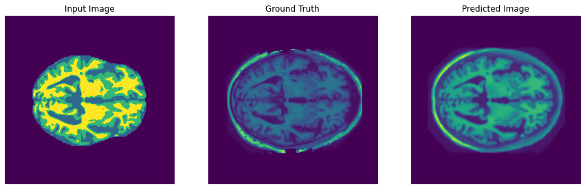

# Pix2Pix - Brain MRI Segmented Image Translation Using TensorFlow.
The objective of this recognition problem is to develop a generative model on the OASIS segmented brain MRI images using conditional-GAN.

## Description of the algorithm
Pix2Pix is a conditional Generative Adversarial Network model also known as GAN, designed for image-to-image translation. GAN architecture is comprised of a generator model which tries to generate fake or synthetic images, followed by a discriminator which on the other hand classifies image as real (from the dataset) or fake (generated from generator). The weights of discriminator model are updated directly, however, the weights of generator model are updated via discriminator model. The two models are trained simultaneously where the generator tries to fool the discriminator and the discriminator try to classify fake images from real ones.

Few examples of Pix2Pix GAN use cases: -

## Problem this algorithm solves
This algorithm solves image-to-image translation problems. Here it is generating brain MRI images from segmented brain MRI images.

## Working of the algorithm
On running Driver.py script, Pix2Pix_algorithm.py get triggered which performs the following actions in sequence as mentioned: -

1. Data loading & pre-processing - Training data & validation dataset is loaded from directory where they are stored into kernel instance. Loaded data is then pre-processed by converting pixel values from -1 to 1.
1. Generator (U-net) & Discriminator models are initialized along with respective loss functions and adam optimizers.
1. Model is trained using gradient tape. At each training iteration model is trained on number of images at a time depending upon the supplied value of variable batch_count. Also, after each epoch an image from validation dataset is taken and passed to through the generator to check the model performance.
1. After model is trained, testing data set is loaded, pre-processed and finally using generator brain MRI images are generated.

High level architecture of Pix2Pix GAN model with Input, generated images from generator & ground truth image is shown below: -

## Results
*1st Result-*

*2nd Result-*

## Dataset
Training, validation & testing dataset size used are: -
* Training data size used to train model is **9664**.
* Validation dataset has **1120** number of images.
* Testing data has **544** number of images.  

Model training needs as large number of data samples as we can train it on therefore, large proportion of dataset is used as training dataset. Validation dataset on the other hand is used to monitor the performance of the model on unseen data while it is still under training therefore a small proportion would suffice the need. And finally, after model is trained its performance can be test on testing data which can be the smallest among training, validation & testing dataset.

## Sources
* https://www.tensorflow.org/tutorials/generative/pix2pix
* https://arxiv.org/abs/1611.07004
