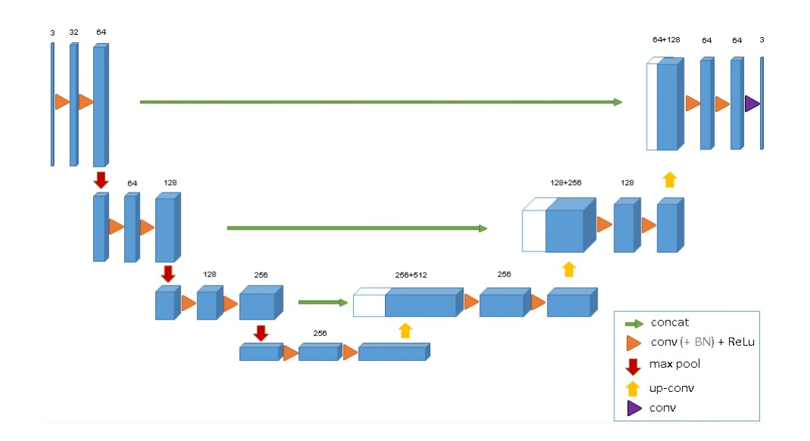
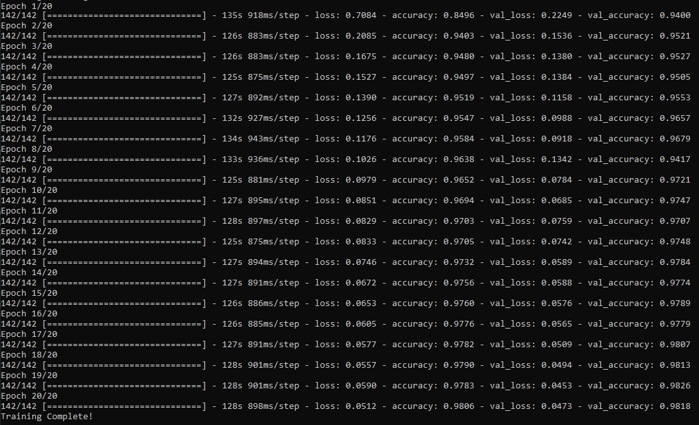

# 3D Prostate Segmentation Using 3D-UNet Architecture
COMP3710 Report Task - Jake Babbidge - 45816145

## UNet Architecture
The architecture of a UNet consists of a downsampling, or encoder like path on the left, followed by an upsampling, or decoder like path on the right. The idea of the downsampling, or contractive path is to find features from the source image by iteratively applying convolutions and max pooling operations. Once these features have been reduced at the bottom of the UNet architecture, the features are then carried up the expansive path, to go from identified features, to label classifications. UNet's main unique feature is that it pulls across the features from the associated contractive node, to give it much more context when rebuilding from the features. A convolution of size 1x1x1 is then run over the output of the network to generate voxel masks for each label class. The main items that i added to the architecture was the incorporation of dropout layers, in an attempt to make the model more generalized. An overview of the 3D Unet architecture is shown below [1]:



## The Problem
The dataset i am applying this 3D UNet architecture to, is the CSIRO 3D Prostate MRI Scans dataset available [here](https://data.csiro.au/collection/csiro:51392v2). The dataset consists of 211 labelled MRI scans of male pelvises labelled with six unique labelled classes; Background, Body, Bone, Bladder, Rectum and Prostate. The aim of the 3d UNet model is to be trained up to a level where it is able to achieve a DICE score of > 0.7 on all labelled classes with unseen patient scans.

## Processing The Data
Due to enormous wait times on the UQ Goliath cluster, and lack of being able to effectively debug solutions, i opted to downscale the data by a factor of 2x, bringing each scan down to 128x128x64 to allow me to train the model locally, on my GTX 1080 with only 8GB of VRAM.
### Anomalies
210/211 scans in the dataset were of shape 256x256x128, with only one scan being a different shape. To handle this, i implemented an anomaly checking system in the data loading phase which automatically removes data that has a different shape from the model training process.
### Anti Patient Case Leakage
To ensure the model cannot cheat by seeing the same patient both in training and testing splits, when creating the generators for the model to pull from the dataset, the dataset splitting is done based on each patient along with ALL of their scans in an iterative process. This ensures that each patient only has their scans in one bucket; train, validate, or test.
### One Hot Encoding
To prevent the model from associating more weight to classes of higher index, or magnitude, the scan labels are fed into the model after being one hot encoded using keras' `to_categorical` function.
### Train / Val / Test Split
I initially started with a train, val, test split of 0.85, 0.1, 0.05, however this lead to a model with too much training data, and not enough validation and testing data, as the model was significantly overfitting, and was not learning from the small portion of validation it recieved. This is why the end result utilises a train, val, test split of 0.7, 0.15, 0.15, to make a more generalised model, which is better suited to this task.

## Loss Function
Throughout building this UNet and training it many times, i have experimented with a variety of different loss functions. I initially went for a multiclass DICE loss implementation, as afterall that is what we are trying to minimise. Unfortunately, however, i quickly found out that this gave the model the wrong intentions, and it constantly focused on optimising the classes with the largest area, neglecting the classes with small area, to rack up more reward.

This is an inherent problem due to the frequency of classes being nowhere near equal. For example, the Background and Body class take up roughly 90% of all labelled volume, with the other 4 making up the remaining 10%.

A possible solution i could have used would be to use a weighted DICE loss function, however determining the exact weights to use, to give good results is difficult.

With the above problems, i settled on using keras' `categorical_crossentropy`, which does not show these side effects as prominently, due to the way it is calculated.

# Usage
To use the `driver.py` script, ensure you have the following dependencies installed using pip:
## Dependencies
 - Tensorflow
 - Keras
 - Scipy (For 3d Volumetric Downscaling)
 - Numpy
 - NiBabel
 - Matplotlib
 - ArgParse (For argument parsing)
## CLI Usage
Extract the files from the data set into the root folder, at the same level as `driver.py`, to create a structure as follows:
```
model.py
driver.py
data/
	=> semantic_labels_anon/
		=> Case_XXX_WeekX_SEMANTIC_LFOV.nii.gz
		=> ...
	=> semantic_MRs_anon/
		=> Case_XXX_WeekX_LFOV.nii.gz
		=> ...
```

To train the prostate model, open the prostate root directory and run `python driver.py --mode=train --epochs=10` to train with 10 epochs. This will then save the best model checkpoint under `prostate_model.h5`.

Once you have trained the model, you can run `python driver.py --mode=evaluate` to evaluate the model's DICE performance based on the model stored at `prostate_model.h5`.

# Results
After training the model on just 20 epochs over roughly 45 minutes, i am very impressed with the results of the model. Below are the average dice scores obtained from evaluation on test set for each class:
 - Background Class: 0.997
 - Body Class: 0.972
 - Bone Class: 0.829
 - Bladder Class: 0.837
 - Rectum Class: 0.342
 - Prostate Class: 0.387

Training Log Shown Below:



# References
[1] Çiçek, A. Abdulkadir, S. S. Lienkamp, T. Brox, and O. Ronneberger, “3D U-Net: Learning Dense
Volumetric Segmentation from Sparse Annotation,” in Medical Image Computing and Computer-Assisted Intervention – MICCAI 2016, ser. Lecture Notes in Computer Science, S. Ourselin, L. Joskowicz, M. R. Sabuncu,
G. Unal, and W. Wells, Eds. Cham: Springer International Publishing, 2016, pp. 424–432.