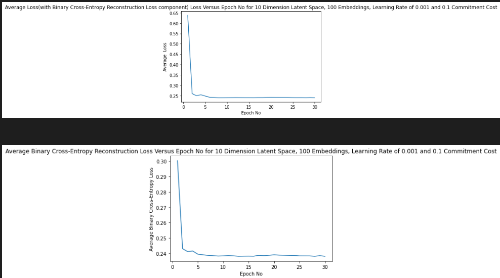
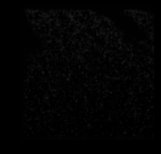

# Vector Quantized Variational Autoencoder on Oasis Dataset (Q8)

### Description of Model and Problem 
&nbsp;

In this project I developed a Vector Quantized Auto-encoder to encode and then reconstruct the OASIS brain image data. This image data consists of brain scans. The model that I used, involves an encoder layer, a vector quantizer layer, and a decoder layer. The encoder layer involves two convolutional neural net layers with rectified linear activation functions. This layer changes the dimensionality of the images from their original dimensions. The vector quantizer layer,  represents each sample in the  output of the encoder when flattened to be of the dimensionality: M * channels (where M=No. Samples * height*width), as an embedding vector. For each sample/row in the flattened output of the encoder, this embedding vector is the one amongst a range of embedding vectors which minimimizes the euclidean distance between it and the corresponding row of the flattened output of the encoder. The decoder layer is similar to the encoding layer in that it also involves two convolutional neural network layers, with a rectified linear unit between them.  However, the last layer of the decoder uses a sigmoid activation function rather than a rectified linear unit as used in the last layer of the encoder. A sigmoid output activation layer is used because its outputs are reals between 0 and 1 which is precisely the format that image pixel data must be in. The purpose of the decoder is to convert the output of the vector quantizer layer back into the original image.

After the construction of the aforementioned model, I constructed a CNN model to train the prior over the embedding vectors (for each image and pixel). This model involves masked convolutional layers, where in this particular case, it involved two CNN layers, the first having a rectilinear activation function and the second with a softmax activation function. This function takes in as input, the embedding vector indexes of each sample and pixel (a number which represents which embedding vector is used to quantize that image and pixel) according to the vector quantizer layer of the best vector quantized auto-encoder model mentioned in the last paragraph. The target used to train the model, is also those same embedding vector indexes for each sample and pixel of the training data from the vector quantizer layer from the best VQVAE model. The CNN, model which trains the prior, outputs probabilities for each sample and pixel representing the probability of each embedding vector (being used to encode that sample and pixel). In constructed this model I was guided by: https://keras.io/examples/generative/vq_vae/

### How it works in More Detail
&nbsp;

This VQVAE model works by updating the weights (the weights being both those associated with the convolutional neural networks as well as the values of each element of the embedding vectors) after processing each batch in accordance with the ADAM optimizer. The ADAM optimizer is a gradient descent based method which adapts/alters the learning rate throughout training. The optimizer alters the weights in such a way that it optimizes the loss function. The total loss function involves three separate loss functions, two of which have a fixed form unique to the vector quantized auto-encoder. One of these fixed loss functions is multiplied by a weight called the commitment cost, whilst the other two loss functions (including the non-fixed-form loss function) are simply added to this value to form the total loss function. The third, non-fixed-form loss function is a reconstruction loss of one's choosing. In this algorithm, the reconstruction loss function was chosen to be Binary Cross-Entropy. For a single element of one sample's output, Binary Cross-Entropy (BCE) is of the form:

$BCE=p\,log(q)+(1-p)\,log(1-q)$

Here, $p\in [0,1]$ and is the  the value of a single element of the target of a sample, whilst $q\in  [0,1]$ and it denotes a single element of the output of a sample. Binary Cross-Entropy might seem like a strange choice, as it is usually used to compare probability outputs to either target probabilities or 0-1 valued class indexes for the purpose of classification. However, it can be used in the problem of issue, firstly because the outputs of the algorithm are pixels which take values in the unit interval just like probabilities. Secondly, and of even more importance, the minimum value of the Binary Cross-Entropy loss function when restricted to a single output element from a single sample, is found when $p=q$ which is indicated by $(2)$ below. 
&nbsp;

In mathematical detail, for normal categorical cross entropy, where $p_i,q_i\in [0,1]$, and $\sum_i^n pi=\sum_i^n q_i=1$   when $\exists (i)\, s.t\, p_i\neq q_i$, it holds that $(1)$:
 
 &nbsp; 
 &nbsp;
 $(1):  \sum_i^n p_i\,log(p_i) < \sum_i^n p_i\,log(q_i)$ 
&nbsp;

See: https://stats.stackexchange.com/questions/488032/minimum-value-of-cross-entropy-cost-function) which details this. It can be shown that $(1)$ entails $(2)$, below, by taking $n=2$, $p_i=p\,,q_i=q$. $(2)$ is an inequality governing the binary cross entropy contribution of a single element of the output of a sample when $p\neq q$ where the requirement that $p,q$ be probabilities (i.e $\sum_i^n pi=\sum_i^n q_i=1$) can be discarded because with binary cross entropy, $1-p$ and $1-q$ is explicitly used in the equation rather than using $p_2,q_2$ so we only require $p,q\in [0,1]$

$(2): p\,log(p) + (1-p)\,log(p) < p\,log(q)+(1-p)\,log(1-q)$
&nbsp;

Usually these $p$ and $q$ are probabilities but this is not necessary as $(2)$, unlike $(1)$, only requires that $p$ and $q$ are elements of $[0,1]$, given what was said in the last paragraph. This means the binary cross entropy is a meaningful  loss function for the use case of this project, as the loss function is minimized when the target pixel values equals the output pixel values of the model (as pixel values are in $[0,1]$).  Finally, one other justification for using the binary cross entropy is that in tests conducted, the validation mean SSIM was much higher when using binary cross-entropy as the reconstruction loss function when compared to mean square error.

The model used to train the prior, works by using the ADAM optimizer to minimize the (sparse) categorical cross entropy between the target encodings of each sample and pixel (output from the vector quantizer layer of the best VQVAE model) and its probability output, which are the probabilities of predicted target encodings.

This model involves masking, which is an operation conducted on the kernel of each of the convolutional layers, so that output for some pixel in an image only relies on previous pixels in the image. A prior is then constructed by sampling indexes of embedding vectors (again a number representing which embedding vector is used) from the probabilities of the CNN model one pixel at a time, and then inputting these sampled indexes into the CNN model to produce new probabilities, which are then used to sample indexes of embedding vectors for the next pixel in the image.

### Preprocessing and Test, Train and Validation Split
&nbsp;

Little preprocessing of the dataset (with regard to training the VQVAE model) was required, as the usage of the binary cross-entropy loss function already resulted in high mean SSIM values over the validation data. The one preprocessing step that was conducted, was data augmentation. Some information on data augmentation can be found here: https://nanonets.com/blog/data-augmentation-how-to-use-deep-learning-when-you-have-limited-data-part-2/. It was reasoned that because the training dataset at roughly 10000 samples is arguably still small, increasing the size of the dataset may improve generalizability of the model. As such, training dataset size was doubled by adding another (roughly) 10000 samples which consisted of the original training dataset but with the containing images flipped upside down. Finally, with regard to the test, train, validation split, I used the predefined splits that come with the OASIS dataset which involves a very high proportion of data devoted to training. This split can be justified by the fact that the total OASIS dataset (training+test+validation data) is not large so a greater proportion (over 80 percent) than usual of the total data should be devoted to training, otherwise one risks non-generalizability of the model.

No additional preprocessing was required for the data that was fed into the CNN used to train the priors; all that was required, was fetching the encodings output from the vector quantizer layer of the best VQVAE model (best according to the validation data) on the training data.

### Dependencies, Python Version and Reproducibility
&nbsp;

On the computer on which this code successfully runs, the following packages with the associate version number (to the right) are installed:

absl-py                 1.3.0
&nbsp;

anyio                   3.4.0
&nbsp;

argon2-cffi             21.1.0
&nbsp;

arrow                   1.2.2
&nbsp;

astunparse              1.6.3
&nbsp;

attrs                   21.2.0
&nbsp;

Babel                   2.9.1
&nbsp;

backcall                0.2.0
&nbsp;

basemap                 1.3.3
&nbsp;

basemap-data            1.3.2
&nbsp;

bleach                  4.1.0
&nbsp;

cachetools              4.2.2
&nbsp;

Cartopy                 0.20.2
&nbsp;

certifi                 2020.12.5
&nbsp;

cffi                    1.14.5
&nbsp;

chardet                 4.0.0
&nbsp;

click                   7.1.2
&nbsp;

cloudpickle             2.2.0
&nbsp;

colorama                0.4.4
&nbsp;

cryptography            3.4.7
&nbsp;

cycler                  0.10.0
&nbsp;

Cython                  0.29.26
&nbsp;

debugpy                 1.5.1
&nbsp;

decorator               5.1.0
&nbsp;

defusedxml              0.7.1
&nbsp;

dill                    0.3.5.1
&nbsp;

dm-tree                 0.1.7
&nbsp;

dnspython               2.1.0
&nbsp;

email-validator         1.1.2
&nbsp;

entrypoints             0.3
&nbsp;

fastrlock               0.8
&nbsp;

Flask                   1.1.2
&nbsp;

Flask-Babel             2.0.0
&nbsp;

Flask-Table             0.5.0
&nbsp;

Flask-WTF               0.14.3
&nbsp;

flatbuffers             22.10.26
&nbsp;

future                  0.18.2
&nbsp;

gast                    0.4.0
&nbsp;

google-auth             1.30.0
&nbsp;

google-auth-oauthlib    0.4.4
&nbsp;

google-pasta            0.2.0
&nbsp;

grpcio                  1.37.1
&nbsp;

h5py                    3.1.0
&nbsp;

idna                    2.10
&nbsp;

ignite                  1.1.0
&nbsp;

imageio                 2.16.1
&nbsp;

imbalanced-learn        0.8.1
&nbsp;

ipykernel               6.5.1
&nbsp;

ipython                 7.30.0
&nbsp;

ipython-genutils        0.2.0
&nbsp;

itsdangerous            1.1.0
&nbsp;

jedi                    0.18.1
&nbsp;

Jinja2                  2.11.3
&nbsp;

joblib                  1.0.1
&nbsp;

json5                   0.9.6
&nbsp;

jsonschema              4.2.1
&nbsp;

jupyter-client          7.1.0
&nbsp;

jupyter-core            4.9.1
&nbsp;

jupyter-server          1.12.1
&nbsp;

jupyterlab              3.2.4
&nbsp;

jupyterlab-pygments     0.1.2
&nbsp;

jupyterlab-server       2.8.2
&nbsp;

keras                   2.10.0
&nbsp;

keras-nightly           2.5.0.dev2021050100
&nbsp;

Keras-Preprocessing     1.1.2
&nbsp;

kiwisolver              1.3.1
&nbsp;

libclang                14.0.6
&nbsp;

llvmlite                0.38.1
&nbsp;

lxml                    4.9.1
&nbsp;

Markdown                3.3.4
&nbsp;

MarkupSafe              1.1.1
&nbsp;

matplotlib              3.4.1
&nbsp;

matplotlib-inline       0.1.3
&nbsp;

mistune                 0.8.4
&nbsp;

multiprocess            0.70.13
&nbsp;

nbclassic               0.3.4
&nbsp;

nbclient                0.5.9
&nbsp;

nbconvert               6.3.0
&nbsp;

nbformat                5.1.3
&nbsp;

nest-asyncio            1.5.1
&nbsp;

networkx                2.7.1
&nbsp;

nibabel                 4.0.2
&nbsp;

notebook                6.4.6
&nbsp;

numba                   0.55.1
&nbsp;

numpy                   1.19.5
&nbsp;

oauthlib                3.1.0
&nbsp;

opt-einsum              3.3.0
&nbsp;

packaging               21.3
&nbsp;

pandas                  1.2.4
&nbsp;

pandocfilters           1.5.0
&nbsp;

parso                   0.8.2
&nbsp;
path                    16.2.0
&nbsp;

patsy                   0.5.1
&nbsp;

pickleshare             0.7.5
&nbsp;

Pillow                  9.1.0
&nbsp;

pip                     21.1
&nbsp;

pmdarima                1.8.4
&nbsp;

prometheus-client       0.12.0
&nbsp;

prompt-toolkit          3.0.23
&nbsp;

protobuf                3.15.8
&nbsp;

pyasn1                  0.4.8
&nbsp;

pyasn1-modules          0.2.8
&nbsp;

pycparser               2.20
&nbsp;

Pygments                2.10.0
&nbsp;

pymatreader             0.0.24
&nbsp;

PyMySQL                 1.0.2
&nbsp;

pynndescent             0.5.7
&nbsp;

pyparsing               2.4.7
&nbsp;

pyproj                  3.3.1
&nbsp;

pyro-api                0.1.2
&nbsp;

pyro-ppl                1.7.0
&nbsp;

pyrsistent              0.18.0
&nbsp;

pyshp                   2.1.3
&nbsp;

python-dateutil         2.8.1
&nbsp;

python-utils            3.1.0
&nbsp;

pytz                    2021.1
&nbsp;

PyWavelets              1.3.0
&nbsp;

pywin32                 302
&nbsp;

pywinpty                1.1.6
&nbsp;

pyzmq                   22.3.0
&nbsp;

requests                2.25.1
&nbsp;

requests-oauthlib       1.3.0
&nbsp;

rsa                     4.7.2
&nbsp;

scikit-image            0.19.2
&nbsp;

scikit-learn            0.24.2
&nbsp;

scipy                   1.6.3
&nbsp;

seaborn                 0.12.0
&nbsp;

Send2Trash              1.8.0
&nbsp;

setuptools              49.2.1
&nbsp;

Shapely                 1.8.2
&nbsp;

six                     1.15.0
&nbsp;

sklearn                 0.0
&nbsp;

sniffio                 1.2.0
&nbsp;

statsmodels             0.12.2
&nbsp;

tb-nightly              2.6.0a20210430
&nbsp;

tensorboard             2.10.1
&nbsp;

tensorboard-data-server 0.6.0
&nbsp;

tensorboard-plugin-wit  1.8.0
&nbsp;

tensorflow-estimator    2.10.0
&nbsp;

tensorflow-i0-gcs-filesystem 0.27.0
&nbsp;

tensorflow-probability  0.27.0

termcolor               1.1.0
&nbsp;

terminado               0.12.1
&nbsp;

testpath                0.5.0
&nbsp;

tf-estimator-nightly    2.5.0.dev2021032601
&nbsp;

tf-nightly-gpu          2.6.0.dev20210430
&nbsp;

threadpoolctl           2.1.0
&nbsp;

tifffile                2022.3.25
&nbsp;

torch                   1.10.0+cu113
&nbsp;

torchaudio              0.10.0+cu113
&nbsp;

torchmetrics            0.10.0
&nbsp;

torchvision             0.11.1+cu113
&nbsp;

tornado                 6.1
&nbsp;

tqdm                    4.62.3
&nbsp;

traitlets               5.1.1
&nbsp;

typing-extensions       3.7.4.3
&nbsp;

umap-learn              0.5.2
&nbsp;

UNKNOWN                 0.0.0
&nbsp;

urllib3                 1.26.4
&nbsp;

utils                   1.0.1
&nbsp;

Wand                    0.6.7
&nbsp;

wcwidth                 0.2.5
&nbsp;

webencodings            0.5.1
&nbsp;

websocket-client        1.2.1
&nbsp;

Werkzeug                1.0.1
&nbsp;

wheel                   0.36.2
&nbsp;

wrapt                   1.12.1
&nbsp;

WTForms                 2.3.3
&nbsp;

xmltodict               0.12.0

This list includes the dependencies required for the modules in the pull request as well as additional packages that were installed on the computer from which the code was run, and thus may be required for reproducibility. The operating system used was windows 11 Pro, version 21H2 and build 22000.1098,  and python version 3.94. Ver21H2. The seeds have been manually set so the output of the code is reproducible between runs when running it on the same machine. To ensure reproducibility between machines, you need to ensure that you meet all these conditions (same packages, same version of python and windows) which increases the chance that you can reproduce the same results presented here. Otherwise, it is very unlikely that the results generated will be significantly different.

### Files Associated this Pull Request/Folder
&nbsp;

The following files are included:

"modules.py": This includes the code in which the model is constructed and which implements training for a chosen set of hyperparameters.More exactly, "modules.py' consists entirely, of two functions: the function 'VQVAE1' which trains the VQVAE model for a specific set of hyperparameters, and plots the loss function versus epoch number, and 'PriorCNN' which trains the CNN model for the prior for a specific learning rate and plots the loss function versus epoch number.

"Modules.py": This function is an older version of "modules" before it was renamed to "modules". It is included so that one can see the earlier versions/commit history that went on before the renaming.

"dataset.py": This code loads the data, and conducts preprocessing. It also extracts the encodings of the best VQVAE model for a given datasest. The function "DataProcess" loads the data and conducts preprocessing whilst 'dataencodings' extracts the embedding vector indexes for a given dataset according to the best VQVAE model.

"train.py": This code consists of the function 'TRAINVALTEST' which trains the model and validates it across a range of hyperparameters, and then finds the model which possesses the best validation mean SSIM, and returns it (and saves it), along with its mean SSIM on the test set, its validation mean SSIM, and the indices corresponding to the hyperparameters associated with it. It also returns the plots of the loss function for each set of hyperparameters as these are produced as a result of the fact that "train.py" calls the appropriate function within "modules.py". The hyperparameter values I tried were dimensionality of the latent space values of 10 and 25, numbers of embedding vectors of 10 and 100, learning rates of 0.0001 and 0.001, and commitment costs of 0.1 and 0.3. 'train.py' also includes the function 'PredictPrior' which trains the prior using the function 'PriorCNN' from 'modules.py' and also computes its' accuracy over the encodings of the vector quantizer layer of the best VQVAE model over the validation and test set. In coming up with the model in 'PredictPrior' I manually did some hyperparameter tuning to pick the best learning rate; I tried learning rates of 0.001, 0,0001 and 0.00001.

"predict.py": This script consists in the function, 'Predict' which returns test set mean SSIM and also plots the reconstructions of some of the test set images to show that a reasonably clear image, as well as the function 'GeneratedImages which displays images generated from the trained prior. 

"goodmodel4.pkl": This is a file which contains the model which had the best performance on the validation data. This file was created as a result of the function, 'TRAINVALTEST', which saves the best model to that file. The model is retrieved/loaded from this file when 'Predict' is run.

"Priormodel.pkl": This is a file which contains the trained CNN model used to compute the prior. That is, the CNN model trained on the encodings of the best vector quantizer layer of the best VQVAE model over the training dataset.

Various PNG files are also included in the pull request and these are needed for the readme file you are currently reading to display images depicting the output of code.

### Example Inputs/Outputs:
&nbsp;

The best VQVAE model, was found using 'TRAINVALTEST' to have a test mean SSIM of 0.9584, where it used 10 embedding vectors, had a latent space dimensionality of 10, with a learning rate of 0.001 and a commitment cost of 0.3.

To run the functions within these modules first, in 'dataset.py' in 'DataProcess', you need to make the following replacements:
 
 -'path of folder containing train data' in 'Image.open(f'path of folder containing train data/case_{h}_slice_{z}.nii.png')'.convert('RGB'), with the actual path on your computer of the folder containing the OASIS brain train data. Thus, if the training data is stored directly in 'D:/traindata:' with no other subfolders between it and the files then the line of code would become 'Image.open(f'D:/traindata/case_{h}_slice_{z}.nii.png').convert('RGB)'.
 
 -'path of folder containing validation data' in 'Image.open(f'path of folder containing validation data/case_{h}_slice_{z}.nii.png').convert('RGB')', with the actual path on your computer of the folder containing the OASIS brain validation data. Thus, if the validation data is stored directly in 'D:/validdata:' with no other subfolders between it and the files then the line of code would become 'Image.open(f'D:/validdata/case_{h}_slice_{z}.nii.png').convert('RGB)'.
 
 -'path of folder containing test data' in 'Image.open(f'path of folder containing test data/case_{h}_slice_{z}.nii.png')'.convert('RGB'), with the actual path on your computer of the folder containing the OASIS brain test data. Thus, if the test data is stored directly in 'D:/testdata:' with no other subfolders between it and the files then the line of code would become 'Image.open(f'D:/testdata/case_{h}_slice_{z}.nii.png').convert('RGB)'.

 Also, in 'dataset.py' in 'dataencodings' you need to replace 'path and finalname of final model' in 'with open('path and filename of final model', 'rb') as file:' with the path and filename corresponding to where the final model file is saved. Here and elsewhere, final model refers to the best VQVAE model according to the validation data set.
 
 Then in 'train.py', within 'TRAINVALTEST' you need to replace 'path and filename of final model' in 'open('path and filename of final model', 'wb') as file:' with the desired path and filename corresponding to where you want to save the final/best model (found through validation).  So if you want to save the final model with the name 'finalmodel' directly in the D: drive you would replace 'path and filename of final model' with 'D:/finalmodel' so that the line of code would now read 'open('D:/finalmodel', 'wb') as file:'. Also, in 'PredictPrior' you need to replace 'open('path and filename of trained prior model','wb') as file:' with the desired path and filename corresponding to where you want to save the trained model that generates the prior probability over the encodings/indexes of embedding vectors'. So if you want to save the trained model used to generate the prior with the name 'Prior' directly in the D: drive you would replace 'path and filename of trained prior model' with 'D:/Prior' so that the line of code would now read 'open('D:/Prior', 'wb') as file:'. Again (also in 'PredictPrior') you need to replace path and finalname of final model' in 'with open('path and filename of final model', 'rb') as file:' with the path and filename corresponding to where the final model file is saved.

 Finally, in 'predict.py' in 'Predict' you need to replace 'path and finalname of final model' in 'with open('path and filename of final model', 'rb') as file:' with the path and filename corresponding to where the final model file is saved.  Ideally, same path and filename should be the same as that chosen in 'TRAINVALTEST' and 'PredictPrior' in 'train.py' and 'dataencodings' in 'dataset.py',  as mentioned in the previous two paragraphs. Otherwise, if you want to load the presaved (final VQVAE) model included in the pull request, then you need to include the path and filename of the presaved file 'goodmodel4' (just be careful that if you run 'TRAINVALTEST' in 'train.py' that the path and filename you choose within 'TRAINVALTEST' to save the resulting model, is different to the path of the presaved model with filename, 'goodmodel4', otherwise you might overwrite it, although both models should be the same or very similar).   If for example, you want to load the presaved model and you keep it directly in the D drive then you would replace 'path and filename of final model' with 'D:/goodmodel4' so the line of code would now read 'with open('D:/goodmodel4', 'rb') as file:'. 
 
 In 'GeneratedImages' in 'Predict', you also need to replace 'path and finalname of final model' in 'with open('path and filename of final model', 'rb') as file:' with the path and filename corresponding to where the final model file is saved. If you do want to use the presaved final model then you will also have to load it in 'dataencodings' in 'dataset.py' and 'PredictPrior' in 'train.py'. You also need to change 'path and finalname of trained prior model' in 'with open('path and filename of trained prior model'', 'rb') as file:' with the path and filename corresponding to where the trained model used to generate the prior is saved. Ideally, the same path and filename should be chosen as that used to save the trained model used to generate the prior in 'PredictPrior()' within 'train.py'. If you want to load the presaved model used to generate the prior, included in the pull request, then you need to include the path and filename of the presaved file 'Priormodel'. 

 In order to run the code snippets that come later, first the following code must first be run :

    import os
    os.chdir('C:/Users/William/patternflow1/PatternFlow/recognition/Q8 Autoencoder-OASIS/')

    from modules import VQVAE1
    from dataset import DataProcess
    from train import TRAINVALTEST
    from predict import Predict
    from dataset import dataencodings
    from modules import PriorCNN
    from predict import GeneratedImages
    from train import PredictPrior

Note that you should  change 'C:/Users/William/patternflow1/PatternFlow/recognition/Q8 Autoencoder-OASIS/' in the second line, to whatever happens to be path of the folder on your computer containing the files included in this pull request.

Then to train a single model with fixed hyperparameters, such as commitment cost=0.3, learning rate=0.001, 10 embedding vectors, and latent space dimensionality of 10 you run:

    TRAINDATA,VALIDDATA,TESTDATA,DATALOADER=DataProcess()
    in1=VQVAE1(TRAINDATA=TRAINDATA,train_loader=DATALOADER,dimlatent=10,noembeddings=10,learningrate=0.001,0.3)

This produces the following output showing the loss per epoch:

You may also get a warning message that nn.functional.sigmoid is deprecated but this can be ignored.

To train models for each of many different hyperparameters and pick the model/hyperparameter combination that performs best on the validation set, run:

    mod,ssim,ssimtest,indices=TRAINVALTEST()

This code stores the best model over the validation dataset in 'mod', an array which contains the mean ssim values on the validation dataset for each hyperparameter combination in 'ssim', the mean ssim value of the best model/hyperparameter combination over the test set in 'ssimtest', and the indices which reveal which hyperparameter combination was best in 'indices'. The output the code produces is a series of loss per epoch plots for each model/hyper-parameter combination that is tried on the validation data:

Finally to load the trained model (which will either be the presaved model present in this pull request ("goodmodel3.pkl") or the model saved during the last instance of running 'TRAINVALTEST', depending upon which path is used within 'Predict'), just run the code below.

    Predict()

In this case, as I have set the path within 'Predict' to the presaved model ("goodmodel4"), it produces five reconstructions of brain images  within the test dataset and the mean ssim on the test data, all of which is produced according to the pre-saved model in "goodmodel4" (which is the best model on the validation data set). This model was saved as a result of running TRAINVALTEST on my local computer, but if you have saved the best model with a different file and path you just need to replace 'goodmodel4' in the appropriate place in  'Predict' with that file and path. The output of the code above is below:

The best model has a mean ssim on the test set of 0.9614096283912659

As can be seen from the pictures, the best model produces reasonably clear images and has a mean ssim on the test set of over 0.6.

In order to use the generated priors, you first must extract the encodings by first running:

    trainencodings,dataloader=dataencodings(TRAINDATA)

This code was run as a result of running using the presaved best VQVAE model 'goodmodel4', but if you have saved the best model with a different file and path you just need to replace 'goodmodel4' in the appropriate place in  'dataencodings' with that file and path.

Then to train the CNN used to generate the priors you run
    
    import dill as pickle
    with open('goodmodel4', 'rb') as file: 
     finalmodel=pickle.load(file)
    model=PriorCNN(trainencodings,dataloader,0.0001,finalmodel.embeddingdim)

In the code above I have loaded the pre-saved best VQVAE model,'goodmodel4', but if you have run 'TRAINVALTEST' and saved the best VQVAE model in a different filename and path you simply need to replace 'goodmodel4'  with that path and filename. In any case, it produces the following graph detailing the loss function:

Alternatively, you can run:

    x,y,z=PredictPrior()

Which produces the same graph as that above (given I have used a learning rate of 0.0001 above which is the same as the best CNN prior model in 'PredictPrior'), but also stores the model in x, the validation encoding accuracy of the CNN model used to train the Prior in y, and the test encoding accuracy of the CNN model used to train the prior in z. Again, in 'PredictPrior' I used the presaved best VQVAE model, 'goodmodel4'; again if your best VQVAE model is saved with a different filename and path you just need to use these instead of 'goodmodel4', in the appropriate place in 'PredictPrior'. In the case of the trained prior model saved in 'Priormodel', it did in fact use a learning rate of 0.0001 and had a validation encoding accuracy of roughly 0.65 and test encoding accuracy of roughly 0.62. Here, validation encoding accuracy and test encoding accuracy refer to the accuracy of the trained model used to generate the prior whose inputs are the indexes of each embedding vector for each image produced by the vector quantizer layer of the best VQVAE model on the validation dataset and test dataset respectively.

Then to generate the images, sampled using the prior you run:

    GeneratedImages()

This produces the following five images

Here you can see that there is some kind of mass forming in the middle of the images, but it does not yet look like a brain nor is it very clear. As I mentioned before I tried various different learning rates for training the prior model all of which had validation and test accuracies (here validation dataset and the test dataset are indexes of each embedding vector for each image produced by the vector quantizer layer of the best VQVAE model on the validation dataset and test dataset respectively) above 0.6, which seems reasonable. In addition, in generating the images, I tried different initializations of the array of encodings ('samplearray' variable in function 'GeneratedImages') which is fed into the CNN model used to train the prior for the first pixel. I tried initializations of all 0, as well as ones but it didnt make any real difference. I am thinking, although I am not sure, that the issues might be size (the number of pixels 256*256) which means, one has make many more predictions (which based on previous pixel predictions) which allow any inaccuracies/performance issues to accumulate.

  

