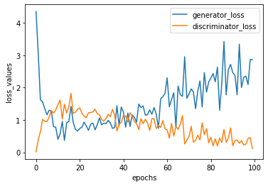

Shivaji parala
===========================================================
Student no.45512746
===========================================================
Pattern Recognition
===========================================================

Deep convolutional Generative Adversive Networks
===========================================================

Generative Adversial networks or GAN's use generator framework to generate new image from noise and discriminator framework classfies the generated image into real or fake on 
comparision with original data. As trainig goes on, weight in both generator and discriminator are adjusted to optimal values to give desired output.End goal is generating images 
similar to training image data.

Deep convolutional Generative Adversive Networks or DCGAN's are most fundamental implementaion of GAN'S involving deep convolutional layers in the network to generate image and 
classify the generated image."DCGAN.s" were introduced by Alec Radford & Luke Metz in their article "Unsupervised representative learning with Deep convolutional geneartive  
adversalnetworks.


Above picture display the basic architechture of Deep convolutional Generative Adversive Networks.

# The Architecture of DCGAN:

## Generator:

Generator mainly consists of deconvolutional layers or upsampling layers.Upsampling can be described as reverse of covolution and trnspose convolution layers perform this rask.
In this project, Initially noise of shape (100,) is passed through the network after few deconvolutional layers output image of size (128,128,1) is generated.

## discriminator:

This can be viewed a simple binary classifier containing many convolutional layers .finally flattened data is used to generate probability to classify the images,i.e, real or 
fake.

# Internal components of Generator and Discriminator:

## No max or average pooling:

As network only contains convolution layer we do not use max pooling for downsampling. Instead all the operations will be through strided convolutions.

## Batch normalization:

I will be using batch normalization in both generator and discriminator as it normalizes input data to each unit uin a layer and also helps in rectifying poor initialization problem.

## Activation functions:

In both generator and discriminator. i will be using leaky relu activation function after convolutional and batch normalization layers.For last convolutional layer in generator tanh function is used.

In original paper it was metioned that using relu activation function in generator an leaky relu activation whould give better results.I find using leaky relu in both models generate more clear images.Even the Network structure i have initialized differ from the original paper.

# Training process of GAN network:

* Intially, generator starts with a random noise and generates a image.
* Next, discriminator compares the image generated to original image and make a decision
* Based on output of discriminator, generator produce more image trying to get similar images as traning goes on.
* Combiner stacks up generator and discriminator together.
* Most importantly in traning when genarator is in traning process discriminator remains static, and when discriminator is in traning process generator remains static.

# Dataset used in this project:

The Open Access Series of Imaging Studies (OASIS) is collection of neuroimaging datasets publicy available for study and analysis.The image data i will be working on contains 
longitudinal collections of brain images.Majorly images containing obtained from the subjects are used to study Alzheimer's disease.But i will be using nearly 9000 of these 
images to train a DCGAN model and generate new brain images.For futher detailed description of dataset refer http://www.oasis-brains.org.


# Prerequirements : 

- A computer with high end graphic card (NVDIA rtx 2060 recommended), as training a DCGAN model on cpu is very slow.
- python 3.7.0
- tensorflow gpu = 1.15 version to support use of GPU in training

# packages:

I have just provided the commands to easily install recquired libraries through command prompt.
```bash
pip install Tensorflow-gpu
pip install pandas
pip install matplotlib
pip install keras
pip install Ipython
pip install opencv
pip install skimage
```

# Details regarding code:
"function.py" consists of all functions used to implement the model.
"main.ipynb" contains all the code needed to implement the model and to choose right hyperparameters. Based on necessicity, parameters can be tuned in this script to achieve 
required goal.'

Procedure followed in implementing the DCGAN model:
===========================================================
1.Load the image 
2.Preprocessing the image: while orginal image is 3 dimensional with shape 256 x 256. I have converted this 3D image into gray scale image with shape 128 x 128
3.Normalizing[-1,1] the data  by subtracting and dividing by 127
4.Creating the generator fucntion:
  - Initially a dense layer and then three upsampling layers or de-covolutional layers.
  - After each layer bacth noramalization and leaky relu were added
  - Negative slope parameter in leakyrelu layer was set to 0.2
  - checking whether the output is of shape = (128,128,1)
5. Creating the discriminator model:
  - Input to this method is out put of discriminator model. specifying the input shape as (128,128,1)
  - Two convolutional layers were installed and one dense layer.
  - Down sampling through strided convolutions.
  - final generating probabilities through dense layer 
6.Creating loss function:
  - In both generator and discriminator, Binary cross entropy method was used.As Binary cross-entropy deal with only binary classiication this could be good choice.
  - In generator loss is calculated from discriminator. If generator sucessfully produce images which pass dicriminator as real it get 1 value orther wise 0 value.
  - In discriminator all the real images treated as one's and all fake images treated as zero's.
7.Adam optimizaer was chosen for model optimization(learning rate =0.001)
8.Training_step:
  - Generate batch size of images (here 128) from generator with random noise as input
  - Feed these images to dicriminator to classify into real or fake
  - Calculate the gradients and apply new gradients to dicriminator and generator.
  - return loss values
9.Training: Given the epoch number for each epoch iterate the traning step
10. plotting the generator and discriminator loss values.
11. generating a gif through image saved at each epoch in traning.
12. Finally generating images similar to traning images through by feeding random noise vector.

Results:
===========================================================
# Loss plots
  


# images generated in traning at 100th epoch
  


# Generated images after traning:


