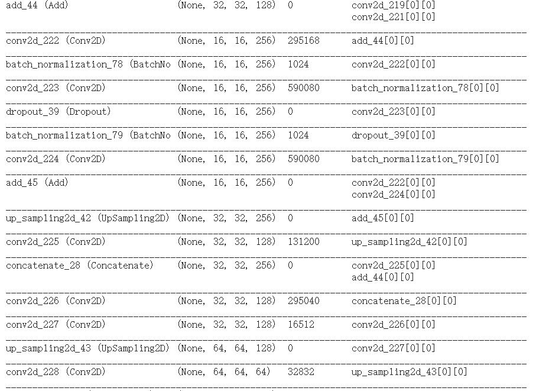
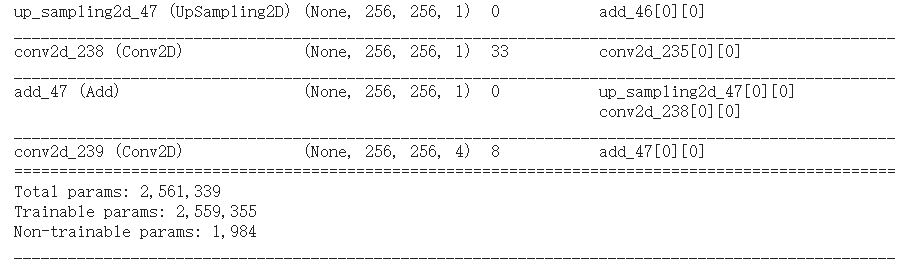

# Introduction

This is a project realted to do a segment the OASIS brain data set with an Improved UNet with all labels having a minimum Dice
similarity coefficient of 0.9 on the test set.
Under the improved_unet file it will contain two python scripy, which call Script.py and model.py

# Requirement
tensorflow = 2.3.0
python = 3.7.7

Also need to create a file under C drive call content in order to load and save the dataset

## Algorithm
In this project, I have build a improved_unet base on this paper:https://arxiv.org/abs/1802.10508v1
Here are the model summary

And the newwork architecture form the paper

