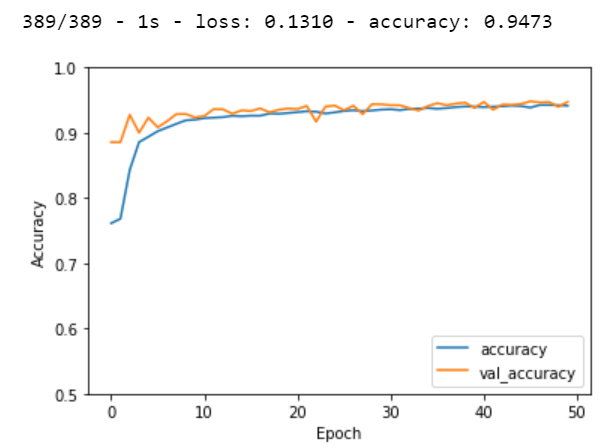

##  Improved Unet
Improved unet is an improvised form of the unet. The network follows a similar architecture to unet. It starts with a context aggregation path encoding abstract representations of the input as we go deeper into the network. This is followed by a localization pathway that recombines these representations with shallower features to precisely localize the structures of interest. Then gradient signals are injected further deep in the network through deep supervision.

#### Problem definition
The ISIC dataset is a set of dermoscopic images of skin affected by Melanoma and label images (segmented) showing the region of affected skin cells. The input image is partitioned various parts called segments. Then the important image segments are used for processing the input image. An image is a set of different pixels. The pixels that have similar attributes are grouped together using image segmentation to detect  boundaries or objects. Based on the input images, the improved unet network segments the images with the help of various sections decribed below. The performance of the improved U net is then checked with the test set. 

### Context Pathway
Context modules are used as activations in the context pathway. Each context module consists of – a 3x3 convolution layer, followed by a dropout layer with 0.3 which followed by another 3x3 convolution layer. Each convolution layer uses Leaky ReLU as the activation function for the layer. In the context pathway, the context modules are connected by 3X3 convolution layers with stride 2 hence reducing the resolution of the feature map.

### Localization Pathway

Localiaztion pathway takes the ouput of the context pathway whi9ch encode contextual information from low spatial resolution to higher spatial resolution. This is done by using a set of upsampling modules followed by localization modules. An upsample module consists of an upsampling layer with size 2 followed by a 3x3 convolution layer with Leaky ReLU as the activation function. The output of each upsampling module is concatenated with the output of the corresponding level of context aggregation pathway. This is then fed to a localization module which consists of a 3x3 convolution layer followed by a 1x1 convolution layer with Leaky ReLU activation function used for both the layers. This combination of an upsampling module, concatenation of corresponding ouput of the context pathway and localization module is repeated 4 times but the last set contains a 3x3 convolution layer in the place of a localization module.

### Deep Supervision
Deep supervision is used in the localization pathway by using segmentation layers. These segmentation layers are combined using element wise summation of the outputs of localization modules and finally this is followed by an output layer with 1 filter as we have binary classification of pixels.
Therefore in an Improved Unet there is a context pathway that encodes abstract features followed by a localization pathway that recombines the outputs of context pathway at various levels and finally deep supervision with segmentation layers.

### Visual Architecture

### Dependencies used in the algorithm 
* Numpy 
* Matplotlib
* Sklearn
* Glob 
* Tensorflow
* Keras - models , layers

### Data Preprocessing
* The images have different sizes and hence have been resized to 256x256 pixels. Both input images and label images have been resized.
* The data used for this project is the ISIC Melanoma Dermoscopy dataset. The total number of images in this dataset are 2594. This data is split into train(60%), validation(15%) and test(25%). The model  is trained on the training data and the validation set is used for calculating validation loss and validation accuracy during training.
* After training the model with the help of training and validation sets, test set is used to calculate the dice coefficient.
* The label images have 2 pixel values - 0 and 1 which makes the problem as binary classification of pixels in the image.

### Model Compliling and Building
* The model is complied using Adam's optimizer with a learning rate of 0.0001, and Binary crossentropy loss. 
* Then the model is built with 50 epochs and batch size 32. 

#### Training accuracy vs Validation accuracy

### Results

* The data seperated as test data is used for predictions and checking the closeness of the predicted values with true values of label.
* The prediction values were rounded 
* One image from the prediction was plotted

#### Prediction Image

The corresponding test label image 
#### Test Label Image

### Dice coefficient
* In order to check the performance of the model, dice coefficient was used 
* The dice coefficient obatined was - 0.84

