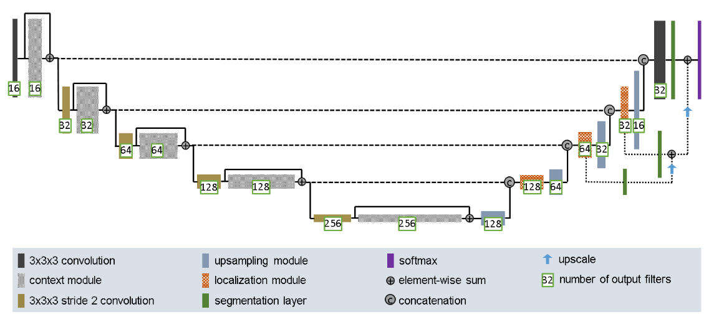
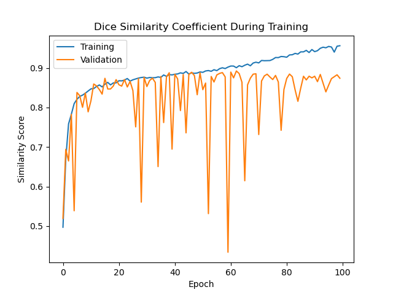
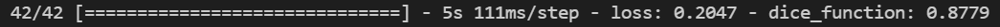
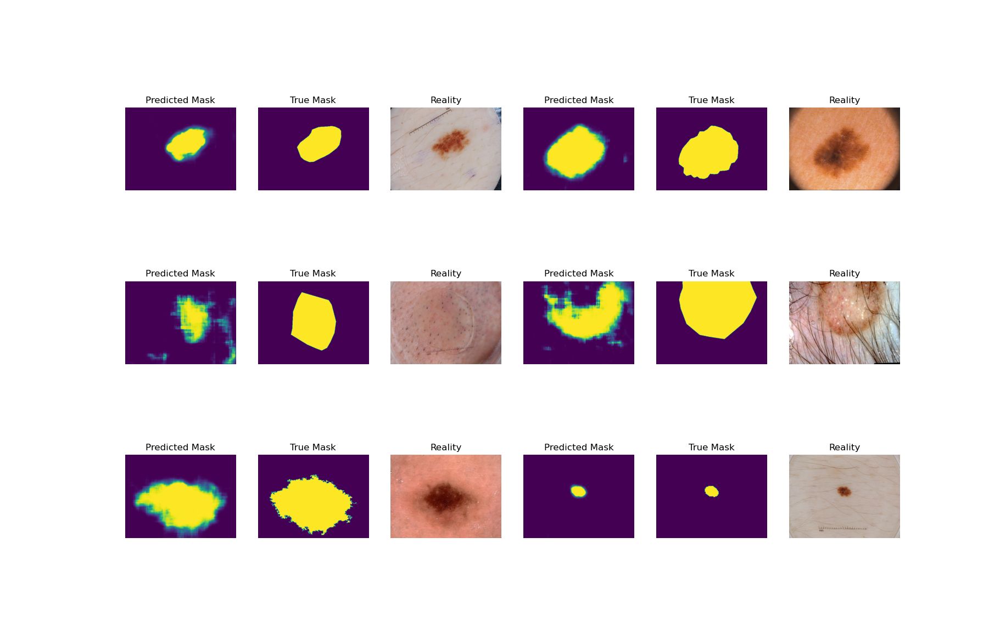
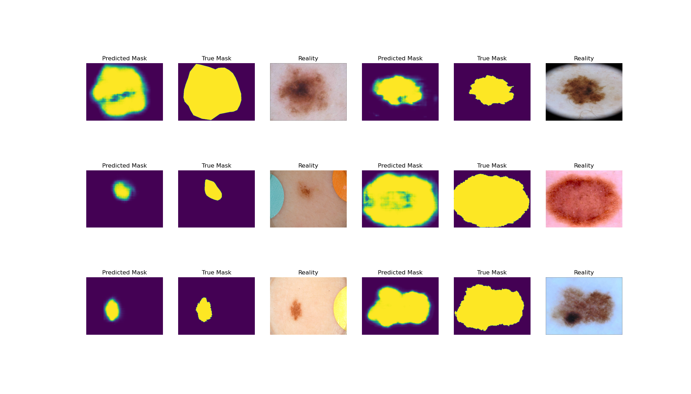

# Skin Lesion Segmentation Using the Improved U-Net

This algorithm uses the improved U-Net model as descibed by [this paper](https://arxiv.org/pdf/1802.10508v1.pdf) by Heidelburg University and Heidelburg Cancer researchers. 

# Contents Page
* [Setup](#Setup)
    * [Dependencies](#Dependencies)
    * [Usage](#Usage)
* [Network Structure](#U-Net_Structure_Details)
    * [Down-sampling](#Down-sampling_Stage)
    * [Up-sampling](#Up-sampling_Stage)
    * [Model Parameters](#Model_Parameters) 
* [Preprocessing](#Preprocessing)
* [Results](#Results)

# Setup
In this section, we will look at how to get this model up and running by using a driver script to communicate with our module.
## Dependencies 
This will be split into two sections, dependencies for the driver script, and another for the module.
### Driver Script
* [numpy](https://numpy.org/install/) - To assist loading and processing data
* [matplotlib](https://matplotlib.org/stable/users/installing.html) - To allow us to see some pretty pictures from the model
* [cv2](https://pypi.org/project/opencv-python/) - Allows us to read in images from disk
* [sklearn](https://scikit-learn.org/stable/install.html) - To split the data into train/test/validation splits
### U-Net Module
* [tensorflow](https://www.tensorflow.org/install) - To build and train the U-Net

Note: It is recommended to use a virtual environment such as one created by [Miniconda](https://docs.conda.io/en/latest/miniconda.html) which allows easy installation of the GPU version of Tensorflow 2 and other dependencies.

## Usage
To run the driver script, simply call `main.py` using Python and it will run for you. Although, by taking a look at the driver code, you will see several options which might be handy if tweaking the model. Firstly, the `main()` function has a parameter called `debugging` which by default is set to `False`. This setting will make the program only process 1/4 of the provided dataset. This is useful if you don't want to sit around and load in the whole dataset every time you run the driver! Other options include the `fit` parameter to the `fit_or_load()` function. This is set to `True` by default which means that the model will be fitted (trained) on the data when the driver runs however, if you already have a trained model, change this setting to `False` and the driver will automatically load your weights and skip the training step.

Inside the `unetModule.py` file, you will see that the Improved U-Net model is defined as a class. This allows for easy access to each of it's paramters as descibed in the [Model Parameters](#Model_Parameters) section.

# U-Net Structure Details
The name U-Net comes from the shape because the network appears in the shape of the letter "U" and is comprised of two main sections: the down-sampling stage and the up-sampling stage. Below is the network structure as described on page 4 (Fig. 1). The goal of this particular implementation is to segment skin lesions from medical images provided by the ISIC 2018 challenge dataset.

### Down-sampling Stage
Here, we take the image we want to segment and feed it into the network. It then passes through several two-dimensional convolution layers ([Conv2D](https://keras.io/api/layers/convolution_layers/convolution2d/)) which shrinks the image resolution and increases the number of filters which provides information. Notice in the figure above that there are several connections which jump over the context modules. These help retain some information from before the convolutions and therefore help with performance of the model.

### Up-sampling Stage
After the image has been processed by the down-sampling stage, we move to up-sample the image back to its original resolution. We introduce up-sampling modules witch apply a transposed two-dimensional convolution ([Conv2DTranspose](https://keras.io/api/layers/convolution_layers/convolution2d_transpose/)) which increases the resolution such that it matches the previous level of the U-Net. After this up-scale, a skip connection is created by concatenating the down-sampling level with the same up-sampling level. On levels 2 and 3 - starting at 1 from the top - we add in segmentation paths which extract segmentations of the images at each of those levels, and add them together to produce the final image we see. These connections are extremely useful and provide the U-Net with much better performance.

### Model Parameters
There are several parameters used in the model's creation which are vital to having it converge using training. The parameters seen by default in the module are as follows.
* `learning_rate` : Default is 1e-4. This controls how fast the model will change over time, so we want choose a "small enough" number.
* `optimizer` : Default is `Adam` with a learning rate of 1e-3. The [Adam](https://keras.io/api/optimizers/adam/) optimiser is a fairly standard optimiser which worked well in training.
* `loss` : Default is "binary_crossentropy". This was chosen because we are only classifying pixels as two classes: either "lesion" or "not lesion" for the segmentation. If there were more classes, we would use "categorical_crossentropy".
* `leaky` : Default is 1e-2. This controls the `alpha` parameter in the [LeakyReLU](https://keras.io/api/layers/activation_layers/leaky_relu/) layer which acts as the activation in this model.
* `drop` : Default is 3e-1. This conrols the drop-out percentage in the [Dropout](https://keras.io/api/layers/regularization_layers/dropout/) layers.

# Preprocessing
The dataset used in this model is the [ISIC 2018 Melanoma Dermoscopy Dataset](https://challenge2018.isic-archive.com/). Some preprocessing had already been done since there were two folders: one containing the medical images in RGB format, and the other containing the "true masks" of each of the medical images. These two folders are the inputs and labels respectively. 

As what is common practice in machine learning, the image-label pairs were split into training, testing and validation sets. This helps us create a model which is more accurate on images which it has not seen before. In the driver file, you will be able to see that the split sizes relative to the whole dataset are, 60%-16%-24% for training, testing and validation respectively. The reason for this split is we want the majority of the data being used for training but still having a good proportion left for validation. Lastly, we have a bit of data left over from which we can test our model on.

# Results
After training an instance of the U-Net, we get a plot of the [dice coefficient](https://en.wikipedia.org/wiki/S%C3%B8rensen%E2%80%93Dice_coefficient) which shows the similarity score on the training and validation set. This graph can be seen below.

The model was also evaluated on the test set and the resulting dice coefficient was above 0.8 which is a great result. 

Here is a plot of the predicted image segmentation from the model, compared with the true mask and the full RGB image. This is the test set so the model has not seen these images before. 

In the first set of images, we see strange artifact patterns which is most likely due to the Conv2DTranspose layers. The paper for this model noted that they used [up-sampling layers](https://keras.io/api/layers/reshaping_layers/up_sampling2d/) to avoid this "checkerboard" effect. The second set of images seem to be less affected by the artifacts but you can still see a little bit of it happening. 

Full training output can be seen in the "output.txt" file.