# A generative model of the OASIS brain by DCGAN


## Overview
Tensorflow implementation of Deep Convolutional Generative Adversarial Networks 
which is a stabilize Generative Adversarial Networks.   
Both models are trained simultaneously through the confrontation process. 
A generator ("artist") learns to create images that look real, while a judge ("art critic") 
learns to distinguish between true and false images.  
During training, the generator gradually becomes stronger in generating brain images, 
while the judge gradually becomes stronger in its ability to identify these images. 
The training process is balanced when the judge is no longer able to distinguish between real and fake images.  
Structural similarity index(SSIM) is a measure of how similar two digital images are. 
When one of the two images is a distortion-free image and the other is a distorted image, 
the structural similarity of the two can be regarded as an image quality measure of the distorted image.

## Prerequisites
Python 3.3+  
Tensorflow 2.0+  
tqdm  
numpy  
dataset:The OASIS brain  

## My algorithm

### Discriminator
```
model = Sequential()  
model.add(Conv2D(128, (5,5), padding='same', input_shape=in_shape))  
model.add(LeakyReLU(alpha=0.2))  
model.add(Conv2D(128, (5,5), strides=(2,2), padding='same'))  
model.add(LeakyReLU(alpha=0.2))  
model.add(Conv2D(128, (5,5), strides=(2,2), padding='same'))  
model.add(LeakyReLU(alpha=0.2))  
model.add(Conv2D(128, (5,5), strides=(2,2), padding='same'))  
model.add(LeakyReLU(alpha=0.2))  
model.add(Conv2D(128, (5,5), strides=(2,2), padding='same'))  
model.add(LeakyReLU(alpha=0.2))  
model.add(Flatten())  
model.add(Dropout(0.4))  
model.add(Dense(1, activation='sigmoid'))  
opt = Adam(lr=0.0002, beta_1=0.5)  
model.compile(loss='binary_crossentropy', optimizer=opt, metrics=['accuracy'])  
```

### Generator
```
model = Sequential()  
n_nodes = 128 * 16 * 16  
model.add(Dense(n_nodes, input_dim=latent_dim))  
model.add(LeakyReLU(alpha=0.2))  
model.add(Reshape((16,16, 128)))  
model.add(Conv2DTranspose(128, (4,4), strides=(2,2), padding='same'))  
model.add(LeakyReLU(alpha=0.2))  
model.add(Conv2DTranspose(128, (4,4), strides=(2,2), padding='same'))  
model.add(LeakyReLU(alpha=0.2))  
model.add(Conv2DTranspose(128, (4,4), strides=(2,2), padding='same'))  
model.add(LeakyReLU(alpha=0.2))  
model.add(Conv2DTranspose(128, (4,4), strides=(2,2), padding='same'))  
model.add(LeakyReLU(alpha=0.2))  
model.add(Conv2D(3, (5,5), activation='tanh', padding='same'))  
```

### SSIM
```
required_size=(256, 256)  
max_ssim = 0  
ssim_list=[]  
k = 0  
for filename in listdir(directory):  
	k+=1  
	if k == 500:  
		break  
	pixels = load_image(directory + filename)  
	image = Image.fromarray(pixels)  
	image = image.resize(required_size)  
	brain = asarray(image)  
	brain= tf.convert_to_tensor(brain)  
	img= tf.convert_to_tensor(img)  
	brain = tf.cast(brain, dtype= tf.float32)  
	res=tf.image.ssim(img, brain, 255)  
	res=res.numpy()  
	ssim_list.append(res)  
	max_ssim=max(res, max_ssim)  
```

## How to run
Here are three scipts. 
'prepare.py' is used to generate a .npz file which contain 5000
picture picked in OASIS brain train dataset.
Run 'DCGAN.py' to generate and save model which format is 'generator_model_'  + SSIM.
'SSIM.py' is used to test model and check the model, then save the first ten image 
by 'generated_plot ' + number.

## Out Example
The result summarized every two epoches.    
Here are the example of the result and the best model 
I got.  
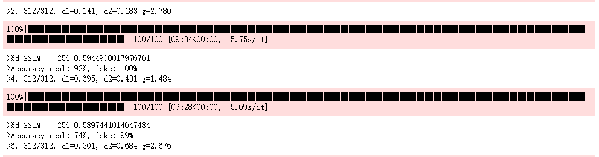
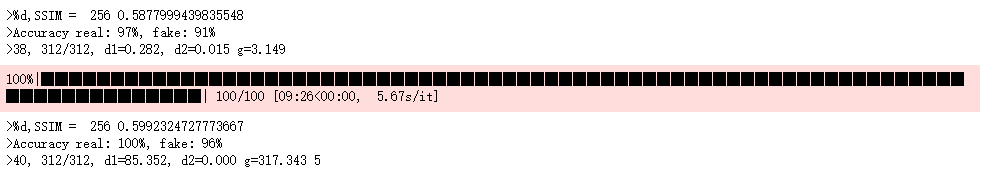
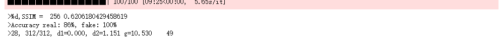


## Test in SSIM
Here are the result of test. And the images generated by 
the best model(epoch = 28 ,SSIM = 0.621).

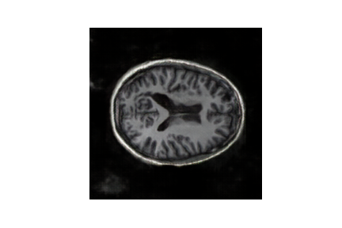
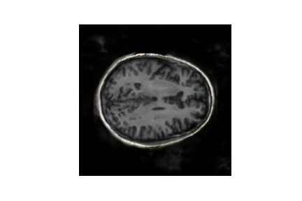
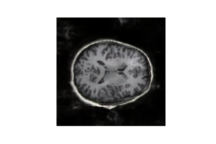
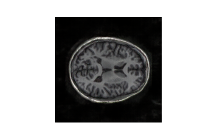
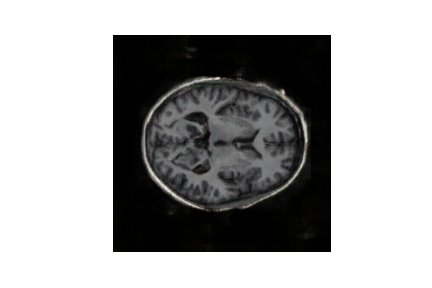
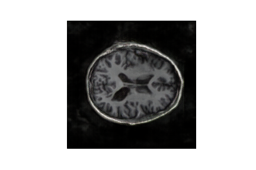
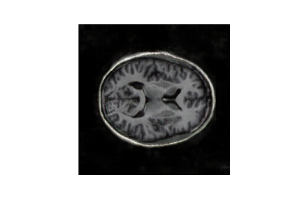
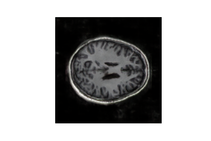
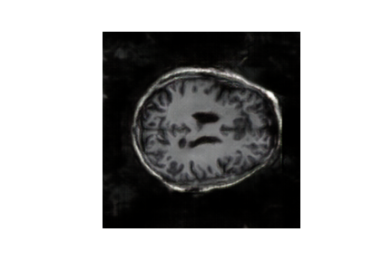
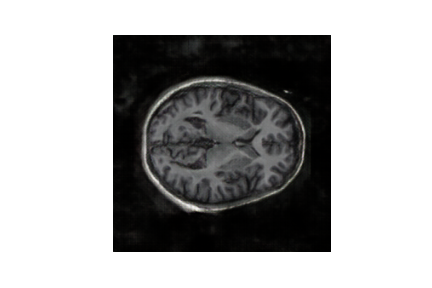

## Author
Tianfang Zhou. Student ID: S4598165