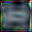
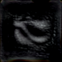
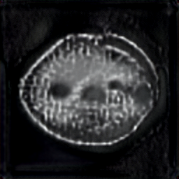
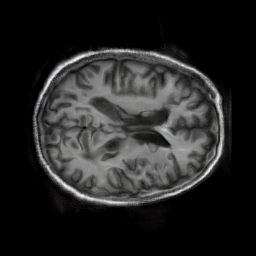
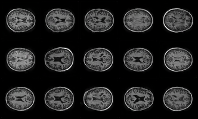
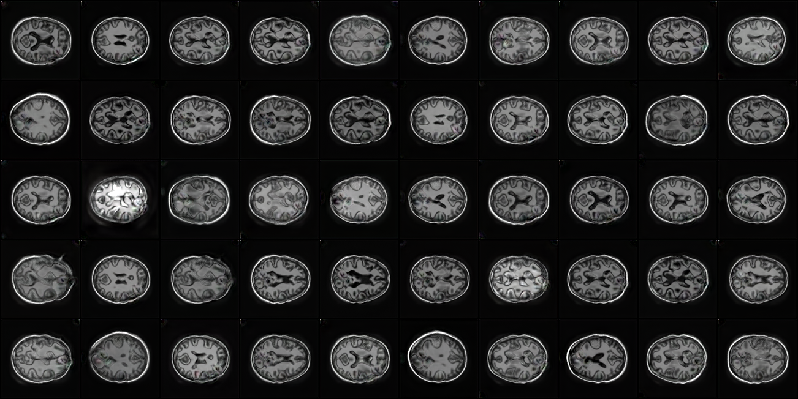
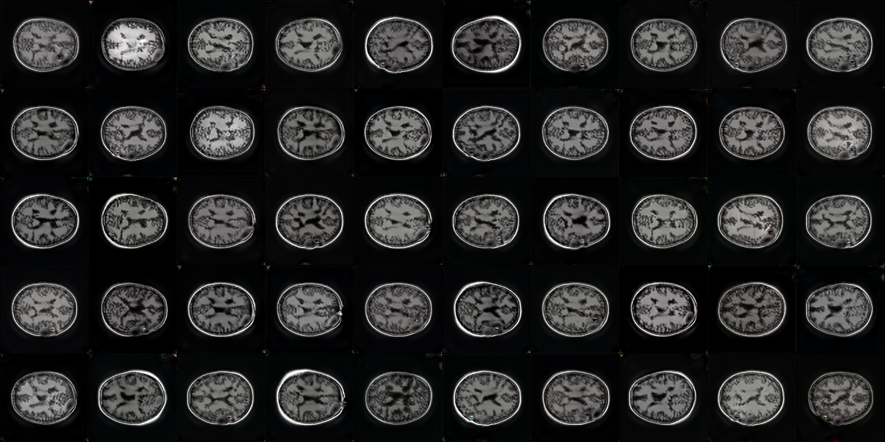
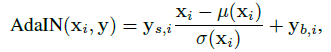

# StyleGan_Oasis

This project is an unofficial implementation of StyleGan based on the Oasis brain dataset.

Reference: https://github.com/rosinality/style-based-gan-pytorch.git ,  https://github.com/SiskonEmilia/StyleGAN-PyTorch.git

Original Paper: https://arxiv.org/abs/1812.04948

## Introduction

"Style" in StyleGAN here refers to the main attributes of the brain region in the data set, where Style refers to the style of the brain structure, such as brain gray matter, brain lesions, etc. 

StyleGAN uses **style** to affect rough information such as brain size and shape, and uses **noise** to affect the details of the cross-section of the brain.

## Dataset

The OASIS datasets hosted by central.xnat.org provide the community with open access to a significant database of neuroimaging and processed imaging data across a broad demographic, cognitive, and genetic spectrum an easily accessible platform for use in neuroimaging, clinical, and cognitive research on normal aging and cognitive decline. All data is available via [www.oasis-brains.org](https://www.oasis-brains.org/).s

## Requirements

- Python3

- Pytorch >= 1.0.0
- lmdb
- tqdm

## Usage

- ### Prepare the data

  ```
  !python prepare_data.py --out LMDB_PATH --n_worker N DATAPATH
  ```

  This step will generate a LMDB Dataset for training

- ### Training StyleGan(Driver.script)

  To start train, use `path=LMDB_PATH`in train_stylegan.py.

  ```
  !python train_stylegan.py
  ```

  ### Generate Pictures

  Run generate_mixing.py , note that default parameters should be changed

  `size=64`
  `n_row=1`
  `n_col=5`
  `path=model.path`
  `mixing=True`
  `num_mixing=20`

  ```
  !python generate_mixing.py
  ```

- ### Train from pre-trained model

​        To continue training from previous training -model ,change default `ckpt=pre-trained.model` in train_stylegan.py. 

- ### During Training Process--examples

  

  

  

- ### Some Generate Samples --style mixing

  #### 64*64 images

  

  #### 128*128 images

  

  
  
  #### 256*256 images
  
  
  
  

## Model Structure

### Overview


**Mapping network** --- **latent code**

Mapping network changes the latent code **z** into **w**. In GAN, z is a random vector that conforms to a uniform distribution or a Gaussian distribution. The Mapping network consists of 8 fully connected layers. Through a series of affine transformations, w is obtained from z, and this w is converted into style Y=(Ys,Yb), combined with the AdaIN (adaptive instance normalization) style transformation method:



**Style-mixing**

The style-mixing part is the biggest difference compared to GAN. The specific method of style-mixing is to input two different latent codes ***z1*** and ***z2*** into the mapping network, and get ***w1*** and ***w2*** respectively, which represent two different styles, and then randomly select an intermediate intersection point in the synthesis network. Use ***w1*** for the part before the intersection and ***w2*** for the part after the intersection. The generated image should have both source A and source B features.

### Parameters

|    Parameter    |                         Description                          |
| :-------------: | :----------------------------------------------------------: |
|      n_gpu      |            number of GPUs used to train the model            |
|     device      |          default device to create and save tensors           |
|  learning_rate  | a dict to indicate learning rate at different stage of training |
|   batch_size    | a dict to indicate batch size at different stage of training |
| mini_batch_size |                      minimal batch size                      |
|      n_fc       |    number of layers in the full-connected mapping network    |
|   dim_latent    |                  dimension of latent space                   |
|    dim_input    |             size of the first layer of generator             |
|    n_sample     |    how many samples will be used to train a single layer     |
|      step       |                which layer to start training                 |
|      ckpt       |                    checkpoint model file                     |
|      Path       |                    Data file path --LMDB                     |
|    max_step     |      maximum resolution of images is 2 ^ (max_step + 2)      |
|      loss       |             Options: wgan-gp,r1,Default=wgan-gp              |
|     mixing      |      Whether to use mixing regularization, Default=True      |
|    n_critic     | How many times the discriminator is updated every time the generator is updated |

