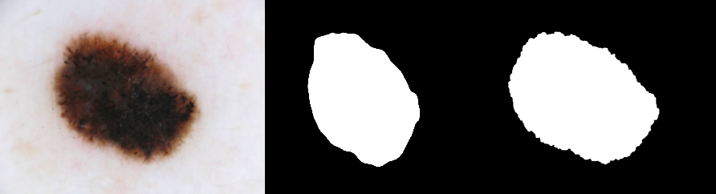
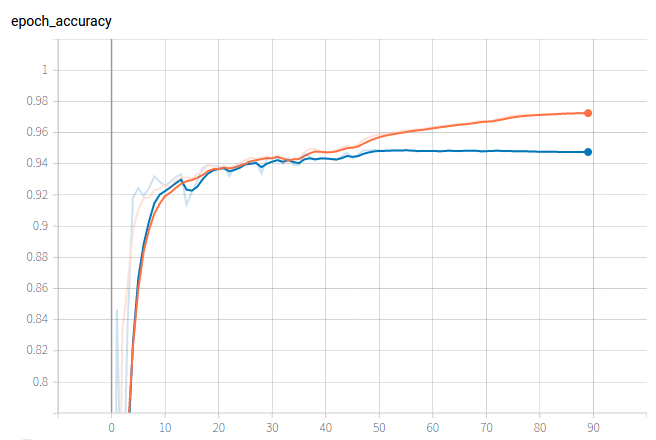
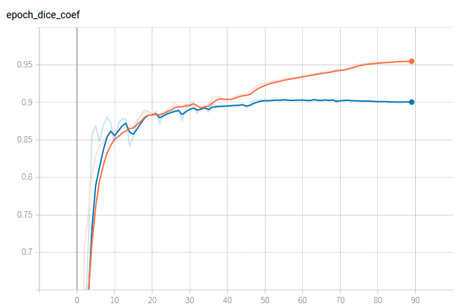
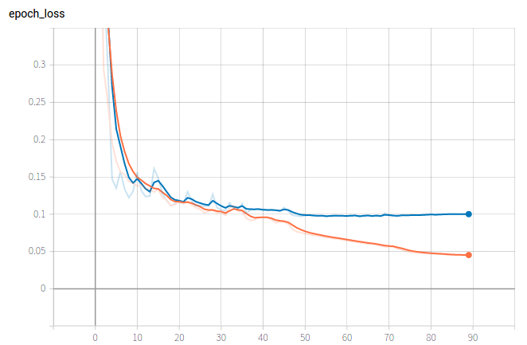
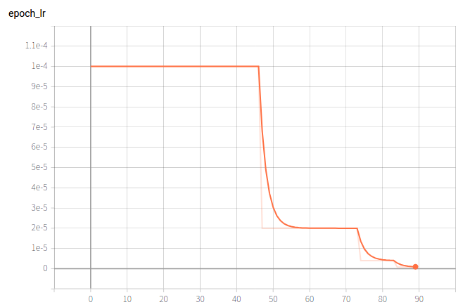

# Improved Uneter
## 1. Requirements   
 ```bash
 tensorflow>=2.2
 scikit-learn
 numpy
 cv2
 ``` 

## 2. Algorithm Description   
 In today's society, the use of neural networks has become more and more extensive, and the combination of neural networks with other industries, such as medicine, is also more and more extensive. In this report, UNET model was used to identify and analyze the skin lesion area, and the lesion area in the image was effectively extracted through UNET.The model is used to automatically predict the segmentation boundary of skin lesions. In the end, we hope that the trained model can separate the lesion area by recognizing the picture, and the classification accuracy can exceed 0.8.
### Model
 
 We use the Unet model to classify the ISIC data set, and separate the skin lesions by identifying pictures. The architecture was inspired by [U-Net: Convolutional Networks for Biomedical Image Segmentation](http://lmb.informatik.uni-freiburg.de/people/ronneber/u-net/).  

 The above is the original model structure proposed in the paper. On the basis of the original model, I modified the four copy and crop and added a 2x2 convolution layer. Using ISIC2016 data set for training, dice loss is used as the loss function, and dice similarity coefficient is used as the evaluation standard. The score of 0.88 is achieved in ISIC16 test set.

### DataSet
 The [Data](https://challenge2018.isic-archive.com/) we used were from the ISIC data set from 2016 to 2018. The data in this dataset is 256 by 256, and then we will split the data set. The ratio of the training set to the test set is 9 to 1.

### Result
Here are the test results,the final result is shown here, where the diseased areas of the skin are better identified.
From left to right are test.jpg pre.jpg mask.jpg
 
Here's the visualization.




 


## 3. Train
1. Download the dataset and unzip it under datasets
```
wget https://isic-challenge-data.s3.amazonaws.com/2016/ISBI2016_ISIC_Part1_Training_Data.zip
wget https://isic-challenge-data.s3.amazonaws.com/2016/ISBI2016_ISIC_Part1_Training_GroundTruth.zip
wget https://isic-challenge-data.s3.amazonaws.com/2016/ISBI2016_ISIC_Part1_Training_GroundTruth.zip
wget https://isic-challenge-data.s3.amazonaws.com/2016/ISBI2016_ISIC_Part1_Test_GroundTruth.zip
```
2. Install the libraries necessary to run the code
3. 
```
python train.py --batch_size 16 --data_dir datasets --workers 8 --epochs 100 --lr 0.0001 --logs ./logs 
```
