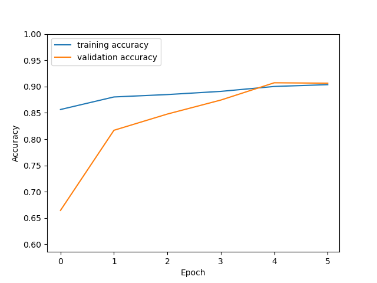

# Segmentation of ISICs dermatology dataset with UNet

Author: Matthew Jones (44335706)

Date: 2020-11-07

This module uses an improved UNet structure to segment the ISICs 2018 dermatological dataset into foreground and background segments. This module was written to solve the 4th problem which aims to have a minimum Dice similarity coefficient of 0.8 on the test set which this model structure has achieved in every training thus far. Admittedly the model does reduce all inputs to a size of 256 x 256 pixels which helps boost accuracy paticularly of larger images. Below this are the dependencies that the module requires in order to operate, usage of the test_driver.py script and the internal workings of the algorithm.

### Dependencies
The following packages are required to run the module correctly
- Tensorflow
- Numpy
- Matplotlib
- Scikit-image
- Scikit-learn

Note that the model relies on Tensorflow only with the remaining packages used to process or display the data.

### Usage
The module can be triggered using the `test_driver.py` script file.
The script is designed to be run from a terminal with commandline arguments as:

```py test_driver.py x_data_path y_data_path x_file_ext y_file_ext num_epochs batch_size```

Parameters:
- `x_data_path` path to the x data folder
- `y_data_path` path to the y data folder
- `x_file_ext` file extension of the x data (e.g. jpg)
- `y_file_ext` file extension of the y data (e.g. png)
- `num_epochs` number of epochs to train the model for
- `batch_size` number of images per batch

### Methodology
An explanation of the inner-workings of the model and the techiques employed.

#### Data Processing
The images were all resized to 256x256 to give them a uniform standard shape well suited to a convolutional neural net.

**Original image and segmentation**

 

**Resized image and segmentation**

 

#### Data Splits
The data was split into portions of 
- Training data (80%)
- Validation data (10%)
- Test data (10%)

These were chosen because the dataset only contains 2594 images and so is not tiny but still a somewhat small dataset. Cross-validation or other methods such as bootstrapping were not used as they were deemed unnecessary but could be added to boost training size. These images were provided to the model using a custom Keras Sequence class named iunet_sequence that provides the data in batches and avoided loading too many images into memory at once. 

#### Model Structure
These images were fed into the model structure as can be seen below:


The model has a depth of three and has managed to achieve DICE similarity scores as high as 0.9125 on the test set. Below we can see the accuracy of the model with only 6 epochs.

 

We also see the corresponding accuracy on the test dataset of 0.8951


We can see an example of a the model's output compared to the true segmentation (note that this was only a partially trained model)


 

