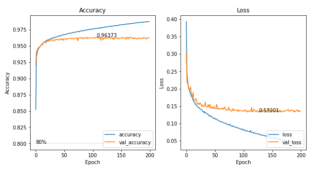
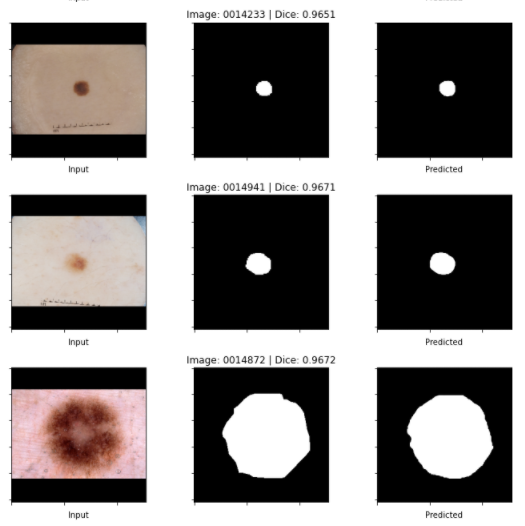
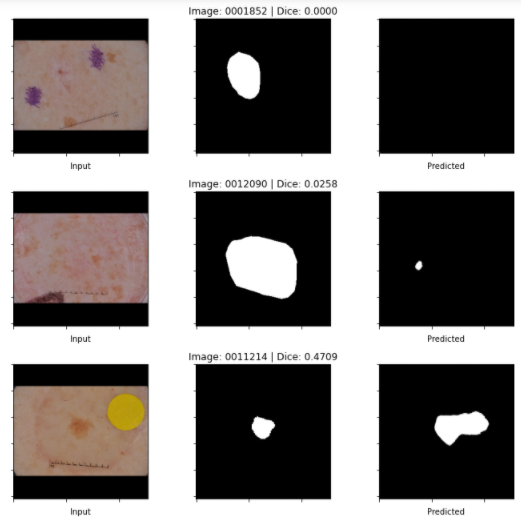
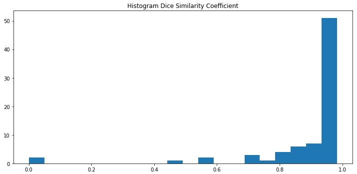

# Segmentation of ISIC data set using an improved UNet
This module has three scripts: **segment.py** which holds the 
algorithm specific functions and classes  required for image 
segmentation, **driver_train_save_evaluate.py** and 
**driver_load_evaluate.py** which act as test scripts 
to run algorithm specific code in a tensorflow GPU 
virtual environment.

The module created was specifically designed for the segmentation 
of skin irregularities occurring in images from the ISIC data set. 
This segmentation is done using a Convolutional Neural Network 
(**CNN**) structure known as a **UNet**. The UNet used has been 
modified using pre-activation residual block context module's in 
feedback to store high resolution information unlike skip connections
 like a classical UNet where high resolution information is lost.
Coloured images are given as input images in addition to black and white
(binary) segmented masks corresponding to the input images, known as target
images. The CNN maps the relationship between the input and target images.
From this, the UNet can predict from new test input data (coloured images) 
what their corresponding segmentation mask should look like. The driver scripts 
show example usage of the algorithm specific implementation of the 
segmentation. The **driver_train_save_evaluate.py** script loads 
input and target images, trains a UNet model, saves it to storage then 
evaluates the accuracy of the predicted output segmentation masks of a 
new test set of data. The **driver_load_evaluate.py** script loads in a 
pre-trained UNet and evaluates the accuracy of the predicted output 
segmentation masks of a new test set of data. 

A model was trained with the **driver_train_save_evaluate** script for 200
epochs, Adam's optimizer (learning rate = 1e-6), 2014 training images and 
503 validation images with a test set of 77 images. The average dice 
similarity coefficient was **0.85**. Below is shown the output from 
the **results** function from **segment.py**. 



This image shows the accuracy and loss tracked over the course of the training
history




This image shows the output from four input test images (if run in 
a jupyter notebook and the **num_imgs** argument is set to the number of images 
that occur in the test predictions output, then all test prediction outputs can
be seen)



This image shows terminal outputs of the worst few images from the prediction,
it shows that not all images are segmented correctly.



This image is a histogram of the distribution of the dice similarity
coefficient's for all images in the test set with their corressponding
output prediction's from the UNet


## segment.py
A few of the important functions from **segment.py** 
module created are described:
* **load_input_image**, **load_segmented_image**: Load images 
from storage into RAM or image generators,
* **inspect**: Inpect images to determine occurrence of appearing 
image sizes,
* **train_val_test_split**: Split single data set into training, 
validation and test data set's,
* **create_generator**: Create image generators compatable with 
**tensorflow.keras.Model** methods for training as some 
data sets do not fit completely into RAM,
* **create_model**: Create a typical UNet CNN model for training, prediction
 and evalutions of image data, 
* **train_model**: Train a new or pre-trained model, 
* **save_model**: Save a model instance,
* **load_model**: Load a model instance, and
* **results** Display the **Dice Similarity Coefficients** of target
 segmentation images and their trained model prediction 
 output counter-parts, show several test prediction outputs and show
 the distribution of dice similarity scores of the test prediction's. 
 
## driver_train_save_evaluate.py
This script trains a UNet CNN from the images supplied to it, 
saves the trained UNet model to storage (if given a filename 
to save to) and finally evaluates the model with a test set 
and displays the results. The test set is independent to the 
training and validation sets used to train
the model.

The flow of control is as follows:
1. Load the ISIC image data set filename's
2. Inspect the sizes of the image files corresponding to the 
filename's (if inspect flag set "True")
3. Plot the occurrence of image size's (if inspect flag 
set "True")
4. Create train, validation and test split of the ISIC dataset
5. Create image generators for each dataset split
6. Create a new UNet model
7. Train the model for the supplied number of epoch's
8. Give a test set to the trained model and receive predicted output's
from the model
9. Display the results on the test set of images and their model 
predicted counterpart's

## driver_load_evaluate.py
This script trains a UNet CNN from the images supplied to it, 
saves the trained UNet model to storage (if given a filename 
to save to) and finally evaluates the model with a test set 
and displays the results. The test set is independent to the 
training and validation sets used to train
the model.

The flow of control is as follows:
1. Load the ISIC image data set filename's
2. Inspect the sizes of the image files corresponding to the 
filename's (if inspect flag set "True")
3. Plot the occurrence of image size's (if inspect flag 
set "True")
4. Load a pre-trained model from the supplied filename
5. Give a test set to the trained model and receive predicted output's
from the model
6. Display the results on the test set of images and their model 
predicted counterpart's

## Envirnoment setup used:
```console
mkdir D:\s4354061
cd D:\s4354061
conda create -y --prefix D:\s4354061\venv tensorflow-gpu
conda activate D:\s4354061\venv
conda install ipykernel -y
python -m ipykernel install --user --name venv --display-name "Python (venv)"
pip install matplotlib
pip install tensorflow_datasets
pip install sklearn
```
 
