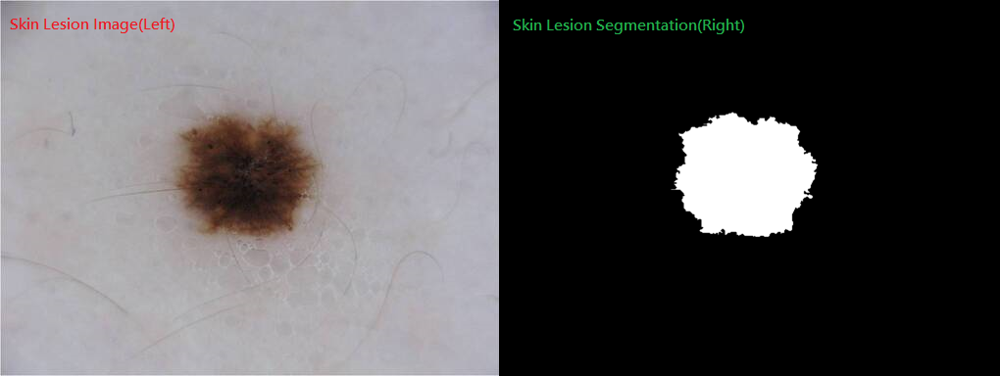
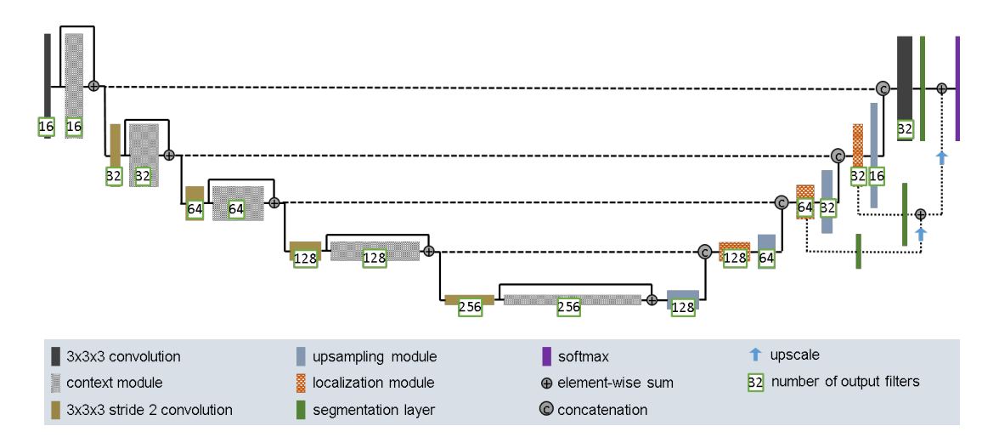

# ISICs Dataset Segmentation with Improved UNet

## Author
**Name:** Jeng-Chung, Lien 
**Student ID:** 46232050 
**Email:** jengchung.lien@uqconnect.edu.au

## Introduction
The International Skin Imaging Collaboration (ISIC) is an international effort to improve melanoma diagnosis. Melanoma is the deadliest form of skin cancer which is a major public health problem. The objective here is to used an Improved version of the UNet based model inspired from the paper [[1]](#reference_anchor1) to perform image segmentaion on the ISICs dataset and achieve a [Dice similarity coefficient](https://en.wikipedia.org/wiki/S%C3%B8rensen%E2%80%93Dice_coefficient) greater than 0.8 on the test set.

## ISICs Dataset
The dataset here to perform the segmentation task is from the [ISIC 2018 challenge](https://challenge2018.isic-archive.com/). The preprocessed version of this dataset contains 2,594 samples. Each sample is a pair of the skin lesion(skin cancer) image and the true label of the skin lesion segmentaion(the target). An example of the sample "ISIC_0000001" in the dataset is shown below, with the skin lesion as the input on the right and the skin lesion segmentation as the target output on the right.

**ISIC_0000001 sample in ISICs dataset example:**

### Data preprocessing
1. **Image Shape Inconsistent:** The images in the 2,594 samples given above has inconsistent image shapes across all samples. For example images with a heightxwidth of 384x511, 768x1024, etc are observed. To keep information consistent across all samples and to fit the same image shape into the model, a reshape transform of the images are needed. The maximum shape of 256x256 to reshape all images as a square image is performed on the dataset, it is calculated as finding the minimum image shape across all samples and fitting a maximum possible square image shape.
2. **Train, Validation and Test Set Split:** A train, validation and test set split is performed on the dataset. A train set 60% of the whole dataset, the train set is the dataset to train the model. A validation set 20% of the whole dataset, the validation set is the dataset to validate how a model performs when training. A test set 20% of the whole dataset, the test set is the dataset to evaluate what is close to the ture performance of the model on unkown data distribution.

## Improved UNet Model
The Improved UNet model is an improved UNet based model architecture inspired from the original UNet paper [[2]](#reference_anchor2). It is using the U-shape architecture from the original UNet with some additional layers and skip connections across different levels of the netowrk. The Improved UNet model is originally used in the paper [[1]](#reference_anchor1) to deal with a three dimensional image input on brain tumor segmentation. Here the skin lesion segmentation would be performed using this inspired Improved UNet model architecture shown below.

**Improved UNet Model Architecture from [[1]](#reference_anchor1):**

The Improved UNet architecture mentioned above uses a 3x3x3 convolution which is a 3D convolution with a 3D input. Since our dataset is using a 2D image as an input, we will be changing the 3D convolution to a 2D convolution with a 3x3 convolution. To describe clearly what an Improved UNet architectue is shown in the architecture image above, we will be splitting it into three parts to explian it's architecture. First, the left side of the U-shape. Second, the right side of the U-shape. Last, the segmentation level.
1. **U-shape Left Side:**
    * **Description**: The U-shape Left Side area shown in the architecture above is first taking the skin lesion image(256x256x3 image) as input and passing it through a 3x3 convolution then a context module. There will be a short skip connections using an element-wise sum adding the 3x3 convolution output with the context module output. Then this will then be connected to a 3x3 stride 2 convolution to reduce the filter shape output. The 3x3 stride 2 will then be connected to another context module. This 3x3 stride 2 convolution with the context module will also have an element-wise sum skip connection. This would be repeatedly perform on different levels of the network. Starting from the first level the convolution and context modules will all be using 16 filters where going down to different levels of the network the numbers of filters will double over levels.
    * **Components**:
        * **3x3 convolution:** This performs a 2D convolution with a kernal size of 3x3 using a zero padding to output the same shape as the input with stride one which the input shape and output shape would be the same. Then connected to an instance normalization layer and a leaky relu activation function with a negative slope of 0.01.
        * **3x3 stride 2 convolution:** This performs a 2D convolution with a kernal size of 3x3 using a zero padding to output the same shape as the input with stride two which the output shape would be half of the size of the input shape. Then connected to an instance normalization layer and a leaky relu activation function with a negative slope of 0.01.
        * **context module:** The context module is in a sequence of the layers connected as, a 3x3 convolution connected to a dropout layer with a dropout rate of 0.3 then connected to a 3x3 convolution.
2. **U-shape Right Side:** 
    * **Description**: The U-shape Right Side area shown in the architecture above is first taking the U-shape Left Side output as the input. It is connected to an upsampling module to upscale the filter shape, which the output shape would be double the size of the input shape. This upsampling module is then concatenate with the short skip connections output from the U-shape left side as a long skip connections. This then is connected to a localization module. This would repeatedly perform on the bottem level of the network then up untill the second level of the network. Starting from a filter size of 128 halving the number of filters of the upsampling module and localization module on different levels of the network. Where in the first level of the network, instead of using another localization module, a 3x3 convolution with 32 filters would be used.
    * **Components**:
        * **upsampling module:** The localization module is in a sequence of the layers connected as, an upsampling layer doubling the input shape as the output shape connected to a 3x3 convolution.
        * **localization module:** The localization module is in a sequence of the layers connected as, a 3x3 convolution connected to a 1x1 convolution.
3. **Segmentation Level:** 
    * **Description**: The Segmentation Level area shown in the architecture above takes the localization module output in the thrid and second level of the network and passes through a segmentation layer. The thrid level segmentation layer is then upscale to the same shape as the second level segmentation layer and an element-wise sum is performed as a short skip connection. This then is peformed on an upscale and element-wise sum with the first level 32 filters 3x3 convolution output through a segmentation layer. Last this short skip connection then is going thorugh a sigmoid as a final output instead of a softmax since it is using only one class as a 2D output with convolutions to get the segmentation(256x256x1 image).
    * **Components**:
        * **segmentation layer:** This performs a 2D convolution with a kernal size of 1x1 using a zero padding to output the same shape as the input with stride one which the input shape and output shape would be the same. Then connected to an instance normalization layer and a leaky relu activation function with a negative slope of 0.01.
        * **upscale:** An upsampling layer doubling the input shape as the output shape.
        * **sigmoid:** This performs a 2D convolution with a kernal size of 1x1 with stride one which the input shape and output shape would be the same. Then connected to a sigmoid activation function as the final output.

## Reference
[1] F. Isensee, P. Kickingereder, W. Wick, M. Bendszus, and K. H. Maier-Hein, “Brain Tumor Segmentation and Radiomics Survival Prediction: Contribution to the BRATS 2017 Challenge,” Feb. 2018. [Online]. Available: [https://arxiv.org/abs/1802.10508v1](https://arxiv.org/abs/1802.10508v1) 
[2] O. Ronneberger, P. Fischer, and T. Brox, “U-Net: Convolutional Networks for Biomedical Image Segmentation,” May. 2015. [Online]. Available: [https://arxiv.org/abs/1505.04597](https://arxiv.org/abs/1505.04597)