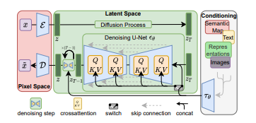
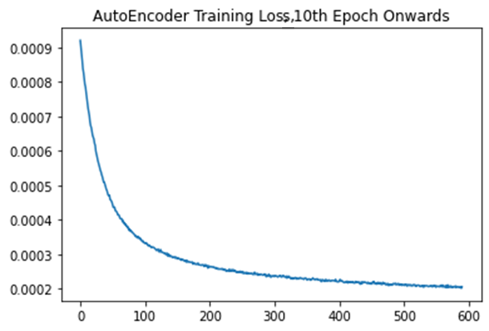
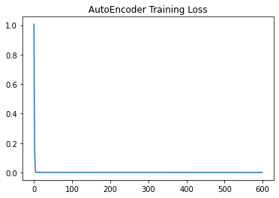
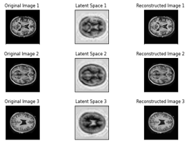
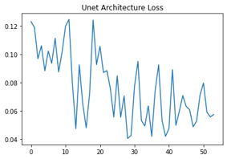
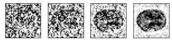

# Stable Diffusion Implementation on the OASIS Brain MRI Dataset

Student: Daniel Ju Lian Wong
<br>
Student ID: 46069340

Diffusion Models are a relatively new generative model that operate by training a neural network to reverse a sequence of noise additions to some dataset. These models have shown a lot of promise with regards to image generation.

A recent development in Diffusion Model architectures is Latent Diffusion Models. Latent diffusion models involve finding training a diffusion model
not on some original dataset, but rather a latent representation of the same
data set. A specific implmentation of Latent Diffusion Models that has gained
popularity recently is Stable Diffusion, a specific implementaion of latent
diffusion using an autoencoder with a downscaling factor of 8 to generate the
latent representation, 

## Algorithm Description

The implemented latent diffusion model can be broken down into two parts:
  1. An AutoEncoder with a downsampling factor of 4
  2. A Unet neural network trained to denoise the latent representation of input images

For a broad overview of the model, see below (note that this implemnetaiton lacks the crossattention blocks and conditioning component, as the task involved only generating new images from the OASIS brain dataset)
<br>

<br>
Image from: https://arxiv.org/pdf/2112.10752.pdf

### The Autoencoder
The Autoencoder is trained separately to begin with, and then the Unet is trained on the latent-space the autoencoder has discovered during it's training.

The Autoencoder was constructed using a combination of residual blocks (blocks
of concurrent convolutional layers, with skip connections between them) using
ReLU activation. A number of convolutions would be followed by a downSampling
layer, whereby the size of the data in the neural network would be reduced by
2 along boths its dimensions using a convolution block with a stride of 2.

After downsampling by a factor of 4 (e.g. moving a 16x16 image to a 4x4 image) 
the upsampling part of the model would be reached. Similarly to the downsampling
component, this would involve passing the data through a number of residual blocks, except that they would pass through an upsampling convolutional layer instead of a downsampling one at the end.

The Autoencoder was trained against the mean-squared-error between its reconstructions of the input images and the output image. The loss can be seen below (note that since the task was to generate instances of data belonging to the original dataset, only training loss was recorded and used)
<br>

<br>

<br>
For an illustration of the latent space and reconstruction of the images using the autoencoder, see below:
<br>

<br>
### The Diffusion model
The diffusion model was constructed using a UNET architecture, comprised of Residual blocks and self-attention layers for better low-dimensional coherance. Skip connections were included between the layers of the UNET network.

For an illustration of the loss during the training process, see below:
<br>

<br>

For an illustration of the denoising process occuring on the latent space, see below:
<br>

<br>

### Differences Between Implemented Model and Computer Vision Stable Diffusion
It is worth noting that there are some differences between the model implemented and a precise implementation of a stable diffusion Model. Firstly, in the original paper, a downsampling factor of 8 was used inside of their autoencoder. Furthermore, the implementation developed lacked cross-attention blocks in the unet, as these are typically used to inject external context into the generative process of the diffusion model (like text to image prompts).
<br>

## Environment
* Python 3.7+
* Tensorflow 2.8.1 + 
<br>

## Python Dependencies:

The following packages should be installed prior to running code in this
repository:
```
$ pip install tensorflow
$ pip install tensorflow_addons
$ pip install einops
```  
<br>

## Result Reproducability:
Note that the outcomes described may not be reproducible on your local machine if you do not have the same version of the utilised software. Furthermore, the training process is innately random, so the exact performance of the models may not be reproducable. 

# Files
The following files are contained within this repo:
###modules.py
> Contains the classes and functions comprising the architecture of the implemented models.
###dataset.py
> Contains code associated with the loading and running of the OASIS Brain MRI. dataset
###predict.py
> Contains examples of the outputs of the trained models.
###train.py
> Contains code associated with the training of the models.


## References:  
1) https://medium.com/@vedantjumle/image-generation-with-diffusion-models-using-keras-and-tensorflow-9f60aae72ac

2) https://arxiv.org/pdf/2112.10752.pdf