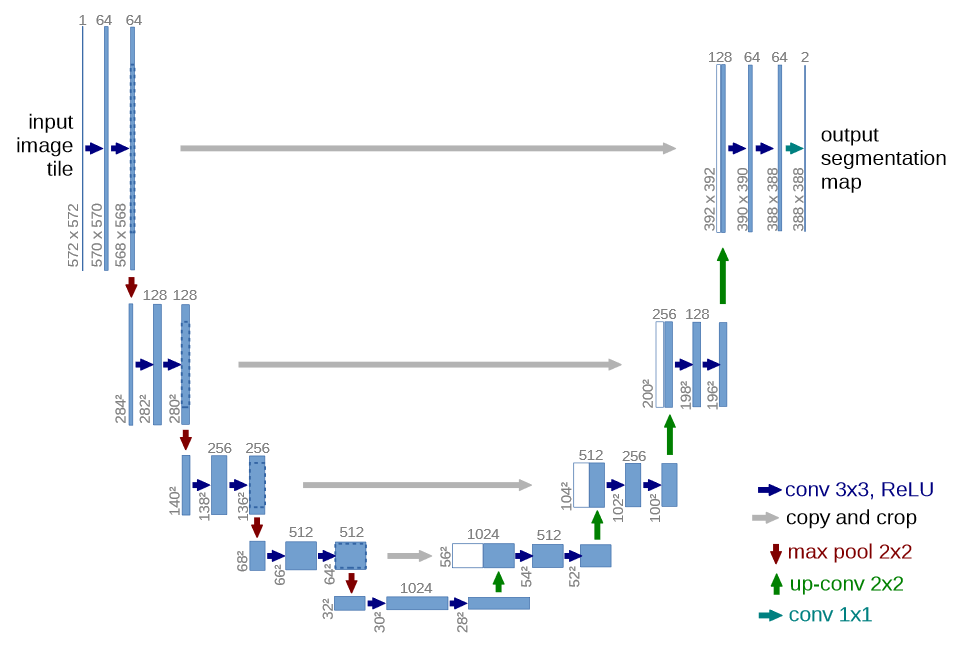
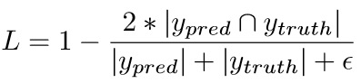
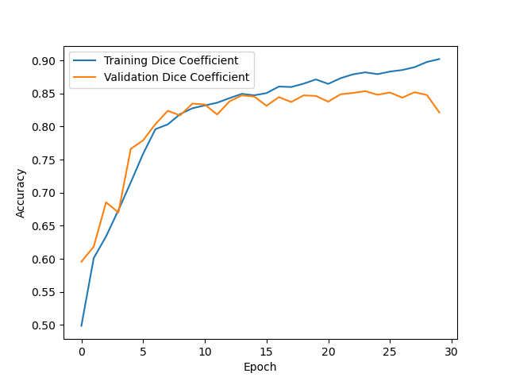
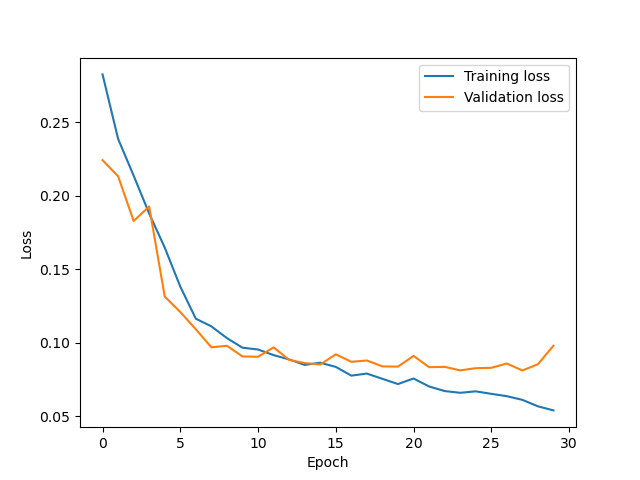
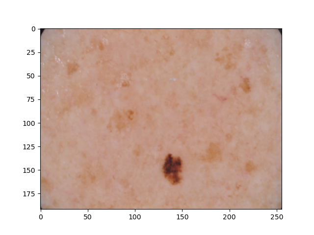
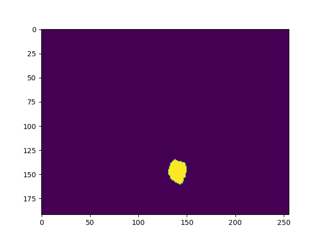
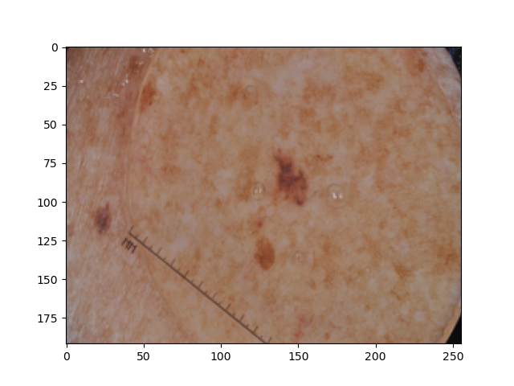
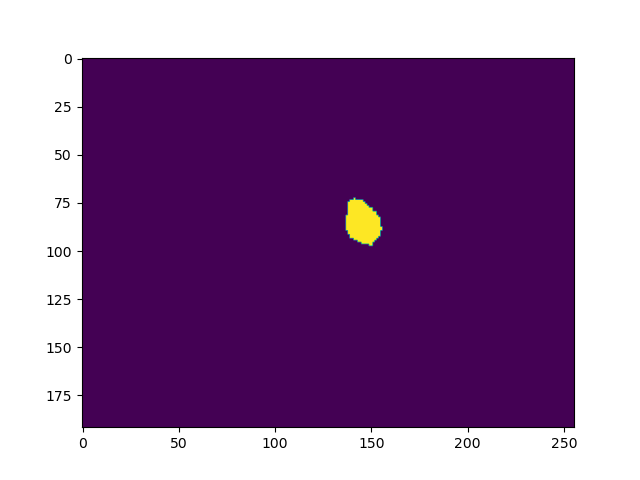

# Segmentation of ISIC data set with U-Net
COMP3710 Final Report Task

Tristan Samson

## Algorithm Description
The model built in model.py and run in driver.py are an implementation of the original
[U-Net](https://arxiv.org/abs/1505.04597) semantic segmentation network. This is a convolutional neural network often applied
to biomedical image segmentation. The implementation of U-Net provided in model.py is
application-neutral. It has been applied in driver.py to provide segmentations of the
ISIC 2018 challenge data for skin cancer. Segmentations distinguish between regions
of the image belonging to potentially cancerous lesions and regions belonging to regular skin.

The U-Net has been implemented exactly as it was described by Ronneberger, et al. A
figure of the network structure is provided below.

The general U-Net structure consists of an initial down-sampling path followed by an up-sampling path.
These paths are sometimes referred to as the contractive and expansive paths. The general idea of the
network is to encode the general segmentation structure of the input in the contracting path, which is then up-sampled
in the expanding path to improve the resolution and precision of the output. A key feature of the U-Net is
the concatenation of the output of each convolution layer in the contractive path to each corresponding
layer in the expansive path. 

Choice of loss function - directly optimising dice coefficient
Though the U-Net can be applied to an arbitrarily large number of segmentation classes, the present
ISIC dataset only requires binary segmentation; is it a lesion or is it skin. The network was originally 
trained to minimise some standard categorical loss function, though it was found that the resulting
network could not achieve the desired accuracy. It appeared to achieve an optimal loss function by
providing predictions close to 0.5 for each of the two classes. As an alternative, a custom loss function
was implemented to optimise the Dice coefficient directly. This loss function is,

where ypred is the predicted segmentation probabilities produced by the network, 
ytruth is the actual ground-truth segmentation, and &epsilon; is a small constant to ensure we get
no divide-by-zero issues. This is a so-called soft dice coefficient, meaning that it accepts the continuous probabilistic values produced
by the network. This is important because the back-propagation algorithm is required to compute partial
derivatives of the loss function with respect to model variables. 

## Training Data
A small amount of pre-processing is done on the provided ISIC dataset in driver.py before it is
provided to the network for training. Upon inspection, the provided training set is quite non-homogeneous,
with different groups of images appearing to be taken in different styles with different visual characteristics.
It is important to ensure that the training, validation, and testing sets have a reasonable sample of the whole dataset.
To facilitate this, the whole dataset and its ground-truth segmentations are first loaded into a combined array and
are shuffled, before being split into training, validation, and testing sets. Ground-truth labels are
encoded in one-hot format to match the two-channel probabilistic output of the network.

The Train/Validation/Test split of the
data was chosen to be 0.7/0.15/0.15. The training allocation was reduced to 0.7 from an initial 0.85/0.1/0.05 as it was
found that (a) the model was over-fitting on the training set and not sufficiently correcting, (b) the test set was too
small to get a consistent representative sample of the whole dataset. The present split seems to somewhat mitigate
these issues.

## Usage
The driver script is set up with all required calls in its main routine. With the below dependencies available simply
call "python driver.py". The ISIC data must be in the path data/ISIC2018_... relative to driver.py.
### Dependencies
Beyond standard python libraries, the model and its driver script require the following packages:

- TensorFlow
- Keras (API used to build model)
- Pillow (Python imaging library)
- Matplotlib (For plotting outputs)
- Numpy (For pre-processing inputs)

It is recommended to install these packages within an Anaconda environment.

## Example Outputs
### Training behaviour

The average Dice Coefficient over the test set is: 0.82

### Example Outputs
Example segmentation 1 (Dice Coefficient = 0.83)

Example segmentation 2 (Dice Coefficient = 0.67)

