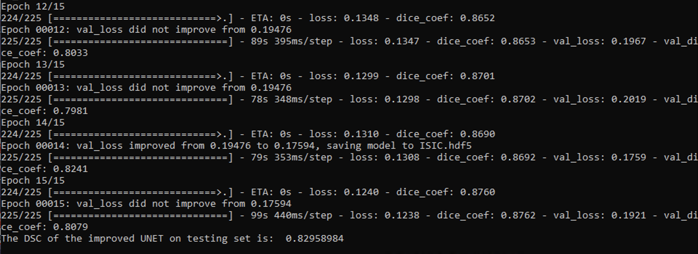
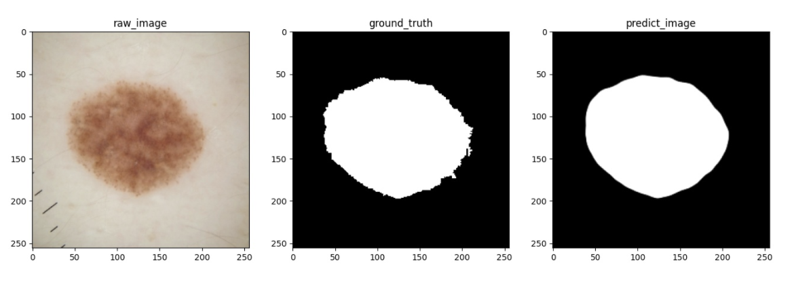
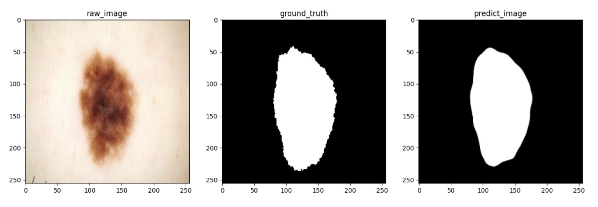
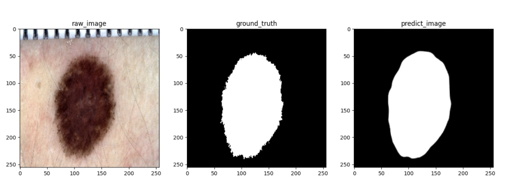

# TASK4: Segment the ISICs dataset 

------

Segment the ISICs dataset with the Improved UNet with all labels having a minimum Dice similarity coefficient of 0.8 on the test set.

Author: Xin Qi (s45104208).       Last updated: *05/11/2020*

## **Quick Start**

------

In the driver.py, it provides a main function to demonstrate how to utilize the model.py to create an improved Unet model and print some useful results on the basis of this model.

The dataset used in driver.py is ISIC 2018 challenge data for skin cancer. More information can be found on https://challenge2018.isic-archive.com/. 

In the command line, type in

```bash
python driver.py
```

to run the driver.py script. It will print the final DSC score on testing set and save three images to show the real performance on training set, validation set and testing set.

## **The Description of the algorithm**

------

The improved Unet is similar to classical Unet. Compared to U-net, I add BatchNormalization and Dropout into the model. Also, the Relu activation on Convelution layer is changed to Leaky_relu activation. There are two phases for this model. The first phase is context aggregation pathway that encodes increasingly abstract representations of the input. The second phase is localization pathway that recombines these representations with shallower features to precisely localize the structures of interest.

## **The problem that it solves**

------

This improved Unet can be utilized to do image segmentation. The ISICs dataset is about skin cancer. When giving a image, we should dertermine the value of each pixel in predicted image (0 or 1). In order to better evaluate the performance of model, we use dice coefficient loss to fit the model.  The final result can be a segmented image.

## **Data Spliting**

------

The whole datset has 2594 raw images and corresponding 2594 ground truth images. I split the dataset into three parts: testing set, validation set and testing set. The sample size of each set is 1800, 400 and 394 respectively.

## **Result**

------

The final DSC in testing set is 0.8296 and the command line output is shown in the next picture.



The following three images shows the real performance on three sets.







## **Dependencies**

------

python=3.7

tensorflow-gpu(tensorflow2.1)

