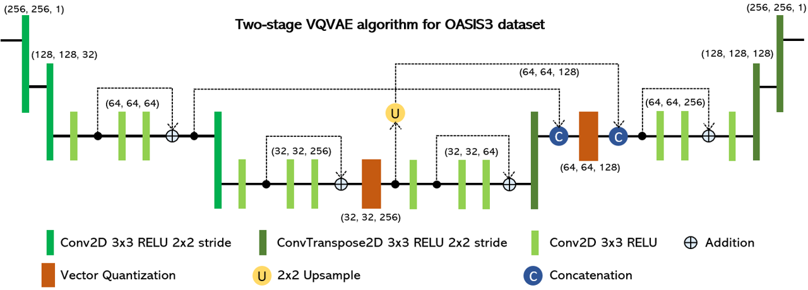
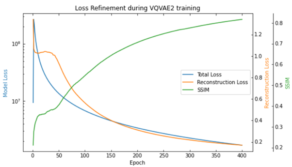
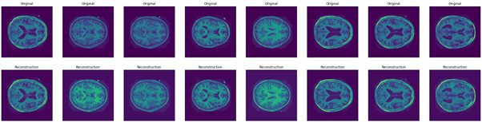
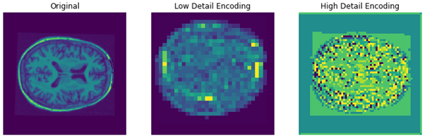
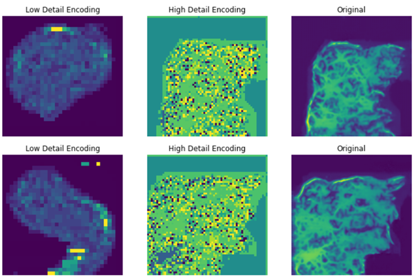

# VQVAE Implementation for OASIS Dataset

### VQVAE Algorithm
This project sought to implement a VQVAE-based image generator for the OASIS3 dataset. To achieve this, the algorithm used by Razavi et al in *'Generating Diverse High-Fidelity Images with VQ-VAE-2'* was adapted into a Tensorflow Keras implementation that worked on the monochrome image data. The final form of this algorithm as implemented here is shown below.

The filter values given in the figure above resulted in a Structured Similarity (SSIM) score of 0.817. This was achieved by training the algorithm for 400 epochs, and the step-wise results of this training are shown in the graph below. As can be seen, the SSIM and reconstruction loss stalled for the first 50 epochs, however, this hurdle was overcome and the rest of the training progressed smoothly after this.

The results of this algorithm can speak for themselves, as they recreate the image very faithfully. Below is a sample of reconstructed test images from the VQVAE, followed by a graphical representation of its encodings. While the reconstructions are a little blurry, they are considered *reasonably clear* for the purposes of this design.

These encodings are generated from a set of internal codebook indices within each VectorQuantizer layer, and are therefore what is sought to be generated to create a facsimile image of a brain. These encodings take the shape of (32, 32, 256) and (64, 64, 128), and are generated by the PixelCNN in the following section.

### PixelCNN Generator
The PixelCNN is used to generate a set of encodings that can be decoded by the VQVAE to generate a new brain image. The data used by the PixelCNN comes from the codebook indices of a VectorQuantizer, which can then in turn be decoded by the VQVAE to create the final image. As such, two separate instances are required to generate encodings for the top and bottom level encodings within the algorithm. This is mostly boilerplate code from *https://keras.io/examples/generative/pixelcnn/*, so please refer there for greater detail on this functionality. In the case of this project, while some shapes and textures can be generated, there are issues with combining the two separate models. As such, the algorithm generates shapes that are not brain-like and fills them with brain-like internals. This results in generations such as this:

As such, while this does not generate a brain entirely, it demonstrates that the algorithm holds promise and could be refined further to generate images with the same fidelity as the VQVAE.

### Dependencies
This algorithm is built in Tensorflow Keras, which means the end product models are reasonably simple to use and adapt. As such, many sections of Tensorflow and its sub-categories are required. In addition, numpy is utilised for direct data training of the PixelCNN on VectorQuantizer codebook indices as this mode requires a non-Tensor data structure. Further, for the graphing and image processing; matplotlib, imageio and mpl_toolkits were utilised. The main functions, such as model declarations of the VQVAE and PixelCNN, are stored in main_functions.py, which is then referenced by the trainer file as well as the testing file *generate_images.ipynb*.

### Dataset Loading
In order to efficiently train the VQVAE, the OASIS3 data was loaded into Tensorflow BatchDataset objects. This greatly reduced the memory required to store the 10000 images predivided into training, validation and testing data. These images are pre-downloaded to a file location of choice, then batched in by filepath as required during training.
