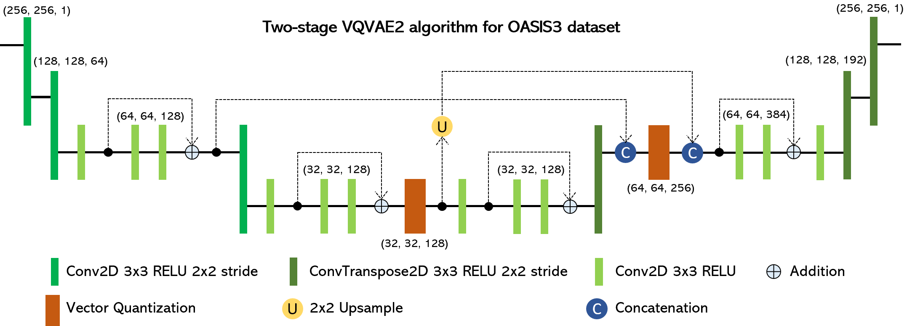
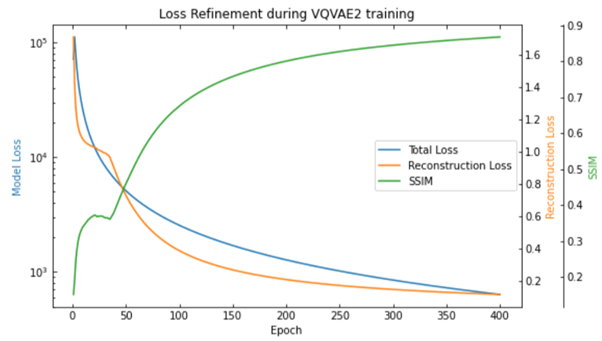
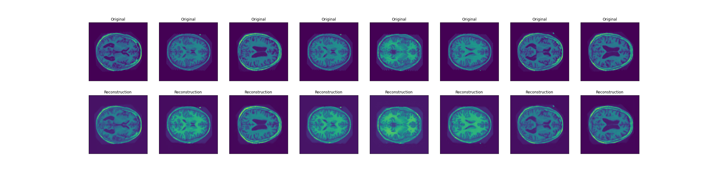
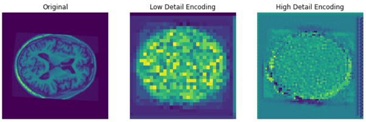

## VQVAE2 Implementation for OASIS Dataset

#### VQVAE2 Algorithm
This project sought to implement a VQVAE-based image generator for the OASIS3 dataset. To achieve this, the algorithm used by Razavi et al in *'Generating Diverse High-Fidelity Images with VQ-VAE-2'* was adapted into a Tensorflow Keras implementation that worked on the monochrome image data. The final form of this algorithm as implemented here is shown below.

The filter values given in the figure above resulted in a Structured Similarity (SSIM) score of 0.867. This was achieved by training the algorithm for 400 epochs, and the step-wise results of this training are shown in the graph below. As can be seen, the SSIM and reconstruction loss actually stalled at 40 epochs, however, this hurdle was overcome and the rest of the training progressed steadily.

The results of this algorithm can speak for themselves, as they recreate the image very faithfully. Below is a sample of reconstructed test images from the VQVAE, followed by a graphical representation of its encodings.

