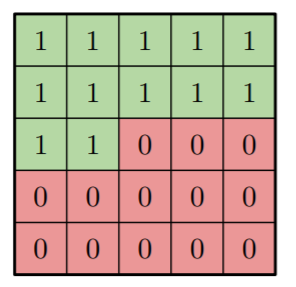
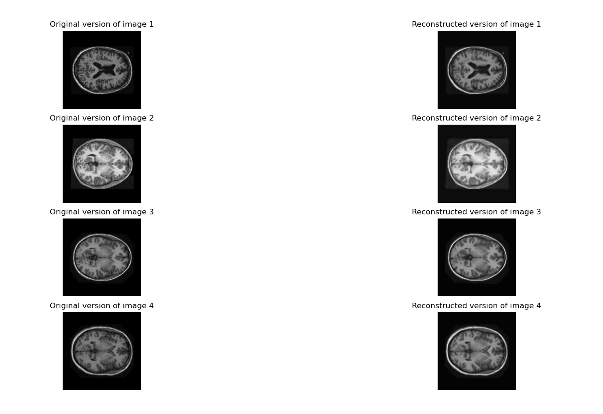

# VQ-VAE for OASIS dataset

## Overview

This project uses Vector-Quantized Variational Autoencoder model ([van den Oord et al,. 2017](http://papers.nips.cc/paper/7210-neural-discrete-representation-learning.pdf)) to learn the manifolds of MRI brain images in OASIS dataset as a means to understand the pattern of the data. Specifically, once the manifolds are learnt, one can visualize these manifolds and make use of the generative ability as well as the decoder of the model to visualize unseen images, which is useful for both model interpretation and data understanding. Regarding the VQ-VAE architecture (Fig. 1), it is comprised of an encoder (i.e., this part encodes the original data to a more compact representation), codebook (i.e., list of latent vectors to describe the manifolds of the original data), and a decoder (i.e., this part uses the manifolds to reconstruct images). About the dataset used in this project, Fig. 2 depicts a small subset of images in this dataset.

    
 

     Fig. 1. The architecture of VQ-VAE (Image source: <a href="http://papers.nips.cc/paper/7210-neural-discrete-representation-learning.pdf">van den Oord et al,. 2017</a>)
 

    

 

     Fig. 2. Sample images extracted from the OASIS dataset
 

## How it works

### Learning VQ-VAE

Suppose that both the encoder and the decoder consist of many convolutional layers.

Denote  be the output shape of the encoder, where  can be viewed as the width and height of a compressed version of the original image, and  is the number of channels or the number of filters. Correspondingly, as the goal of the decoder is to reconstruct the original image based on its compressed version, the input shape of the decoder has to be matched with the output shape of the encoder, and thus the input shape of the decoder is also .

Now, unlike a typical autoencoder with no generative ability or the classical VAE, VQ-VAE wants to encode the information of the original by a set of discrete codes, as it is more natural to represent a certain characteristic of an object in an image such as color, texture, background, and so on. To achieve this, the author proposed a data structure called codebook, which is essentially a list of  -dimensional continuous vectors. Then, each pixel in the compressed image will be mapped to a discrete code, where the code is actually the index of the corresponding vector in the codebook. More specifically, as any pixel in the compressed image is a -dimensional vector, which matches the shape of a vector in the codebook, the code to express a pixel therefore will be the index of the closest vector in the codebook. Mathematically,  the code  of an  pixel can be computed as:

where  is the  output pixel of the encoder,  is the original image, and  is the  vector in the codebook. As a result, the manifold  of an image can be referred to an  matrix containing discrete codes, which is demonstrated in Fig. 1. 

Afterwards, to reconstruct the image,  - the quantized version of  will be fed to the decoder, where each pixel or each vector in  is the closest codebook vector relative to the corresponding pixel in .

Finally, to train this VQ-VAE, the loss function is similar to the loss function of a vanilla VAE, but this loss introduces two additional terms, which aims to optimize the codebook vectors. To be specific,

where,

     
    
     
    
     
    
     
    
     
    
     
    

Due to the time constraint, I cannot go too much into detail on how to simplify this loss function, but basically, if we assume that , and , then , which can be viewed as a constant in the loss function. About the 3rd term of , the objective is to adjust  such that it can capture the information produced by the encoder. Regarding the 4th term, it prevents the model to adjust  to be overfitted with a particular , and thus  also has to be adjusted at the same time by moving itself close to .

Note that, because the process of converting  to  is a non-differentiable function , to update , or the weights of the encoder in general during the backward pass, the author uses a method called [Straight-Through Estimator](https://www.hassanaskary.com/python/pytorch/deep%20learning/2020/09/19/intuitive-explanation-of-straight-through-estimators.html) (STE), which simply treats the gradient of  as . More specifically, suppose one wants to estimate the gradient of a particular weight  in the encoder. In a normal approach, this is what we're supposed to compute:

By using STE, can be estimated as:

where,  is nothing but the output of the decoder.

### Learning the prior

Last but not least, to leverage the generative ability of VQ-VAE, one can use an auto-regressive model, which takes a sequence of historical data as the input to predict the future outcome, to learn the prior distribution of the manifold , as  during the training process of VQ-VAE is assumed to be uniformly distributed, and so the distribution of  is neglected during the training process of VQ-VAE. To be clear, the same author of VQ-VAE use [Gated PixelCNN](https://arxiv.org/pdf/1606.05328.pdf) to learn , where the input of the model is a sequence of the previous pixels from top left to bottom right, and the output is predicted value for the next pixel. Basically, the input of Gated PixelCNN model is nothing but , whose shape is , because the goal is to model the distribution of , i.e., given the previous values of , the model should predict the next value of . Regarding the output of this model, it should predict the probability of having a certain index associated with a vector in the codebook, and since there are  vectors in the codebook, the model should compute  different probabilities associated with all indices in the codebook for each pixel. Therefore, the output is essentially a set of one-hot vectors, where each vector represents an index of a vector in the codebook that is associated with the corresponding pixel in , and thus the shape of the model output is . About the main component of Gated PixelCNN, it has a stack of many gated masked convolutional blocks, where Fig. 3 shows the component of a single gated masked convolutional block. In detail, the first layer of the model is a typical convolutional layer, but the bottom half of the kernel were set to 0 to make sure that the convolution of a pixel is only expressed by its preceding neighbors (Fig. 4), which obey the assumption of an auto-regressive model. About the subsequent layers, the aim is to increase the receptive field in which a single convolution layer cannot cover all preceding pixels with respect to the target pixel, and thus the convolution of any pixel in these layers will also consider the target pixel along with the preceding neighbors while ensuring that the original value of the target pixel will not be included in the whole convolution process. Specifically, these layers are nothing but many gated masked convolutional blocks introduced earlier. For the last layer, it is a typical 2D convolutional layer, whose kernel size is 1, and the number of channels is , which matches the desired output of this model. About the loss function of this model, to simplify the assumption of the categorical distribution of a single pixel, one can use the Sparse Cross Entropy to update the weights for the whole model, as the output of this model is the probabilities for all indices in the codebook and the labels of the pixels are actually the values of  produced by the fine-tuned VQ-VAE. 

    

 

     Fig. 3. The architecture of a single Gated Masked Convolutional layer (Image source: <a href="https://arxiv.org/pdf/1606.05328.pdf">van den Oord et al,. 2016</a>)
 

    

 

     Fig. 4. The masked 3x3 filter of a 2D convolutional layer (Image source: <a href="https://arxiv.org/pdf/1606.05328.pdf">van den Oord et al,. 2016</a>)
 

## Dataset structure

To make sure the code is executable, images must be stored in the following format:

oasis_directory/

...train_folder/

......files/

.........train_img1.png

.........train_img2.png

...validate_folder/

......files/

.........validate_img1.png

.........validate_img2.png

...test_folder/

......files/

.........test_img1.png

.........test_img2.png

## How to run

Before running the scripts, please make sure to specify the following paths in `paths.py` correctly:

- Paths to train & validate & test data
- Paths to save VQ-VAE model checkpoints and best VQ-VAE checkpoint
- Paths to save VQ-VAE prior model checkpoints and best VQ-VAE prior checkpoint

To train the VQ-VAE: Run `run_train_vq_vae.py`

To see how the trained VQ-VAE performs on the test data: Run `run_test_vq_vae.py`

To train the prior of VQ-VAE: Run `run_train_prior.py` 

To see how VQ-VAE generates new images based on the trained prior and the trained model itself: Run `run_sample_images.py` 

## Experimental Results

Fig. 5 shows the reconstruction ability of VQ-VAE model on the test dataset after training through 100 epochs, where the average Structural Similarity Index Measure (SSIM) score is around 0.877 and the average Mean Squared Error (MSE) is about 0.0312.

In terms of the generative ability of VQ-VAE model, Fig. 6 shows the result after training the prior using PixelCNN++, and the model is trained in 100 epochs. It is clear that the model does not capture the pattern of discrete codes well enough, even though I tried tuning the number of gated convolutional layers or other relevant parameters such as the number of hierarchies (i.e., the number of residual blocks according to Figure 2 in <a href='https://arxiv.org/abs/1701.05517'>Salimans et al,. 2017</a>), the number of filters used across the network, and number components for the logistic mixture model used to express the distribution of the discrete codes in a single pixel. Therefore, more time is needed to investigate what is the culprit of making the model unable to converge.

    

     Fig. 5. The original version of some test images vs the reconstructed version via VQ-VAE
 

    

     Fig. 6. Images generated from the trained prior using PixelCNN++ and the trained VQ-VAE 

## Dependencies

Tensorflow >= 2.3.0

Tensorflow Probability >= 0.11.1

Matplotlib

## Reference

Oord, A. V. D., Vinyals, O., & Kavukcuoglu, K. (2017). Neural discrete representation learning. *arXiv preprint arXiv:1711.00937*.

Oord, A. V. D., Kalchbrenner, N., Vinyals, O., Espeholt, L., Graves, A., & Kavukcuoglu, K. (2016). Conditional image generation with pixelcnn decoders. *arXiv preprint arXiv:1606.05328*.

Salimans, T., Karpathy, A., Chen, X., & Kingma, D. P. (2017). Pixelcnn++: Improving the pixelcnn with discretized logistic mixture likelihood and other modifications. *arXiv preprint arXiv:1701.05517*.

Zhou Wang, A. C. Bovik, H. R. Sheikh and E. P. Simoncelli, "Image quality assessment: from error visibility to structural similarity," in *IEEE Transactions on Image Processing*, vol. 13, no. 4, pp. 600-612, April 2004, doi: 10.1109/TIP.2003.819861.

https://keras.io/examples/generative/vq_vae/#vectorquantized-variational-autoencoders

https://github.com/deepmind/sonnet/blob/v1/sonnet/examples/vqvae_example.ipynb

https://www.tensorflow.org/probability/api_docs/python/tfp/distributions/PixelCNN

https://d2l.ai/chapter_convolutional-modern/resnet.html

## Author

Hoa Vy Phun - 46182856
