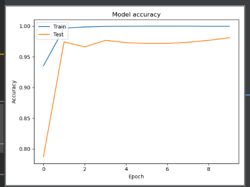
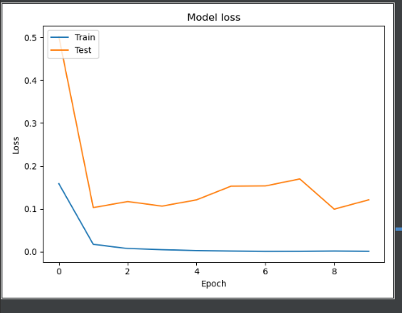
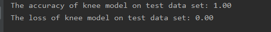
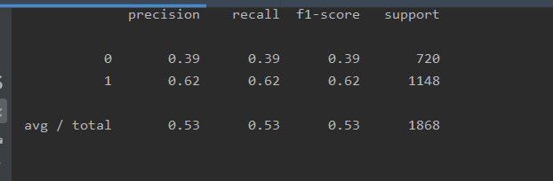

# Classify laterality  of the OAI AKOA knee data set in a minimum accuracy of 0.9 with CNN
* author:Wang Wenhao(46039941)
* date:2020.10.29
* libraries in main.py
1. os, shutil, numpy (used for data split)
2. matplotlib.pyplot (used for result visualize)
3. sklearn.metrics.classification_report (used for predict)
* library in model.py
1. tensorflow.keras (used for cnn constructing and trainning)
## main.py
* parameters(some parameters of model,eg.image_height,image_width,batch_size)
* data_split 
    Use shutil to copy image from the origin folder into the class folder according to their name(contains LEFT or RIGHT).Also, split these data into train(0.7), val(0.2), test(0.1) set. This function is the preprocessing function.
* visualize 
    After model's trainning and fitting, plot the result of the model in accuracy and loss trend curves.
* predict 
    Predict the test data, show the accuracy of the model
## model.py
* constructModelv
    This model is composed of 4 conc_pool unit and 1 flatten layer 
    each unit has convolution, batchnormaliztion(acclerate the train and reduce the overfit), maxpooling part
* fit 
    use data_generator to get the image and flow_from_directory to split them into different class according to the subdir's name 
    use fit_generator to fit the data into the model and record the history for analysis 
    finally, save the model
* evaluate  
    use evaluate_generator to evaluate the accuracy and loss for the model
* load_model 
    load the save model
## result
* accuracy plot 

* loss plot 

* evaluation 

* predict 

