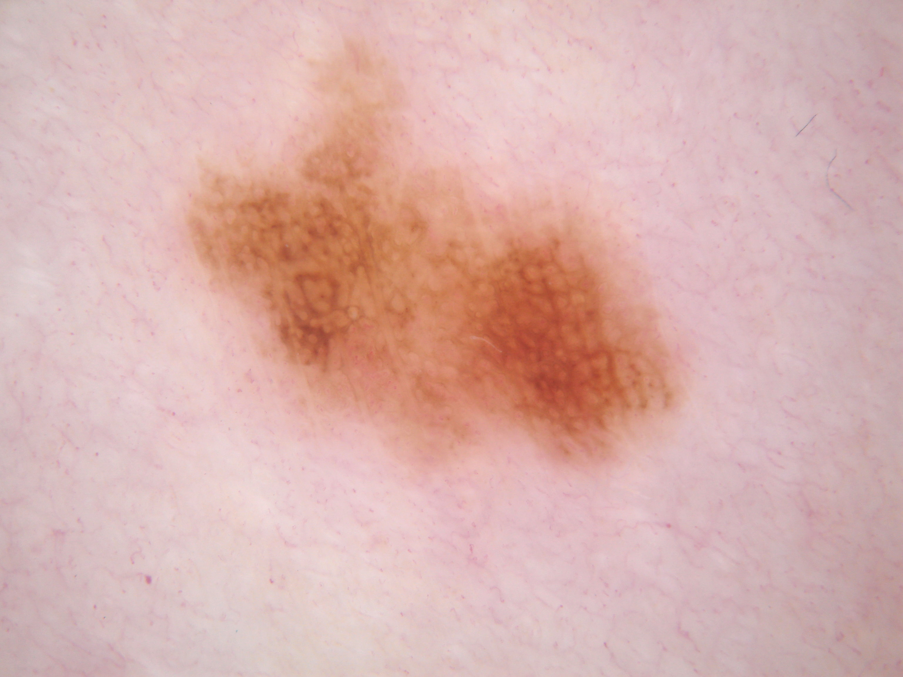
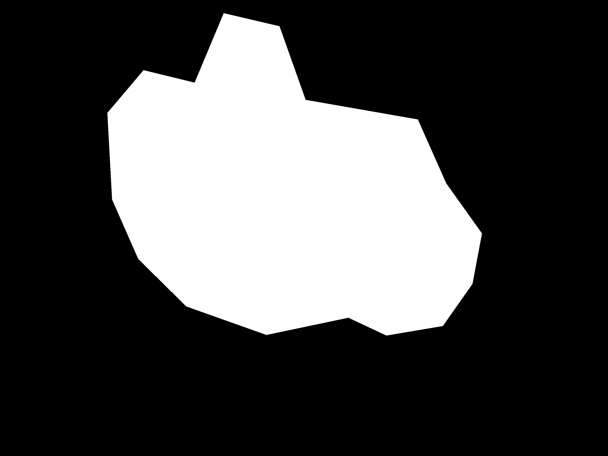

# Improved U-Net for ISIC
Solving ISIC defects segmentation problem using an improved version of U-Net model.

Implemented by Yiyun Zhang (45133507)

## Objective
The objective of this repository is to solve the image segmentation problem for the ISIC melanoma research.
The image segmentation, in simple terms, is to detect the exact areas which frame the target objects appearing in the image.
It aims to accurately separates the outlines of the objects.
In the example below, given an actual image of skin with a defect (top),
the image segmentation model should output the exact areas (called "mask") of where this defect is located (bottom).

When implement the image segmentation effectively, it can save a lot of time in real life situations.
The outputed masks can be also be acted as an intermediate step for other tasks like
classifiction with YOLO for further identifying the types of defects.

There are many algorithms and models that are currently used for image segmentation.
In this repository, I will implement an improved version of U-Net.
This and the standard U-Net model are some of the widely used models in the bioscience for segmentation.
Particularly I will use it to generate the masks for the skin defects similar to the given examples above.
I will talk about how this model works in the next section.

## Methodology
The improved U-Net model is based on the standard U-Net model.
The standard U-Net model is a convolutional neural network
The improved U-Net model, on the other hand, 

Improved UNet Network Architecture:

<!-- [Image of unet model summary] -->

Note that compared to the traditional UNet models, this improved UNet has addtional 

For model details, you can find the link to the original paper in the References section.

## Project Structure
In this repository, there are several Python components used for different tasks:
- `main.py` - The main driver script when running the project.
- `data.py` - Image data preprocessing.
- `metrics.py` - The loss functions for training the model.
- `model.py` - The implemenation of the improved U-Net model.
- `plots.py` - Generate output images and metric plots.
- `demo.ipynb` - Additional Jupyter Notebook for displaying the training process step by step.

Testing enviroment:
- Linux

Addtional Python Packages:
- `tensorflow` - For the model construction
- `tensorflow_addons` - Supports the specical normalisation layers in the model
- `matplotlib` - For displaying and generating plots

## Running Instructions
1. Download the ISIC2018 datasets at: https://challenge.isic-archive.com/data/#2018, specifically these two folders:
    - ISIC2018_Task1-2_Training_Input
    - ISIC2018_Task1_Training_GroundTruth
2. Put these two folders under `./datasets`
3. Open the terminal and `cd` to the project directory (`/recognition/Yiyun_ISIC`)
4. Install the Python libraries listed in `./requirements.txt`: `pip install -r ./requirements.txt`
5. Run the driver script `python3 ./main.py`

## Training, Validation & Test Data
Before directly applying the iamges to train the model, it is also crucial to do data-preprocessing beforehand.
I have shuffled and splitted the dataset into training data,
validation data and test data with 60%, 20% and 20% number of images respectively.
This is a commonly used approach in machine learning that ensures minimal contamination to the test data.
Then I will unify all image sizes and normalise the data in the images.
The detailed implementation of the data-preprocessing can be found in `data.py`.

## Outputs
Here are the example outputs when applying this model on the ISIC2018 dataset:

For the loss, accuracy and dice coefficient metrics during training:

## Troubleshoot
`tensorflow.python.framework.errors_impl.InvalidArgumentError: buffer_size must be greater than zero. [Op:ShuffleDatasetV3]`
- The datasets have not been properly read.
- Check if the `ISIC_DIR` directory in `main.py` and `ISIC_INPUT_DIR`/`ISIC_GROUNDTRUTH_DIR` folder names in `data.py` match.

## References
\[1\] F. Isensee, P. Kickingereder, W. Wick, M. Bendszus, and K. H. Maier-Hein, “Brain Tumor Segmentation
and Radiomics Survival Prediction: Contribution to the BRATS 2017 Challenge,” Feb. 2018. \[Online\].
Available: https://arxiv.org/abs/1802.10508v1
