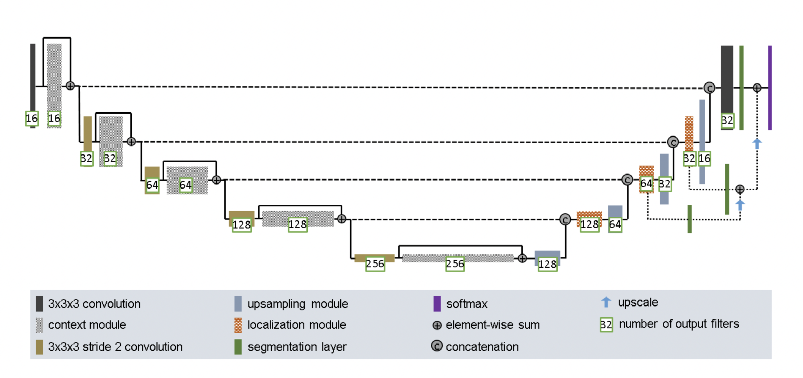
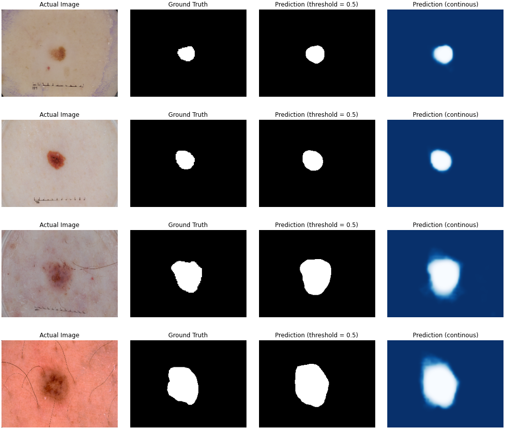
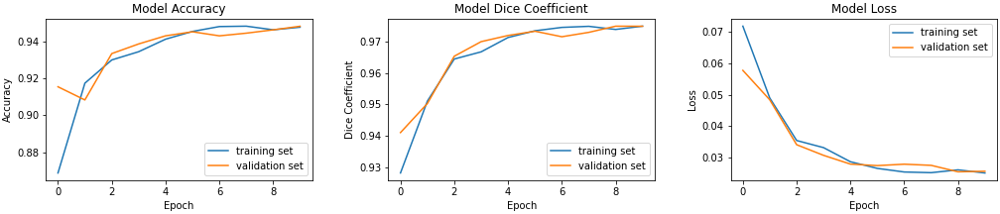

# Improved UNet

Yiyun Zhang 45133507

## Description

This is the implementation of ISIC data segmentation using an improved U-Net.

Improved UNet Network Architecture:

## Instructions
1. Download the ISIC2018 datasets at: https://challenge.isic-archive.com/data/#2018, specifically these two folders:
    - ISIC2018_Task1-2_Training_Input
    - ISIC2018_Task1_Training_GroundTruth
2. Put these two folders under `./datasets`
3. Open the terminal and `cd` to the project directory (`/recognition/Yiyun_ISIC`)
4. Install the Python libraries listed in `./requirements.txt`: `pip install -r ./requirements.txt`
5. Run the driver script `python3 ./main.py`

## Results

## References
\[1\] F. Isensee, P. Kickingereder, W. Wick, M. Bendszus, and K. H. Maier-Hein, “Brain Tumor Segmentation
and Radiomics Survival Prediction: Contribution to the BRATS 2017 Challenge,” Feb. 2018. \[Online\].
Available: https://arxiv.org/abs/1802.10508v1
