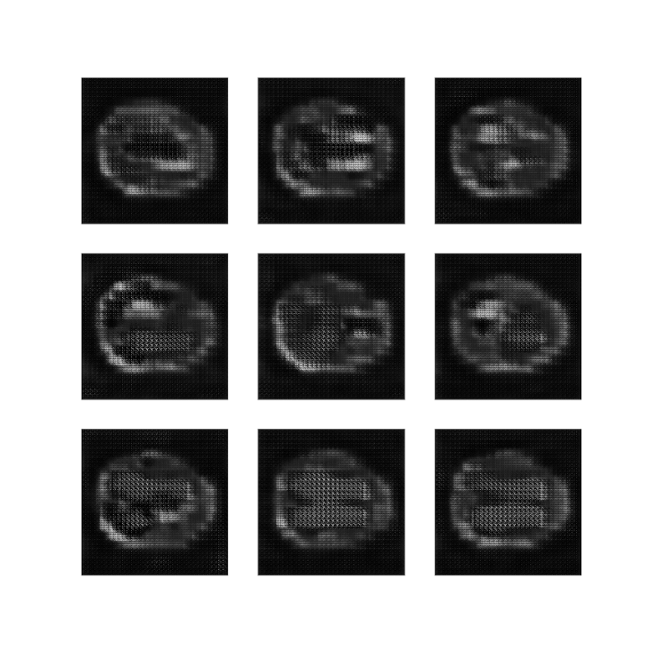

#  DCGAN on the OASIS Brain Data Set

## Introduction
GAN or Generative Adversarial Network is an exciting recent innovation in machine learning. GANs are generative models, which means they create new data instances that resemble the training data. For example, GANs can generate images that resemble human faces by learning from a dataset of human faces. DCGAN is a direct extension of GAN, except that it explicitly uses deep convolutional network layers. 

## How DCGAN Works
A Generative adversarial network has two parts:
1. The **generator** which learns to generate plausible data.
2. The **discriminator** which learns to distinguish the generator's fake data from the real data.


The generator will receive random noise, typically a Gaussian or normal distribution noise and it's going to attempt to output data. The discriminator is the detective; it takes a dataset consisting of real images from the real dataset and fake images from the generator and attempts to classify real versus fake images. The discriminator itself is always performing a binary classification. It's just trying to tell if the input is real or fake.

To build a stable DCGAN, there is already a guideline to follow:
- Replace any pooling layers with strided convolutions (discriminator) and fractional-strided convolutions (generator).
- Use batchnorm in both the generator and the discriminator.
- Remove fully connected hidden layers for deeper architectures.
- Use ReLU activation in generator for all layers except for the output, which uses Tanh.
- Use LeakyReLU activation in the discriminator for all layers.


## Implementation
**Training Data**: 
OASIS Brain data set provided by COMP3710 team. In the training set, there are 9664 brain images of 256x256 pixel in grayscale. For the model training, the original size of images (256x256) will be used.

**Generator**:
- Uses three hidden layers with **kernel size** of 4 and **strides** of 2.
- Uses ReLU as the activation function on all layers, except for the output. The output uses Tanh for the activation function
- Uses **Batch Normalization** at the end of each layer except for the output

**Discriminator**:
- Uses three hidden layers with **kernel size** of 4 and **strides** of 2.
- Uses LeakyReLU as the activation function on all layers, except the output. The output uses Sigmoid for the activation function
- Uses a **Dropout** layer of 0.3 at the end of each layer except for the Flatten and output layer

**Optimizer**: Adam optimizer with learning rate of 0.0002 for both generator and discriminator.

## Project Details
**Author:** Yuris Cakranegara - 4544565

**There are three scripts included in this project:**
- [dataset_loader.py](./dataset_loader.py): Script to load the dataset
- [model.py](./model.py): Script to build and train the DCGAN model
- [main.py](./main.py): Script to setup and run all the processes

**Usage**:
1. Make sure to edit the **line 9** of [main.py](./main.py) to refer to the dataset folder
2. Execute ```python main.py``` to start training the model
3. Look into ```./result_images/``` directory to see the result

**Dependencies Required:**
- Python = 3.7
- Tensorflow = 2.1.0
- Matplotlib = 3.3.1
- Numpy = 1.19.1

## Result
#### Outputs Comparison 
Batch Normalization             |  Dropout Layer
:------------------------------:|:-------------------------:
  |  
<br>
Both of the results above are generated by the same model trained with **100 epochs** and the same optimizer (Adam optimizer with 0.0002 learning rate). The difference is that the left side uses Batch Normalization layer for the discriminator and the right side uses Dropout instead. So in this project, I choose to use the model that uses Dropout layer since it generates better images.

#### Outputs and Real Images Comparison
Output Images | Real Images
:-------------------------:|:-------------------------:
  |  

#### Structural Similarity


## Reference
[1] A. Radford, L. Metz, and S. Chintala, “Unsupervised Representation Learning with Deep Convolutional Generative Adversarial Networks,” arXiv:1511.06434 [cs], Jan. 2016, arXiv: 1511.06434. [Online]. Available: http://arxiv.org/abs/1511.06434
[2] Generative Adversarial Networks, Google Developers. https://developers.google.com/machine-learning/gan
