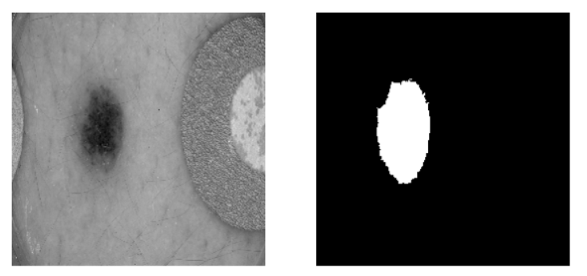
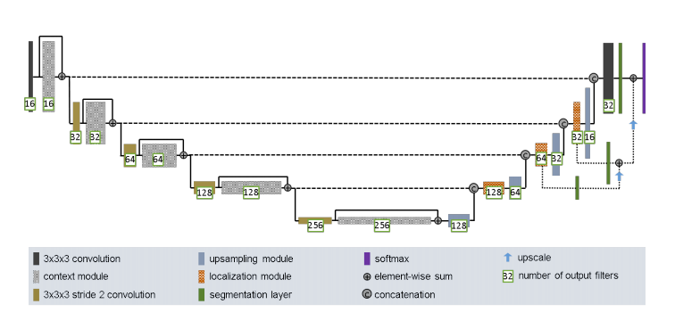
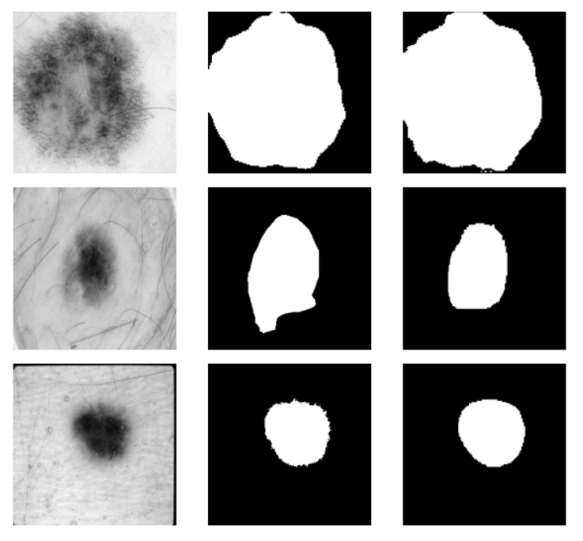
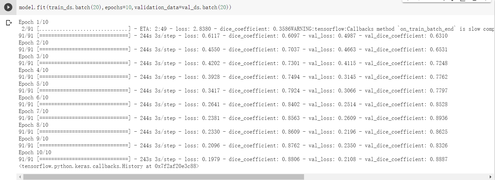
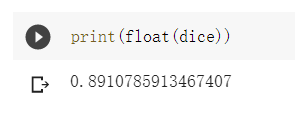

Improved Unet For ISICs data set
========================================================================================================================================
Description
----------------------------------------------------------------------------------------------------------------------------------------

In this project, we will segment the ISICs data set with an improved UNet model with all labels having a minimum Dice similarity coefficient of 0.8 on the test set.

This folders include a README.md , a folder 'png' containg five pictures of the output from the algorithm and two python files, model.py and test-script.py: 

1. An improved Unet model is built in model.py. 

2. test-script.py contains other functions and scrips for running the algorithm.

By runing the test-script.py, we will fit the model of model.py on training and validation data set. With the fitted model, we then get the prediction on test data (pictures of prediction) and the evaluation (Dice similarity coefficient) for the model on test data by comparing with ground truth masks. 

Dataset
----------------------------------------------------------------------------------------------------------------------------------------

The data downloaded from <https://cloudstor.aarnet.edu.au/sender/download.php?token=f0d763f9-d847-4150-847c-e0ec92d38cc5&files_ids=10200257> contains two files, Input data and ground truth data. I split them into training set, validation set and test set with a ratio of 7:2:1.

After processing the data, we can display the image in the data set. Following are the images from training dataset(input and ground truth respectively):

Model Architecture
----------------------------------------------------------------------------------------------------------------------------------------
Our architecture is derived from the U-Net . The context pathway (left) aggregates high level information that is subsequently localized precisely in the localization pathway (right). 

The architecture is shown below:

Output
----------------------------------------------------------------------------------------------------------------------------------------
### 1. Example pictures of prediction

### 2. The process for fitting training set and validation set

### 3. The result of the evaluation for the model on test data

Result
----------------------------------------------------------------------------------------------------------------------------------------
The result of the dice similarity coeffient is roughly 0.89 which is over 0.8. So this model works well that can solve the problem.
    
Author
----------------------------------------------------------------------------------------------------------------------------------------
Zhe Gong  s4555042

Environment
----------------------------------------------------------------------------------------------------------------------------------------
Python: 3.7.9

Tensorflow: 2.3.0

Reference
----------------------------------------------------------------------------------------------------------------------------------------
<https://arxiv.org/pdf/1802.10508v1.pdf>