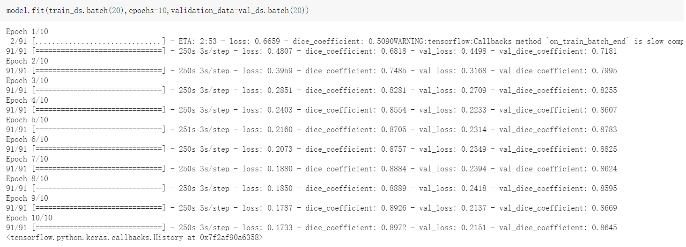

Pattern Recognition
========================================================================================================================================
Description
----------------------------------------------------------------------------------------------------------------------------------------

In this project, we will segment the ISICs data set with an improved UNet model with all labels having a minimum Dice similarity coefficient of 0.8 on the test set.

This folders include a README.md and two python files, model.py and test-script.py. 

1. An improved Unet model is biuld in model.py. 

2. test-script.py contains other functions and scrips for running the algorrithm.

The data downloaded from <https://cloudstor.aarnet.edu.au/sender/download.php?token=f0d763f9-d847-4150-847c-e0ec92d38cc5&files_ids=10200257> contains two files, Input data and ground truth. I split them into training set, validation set and test set with a ratio of 7:2:1.

By runing the test-script.py, we will get the example pictures of prediction and the evaluation (Dice similarity coefficient) for the model on test data. 

Output
----------------------------------------------------------------------------------------------------------------------------------------
### 1. example pictures of prediction

### 2. The process for fitting training set and validation set

### 3. The result of the evaluation for the model on test data

Author
----------------------------------------------------------------------------------------------------------------------------------------
Zhe Gong  s4555042