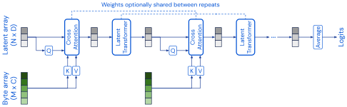
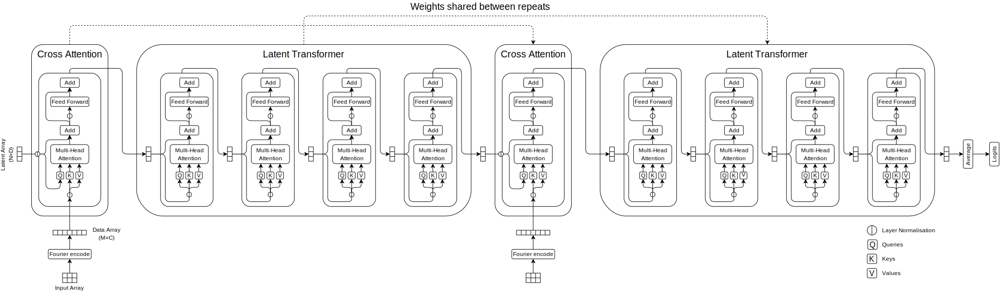
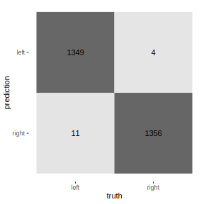

# Perceiver



The Perceiver is a Transformer-based model that solves the quadratic complexity — both memory and compute — of Transformers, allowing for the construction of much deeper networks on current hardware. The Perceiver uses cross-attention to project the input array (which is quadratically huge) onto a much smaller latent array, which is fed into an iterative self-attention transformer. This process is repeated with optionally shared weights; creating a model with the functional form of a Recurrent Neural Network (Jaegle et.al., 2021). The Perceiver makes few assumptions about the structure of the data and can handle different modalities (such as images, audio) with the same model architecture.

The Perceiver is "permutation invariant" (Jaegle et.al., 2021, p. 5), meaning it cannot directly use the spatial structure of the input data. Spatial structure is instead encoded with Fourier position encodings and concatenated with the input. Fourier position encodings add an additional `num_indices × (2 × num_frequency_bands + 1)` features per input data point (i.e. pixels for images).

## AOI AKOA knee laterality classification

The task is to build a knee laterality classifier, using the Perceiver, and obtain a test accuracy > 90%. This was easily achieved with a test accuracy of 99.45%. The architecture for the best model used in this experiment is as follows:



Two blocks consisting of a cross-attention module (1 head) and 4 self-attention modules (8 heads each). 

The images were scaled down to 64×64 and 32 frequency bands were used in the Fourier positional encoding. The resulting data array has size 4096×131. The input latent array is 128×256.

This configuration is a downscaled version of the configuration used in the ImageNet classifier mentioned in the Perceiver paper. It is configured such that the model could train on a GTX 2080.

### AOI AKOA dataset

The AOI AKOA dataset (provided by UQ and available from Blackboard) consists of MRI 2D slices, with features encoded into the filenames. These are:
- patient id
- baseline
- laterality

The dataset contains no pre-defined splits, so these have been created by:
- partitioning by patient (patients are assigned _exactly one split_ to avoid data leakage)
- assigning approximate proportions of 70%:15%:15% for training, validation and testing splits
- balancing laterality (i.e. both classes have equal counts) of the test split
- assigning remaining images to training and validation such they they have _similarly_ balanced laterality proportions

The splits are as follows:

| split      | left | right | total |
|------------|-----:|:-----:|------:|
| train      | 5320 |  7920 | 13240 |
| validation | 1080 |  1640 |  2720 |
| test       | 1360 |  1360 |  2720 |

Laterality was balanced in this way with the intent to augment training and validation by horizontally flipping the images and reversing the labels, then concatenating with the input.

This dataset has been implemented as a Tensorflow dataset, implementation can be found in [`aoi_akoa.py`](./aoi_akoa.py). To use this dataset, the archive must be manually downloaded to `<data-dir>/downloads/manual/akoa_analysis.zip`. The default location for `<data-dir>` is `~/tensorflow_datasets/`.

### Preparation & augmentation

The following preparation was applied to all splits:
- images were normalised to have 0-mean and unit variance
- images were scaled to 64×64 (without aspect ratio distortion)
- labels were 1-hot encoded

Horizontal flipping, reversing of labels and concatenating with input _train_ and _validation_ splits _wasn't_ performed in the best model — it was performed in this experiment, but it resulted in worse performance. When this augmentation was performed, performance dropped to 98%.

### Training

The Perceiver was trained for 10 epochs, with batch size 64, LAMB optimiser with learning rate 0.004 and weight decay rate 0.1, categorical cross entropy loss (with logits) and label smoothing 0.1. These training parameters are consistent with the configuration used in the ImageNet classifier, however the learning rate was kept constant in this experiment. As can be from the below plot, accuracy improvements were only very slight after the 2nd epoch.


### Results

The best performing classifier achieved a test accuracy of 99.45%, which is extreme. 11 of the 15 prediction errors made by the classifier were in incorrectly classifying left knees as right knees; perhaps due to the imbalance in the dataset. Interestingly, when performing the "horizontal flipping" augmentation (command-line parameter `--hflip-concat`), the majority of classification errors were for right knees instead of left (52 right, 3 left).



### Reproduce experiment

The configuration for the _best_ model in this experiment is as follows:

```shell
python experiment.py \
    --epochs 10 \
    --train_batch_size 64 \
    --eval_batch_size 16 \
    --label_smoothing 0.1 \
    --out_dir ./training \
    --data_dir ~/tensorflow_datasets \
    --image_dims 64 64 \
    --num_blocks 2 \
    --num_self_attends_per_block 4 \
    --num_cross_heads 1 \
    --num_self_attend_heads 8 \
    --latent_dim 128 \
    --latent_channels 256 \
    --num_freq_bands 32 \
    --learning_rate 0.004 \
    --weight_decay_rate 0.1
```

## Perceiver model usage

The Perceiver model is implemented as a Tensorflow Keras _subclass_ model. It supports the usual `compile()`, `fit()` & `evaluate()` methods of Keras models. End-to-end usage can be found in the [`experiment.py`](./experiment.py).

```python
from perceiver import Perceiver
# perceiver classifier for aoi akoa knee laterality
perciever = Perceiver(
    num_blocks=2,
    num_self_attends_per_block=4,
    num_cross_heads=1,
    num_self_attend_heads=8,
    latent_dim=128,
    latent_channels=256,
    num_freq_bands=32,
    num_classes=2,
)
```

## Dependencies

Python 3.9.6

### Packages

- tensorflow 2.6.0
- tensorflow_datasets 4.4.0
- tensorflow-addons 0.14.0

## Citations

```bibtex
@article{jaegle_perceiver_2021,
    title = {Perceiver: General Perception with Iterative Attention},
    shorttitle = {Perceiver},
    url = {http://arxiv.org/abs/2103.03206},
    journal = {arXiv:2103.03206 [cs, eess]},
    author = {
        Jaegle, Andrew and Gimeno, Felix and Brock, Andrew and 
        Zisserman, Andrew and Vinyals, Oriol and Carreira, Joao
    },
    month = jun,
    year = {2021},
    note = {arXiv: 2103.03206}
}

@article{vaswani_attention_2017,
    title = {Attention Is All You Need},
    url = {http://arxiv.org/abs/1706.03762},
    journal = {arXiv:1706.03762 [cs]},
    author = {
        Vaswani, Ashish and Shazeer, Noam and Parmar, Niki and Uszkoreit, 
        Jakob and Jones, Llion and Gomez, Aidan N. and Kaiser, Lukasz 
        and Polosukhin, Illia
    },
    month = dec,
    year = {2017},
    note = {arXiv: 1706.03762}
}

@misc{deepmind_perceiver_2021,
    title = {Perceiver and Perceiver IO},
    url = {https://github.com/deepmind/deepmind-research/tree/master/perceiver},
    year = {2021}
}

@misc{kilcher_perceiver_2021,
    title = {
        Perceiver: General Perception with Iterative Attention 
        (Google DeepMind Research Paper Explained)
    },
    shorttitle = {Perceiver},
    url = {https://www.youtube.com/watch?v=P_xeshTnPZg},
    author = {Kilcher, Yannic},
    month = mar,
    year = {2021}
}

@misc{kilcher_attention_2017,
    title = {Attention Is All You Need},
    url = {https://www.youtube.com/watch?v=iDulhoQ2pro},
    author = {Yannic Kilcher},
    author = {Kilcher, Yannic},
    month = nov,
    year = {2017}
}
```
