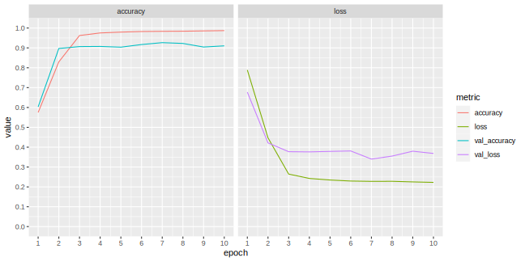

# Perceiver


The Perceiver is a Transformer-based model that solves the quadratic complexity (both memory and compute) of Transformers, allowing for the construction of much deeper networks on current hardware. The Perceiver uses cross-attention to project the input array (which is quadratically huge) onto a much smaller _learned_ latent array, which is fed into an iterative self-attention transformer. This process is repeated with optionally shared weights; creating a model with the functional form of a Recurrent Neural Network (Jaegle et.al., 2021). The Perceiver makes few assumptions about the structure of the data and can handle different modalities (such as images, audio, video, point clouds, etc.) with the same model architecture.

The Perceiver is "permutation invariant" (Jaegle et.al., 2021, p. 5), meaning it cannot directly use the spatial structure of the input data. Spatial structure is instead encoded with Fourier position encodings and concatenated with the input, prior to entering the cross-attention modules as _keys_ and _values_. Fourier position encodings add an additional `num_indices × (2 × num_frequency_bands + 1)` features per input data point (i.e. pixels for images).

## Implementation

This module implements the Perceiver as a Tensorflow-Keras model. The model architecture and configuration (including initialisers, layer normalisation epsilon, etc.) are as described in the ImageNet classification task described in the Perceiver paper, and as implemented in [deepmind-research](https://github.com/deepmind/deepmind-research/tree/master/perceiver). The lone exception: weights are unconditionally shared between repeats. The paper suggests that weights for the first _block_ shouldn't be shared as this leads to training instability; this wasn't observed during training, so repeats share weights due to simpler implementation.

### Usage

```python
from perceiver import Perceiver
# perceiver classifier for aoi akoa knee laterality
perciever = Perceiver(
    num_blocks=2,
    num_self_attends_per_block=4,
    num_cross_heads=1,
    num_self_attend_heads=8,
    latent_dim=128,
    latent_channels=256,
    num_freq_bands=32,
    num_classes=2,
)
```

End-to-end Keras example can be found in [`experiment.py`](./experiment.py).

## AOI AKOA knee laterality classification experiment

The aim of this experiment was to classify knee laterality in MRI slices, achieving a test accuracy above 90%, using a Perceiver model architecture. In this experiment, the Perceiver model (implemented in [`perceiver.py`](./perceiver.py)) achieved a test accuracy of 99.45% in 10 epochs, running on a NVIDIA RTX 2080 (i.e. limited hardware).

The architecture for the model is as follows:


- two blocks consisting of a cross-attention module with 1 head and 4 self-attention modules with 8 heads each
- 32 Fourier frequency bands for Fourier positional encoding
- latent array size of 128×256

Images were scaled down to 64×64 due to memory constraints. The resulting data array that is input into the cross-attention modules (keys and values) has size of 4096×131 after unrolling and appending position encodings.

The deviations from the ImageNet configuration were to reduce the compute and memory requirements, allowing the model to be trained on limited hardware. The dataset is simple enough that this didn't _appear to_ harm model performance.

### Optimiser

The LAMB optimiser is used with learning rate of 0.004 and weight decay rate of 0.1, as per the ImageNet experiment, but the learning rate was held constant instead of decaying in later epochs.

### Loss

Categorical cross entropy (from logits) was used with a label smoothing of 0.1.

### AOI AKOA dataset

The AOI AKOA dataset (provided by UQ and available from Blackboard) consists of MRI 2D slices, with features encoded into the filenames. These are:

- patient identifier
- baseline (not used)
- laterality

The dataset contains no pre-defined splits, so these have been created by:

- partitioning by patient — patients are assigned _exactly one split_, avoiding _data leakage_
- assigning approximate proportions of 70%:15%:15% for training, validation and testing splits
- balancing laterality (i.e. both classes have equal counts) of the test split
- assigning remaining images to training and validation such they they have _similarly_ balanced laterality proportions

The splits are as follows:

| split      | left | right | total |
| ---------- | ---: | :---: | ----: |
| train      | 5320 | 7920  | 13240 |
| validation | 1080 | 1640  |  2720 |
| test       | 1360 | 1360  |  2720 |

Laterality was balanced in this way with the intent to augment training and validation by horizontally flipping the images and reversing the labels, then concatenating with the input; doubling the size of both training and validation splits.

#### Usage

This dataset (with defined splits) has been implemented as a Tensorflow dataset, implementation can be found in [`aoi_akoa.py`](./aoi_akoa.py). To use this dataset, the zip archive must be manually downloaded to `<data-dir>/downloads/manual/akoa_analysis.zip`. The default location for `<data-dir>` is `~/tensorflow_datasets`.

```python
import tensorflow_datasets as tfds
import aoi_akoa

(train, validation, test), info = tfds.load(
    "aoi_akoa",
    split=["train", "validation", "test"],
    with_info=True,
    as_supervised=True,
    shuffle_files=True,
)
```

### Dataset augmentation

_Not applied to the best performing model_.

The train and validation splits were augmented by horizontally flipping images and reversing the laterality label, then concatenating with the original splits; resulting in perfectly balanced dataset and double the original split size.

Applying this augmentation resulted in worse test performance, with test accuracy of 98%.

### Dataset preparation

The following preparation steps were applied to all splits:

- images were normalised to have 0-mean and unit variance
- images were scaled to 64×64 (without aspect ratio distortion)
- labels were 1-hot encoded
- splits were shuffled, such that the order of examples differs for each epoch

### Fourier position encoding

Fourier position encoding was computed from the image `index dimensions` (64×64), then concatenated with the _unrolled / flattened_ input images. 32 frequency bands were used.

### Results

The model achieved achieved a test accuracy of 99.45% after 10 epochs, which is extreme. Training and validation metrics can observed in the figure below.



In model evaluation, 11 of the 15 prediction errors made on the test split by the classifier were in incorrectly classifying left knees as right knees. This is perhaps due to the imbalance in the training and validation splits. Interestingly, when performing the "horizontal flipping" augmentation (command-line parameter `--hflip-concat`), the majority of classification errors were for right knees instead of left (52 right, 3 left).


### Reproduce experiment

This experiment can be re-run (plots not included) by executing the below command:

```shell
python experiment.py \
    --epochs 10 \
    --image_dims 64 64 \
    --num_blocks 2 \
    --num_self_attends_per_block 4 \
    --latent_dim 128 \
    --latent_channels 256 \
    --num_freq_bands 32 \
```

Or equivalently with defaults explicitly defined:

```shell
python experiment.py \
    --epochs 10 \
    --train_batch_size 64 \
    --eval_batch_size 16 \
    --label_smoothing 0.1 \
    --out_dir ./training \
    --data_dir ~/tensorflow_datasets \
    --image_dims 64 64 \
    --num_blocks 2 \
    --num_self_attends_per_block 4 \
    --num_cross_heads 1 \
    --num_self_attend_heads 8 \
    --latent_dim 128 \
    --latent_channels 256 \
    --num_freq_bands 32 \
    --learning_rate 0.004 \
    --weight_decay_rate 0.1
```

## Dependencies

Python 3.9.6

Packages:

- tensorflow 2.6.0
- tensorflow_datasets 4.4.0
- tensorflow-addons 0.14.0

Install dependencies with `pip install -r requirements.txt`.

## Citations

```bibtex
@article{jaegle_perceiver_2021,
    title = {Perceiver: General Perception with Iterative Attention},
    shorttitle = {Perceiver},
    url = {http://arxiv.org/abs/2103.03206},
    journal = {arXiv:2103.03206 [cs, eess]},
    author = {
        Jaegle, Andrew and Gimeno, Felix and Brock, Andrew and
        Zisserman, Andrew and Vinyals, Oriol and Carreira, Joao
    },
    month = jun,
    year = {2021},
    note = {arXiv: 2103.03206}
}

@article{vaswani_attention_2017,
    title = {Attention Is All You Need},
    url = {http://arxiv.org/abs/1706.03762},
    journal = {arXiv:1706.03762 [cs]},
    author = {
        Vaswani, Ashish and Shazeer, Noam and Parmar, Niki and Uszkoreit,
        Jakob and Jones, Llion and Gomez, Aidan N. and Kaiser, Lukasz
        and Polosukhin, Illia
    },
    month = dec,
    year = {2017},
    note = {arXiv: 1706.03762}
}

@misc{deepmind_perceiver_2021,
    title = {Perceiver and Perceiver IO},
    url = {https://github.com/deepmind/deepmind-research/tree/master/perceiver},
    year = {2021}
}

@misc{kilcher_perceiver_2021,
    title = {
        Perceiver: General Perception with Iterative Attention
        (Google DeepMind Research Paper Explained)
    },
    shorttitle = {Perceiver},
    url = {https://www.youtube.com/watch?v=P_xeshTnPZg},
    author = {Kilcher, Yannic},
    month = mar,
    year = {2021}
}

@misc{kilcher_attention_2017,
    title = {Attention Is All You Need},
    url = {https://www.youtube.com/watch?v=iDulhoQ2pro},
    author = {Yannic Kilcher},
    author = {Kilcher, Yannic},
    month = nov,
    year = {2017}
}
```
