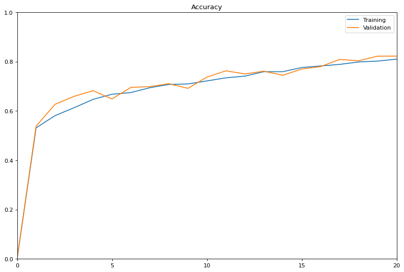

# Brain Visual Transformer

 Dong Hee (Dan) Lee
 s42470126
 Pattern Recognition and Analysis
Task 6 - Classify AD vs Normal of the ADNI brain data using a visual transformer.

# The Transformer

Building upon the previous work of the acclaimed *Attention Is All You Need* paper, the vision transformer is the application of this work to the field of computer vision. 
The Vision Transformer (ViT) adapts the traditional transformer by dividing input images into sequences of square patches as opposed to sequence of words. These square patches are flattened and then proceed much like a traditional transformer architecture; embedding learnable positional labels,  encoded to a latent dimension etc. 

[source](https://ai.googleblog.com/2020/12/transformers-for-image-recognition-at.html)

# Alzheimer's Disease Neuroimaging Initiative

The dataset for this task consists of greyscale images of size 256x240 split into 21,500 training samples and 9,000 test sample. The samples are separated into two classes, brain scan images from patients with Alzheimer's (AD) and brain scan of normal condition (NC)  
 

# The Model
This project chiefly uses vit-pytorch to implement the vision transformer architecture. While acceptable training and validation performances are achieved with some hyperparameter tuning, this ultimately did not result in acceptable test set accuracy. 

## Dependencies
This model is built using the following packages
- PyTorch 1.11 https://pytorch.org/
- Numpy 1.21.5 https://numpy.org/
- vit-pytorch 0.36.2 https://github.com/lucidrains/vit-pytorch 

## Performance and Tuning
Throughout the project, training data was split into 80% for training and 20% for validation with the training procedure saving the weights of the model providing the lowest validation loss and the final performance of the model being reported on via test set accuracy.

The main hyperparmeters tuned as part of this project are as follows

|Parameter| Description |
|---|---|
|dim   |  Size of last dimension after linear transformation |
|  patch_size|  Size of image patches  |
|  depth |  Number of transformer blocks |
|  heads|  Number of heads in multi-head attention layer |
|  mlp_dim|  Dimensions of MLP layer |
|  dropout| Dropout rate  |
|  emb_dropout|  Embedding dropout rate |
|  lr|  Learning Rate |
|EPOCHS | Number of training epochs|

## Model Variants
Numerous variations of the above mentioned hyperparameters were manually and empirically searched in an attempt to achieve the desired >80% test set accuracy. Ultimately, the best test set accuracy achieved sits at a mere 61%. Below outlines a few of the variations attempted.
### Initial Attempt
During training, neither training accuracy or validation accuracy strayed far from 50% (a result equivalent to random guessing). As it was apparent the model would not converge, training was interrupted after only 9 epochs of training.

|Parameter| Description |
|---|---|
|dim   |1024|
|  patch_size|  32  |
|  depth |  10 |
|  heads|  16 |
|  mlp_dim|  2048|
|  dropout| 0  |
|  emb_dropout| 0|
|  lr|  0.01|
|EPOCHS | 20|

- Training Accuracy Plot

The test set accuracy proved no better at 50%.

### Attaining convergence
The number of trainable parameters was reduced in an attempt to attain some level of convergence, chiefly by reducing depth layers and number of attention heads and also introducing dropout rates.
This resulted in the model achieving training and validation accuracies near 80% by the end of 20 epochs of training. 
|Parameter| Description |
|---|---|
|dim   |1024|
|  patch_size|  32  |
|  depth |  8 |
|  heads|  12 |
|  mlp_dim|  2048|
|  dropout| 0.5  |
|  emb_dropout| 0.5|
|  lr|  0.0001|
|EPOCHS | 20|

- Training Accuracy Plot

Despite the improvements, the model fails to generalise on the test set with a test set accuracy of only 61%.

## Improving generalisation

In an attempt to improve generalisability, tuning of the hyperparameters was explored and numerous additional approaches were taken.
- **Reducing patch sizes to 16x16**: Thereby increasing the number of patches (From 8x8=64 patches to 16x16=256 patches) and hence severely also increasing the complexity of the model. This resulted in the model failing to train due to memory limitations (12gb Nvidea 1080ti)
- **Incorporating data augmentations**: Augmenting the training data was achieved by utilising torchvision's AutoAugment transform with AutoAugmentPolicy.IMAGENET. This randomly applies image shifts, flips, rotations and inversions. Unfortunately, this resulted in reduced performance across the board and zero generalisability to the test dataset.

|Parameter| Description |
|---|---|
|dim   |1024|
|  patch_size|  32  |
|  depth |  6 |
|  heads|  12 |
|  mlp_dim|  1024|
|  dropout| 0.5  |
|  emb_dropout| 0.5|
|  lr|  0.001|
|EPOCHS | 20|
- Training Accuracy Plot

The model performed no better than random guessing on the test set with an accuracy of 50%.

## Final Model
Based on the empirical findings above, a final attempt at producing a model capable of generalising well on the test dataset was attempted. No data augmentation was applied and the number of epochs was increased and the model seemed to be fitting well on the training and validation set with accuracy reaching just below 90% for both.
|Parameter| Description |
|---|---|
|dim   |512|
|  patch_size|  32  |
|  depth |  8 |
|  heads|  12 |
|  mlp_dim|  1024|
|  dropout| 0.5  |
|  emb_dropout| 0.5|
|  lr|  0.0001|
|EPOCHS | 30|

- Training Accuracy Plot

- Training Loss Plot

Ultimately, the best performance that was achieved within this project failed to break past 61% test set accuracy. This is typically an indication of overfitting, but the validation set shows a steady increase during training. This leads to two possible conclusions:
Firstly,  since the both the training and validation sets are drawn from the same pool, there exists data leakage within the two sets, hence the model is simply overfitting to the training set while producing good validation accuracy.
Or secondly, there is very limited domain transfer between the training set and the test set so the model strugles to attain good performance on the test set. This is likely the more probably conclusion as the model is still capable of performing marginally better than random guessing.

# References

- https://pytorch.org/
- https://numpy.org/
- https://github.com/lucidrains/vit-pytorch 
- https://ai.googleblog.com/2020/12/transformers-for-image-recognition-at.html