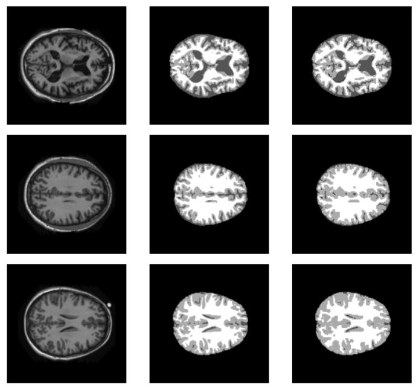
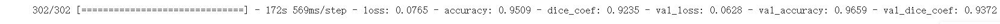
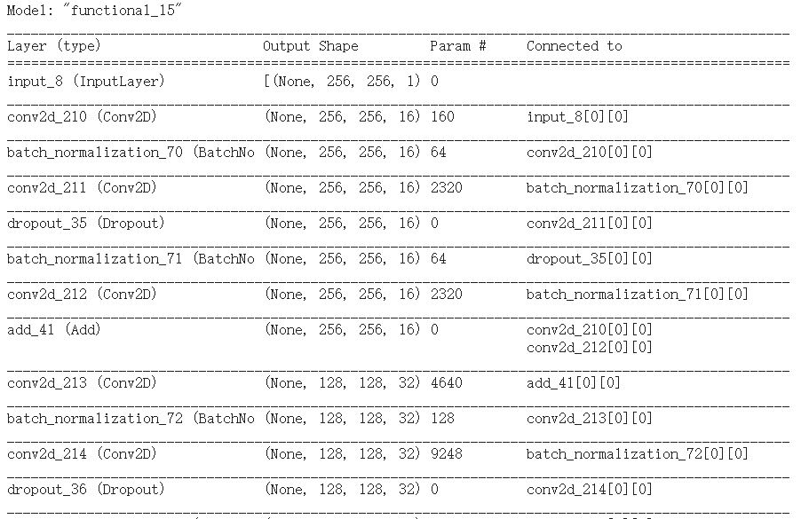
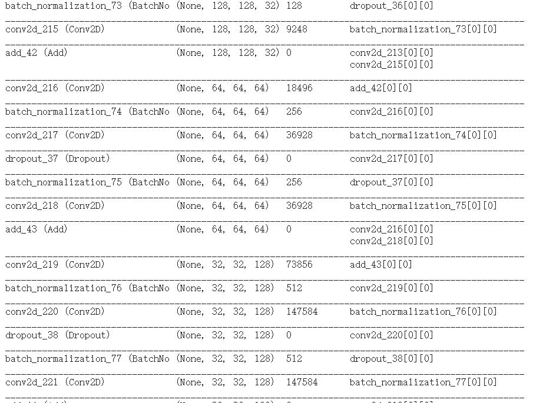
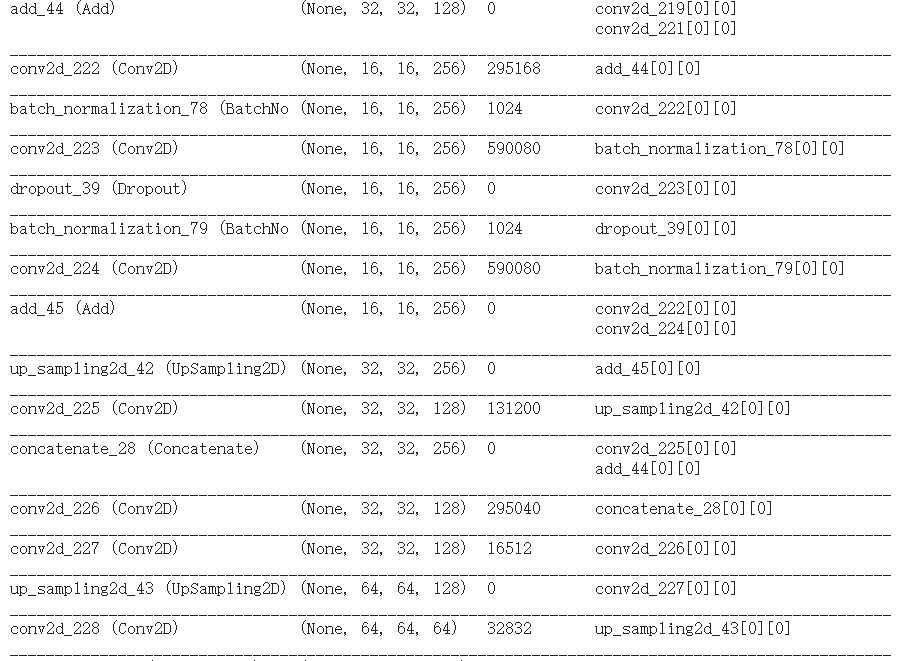
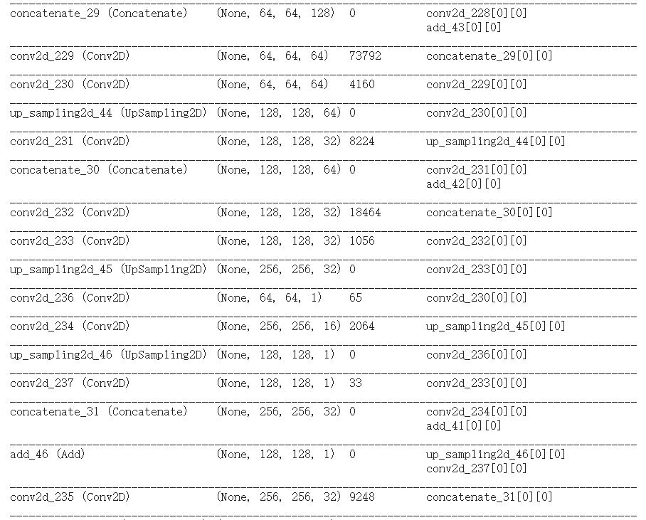
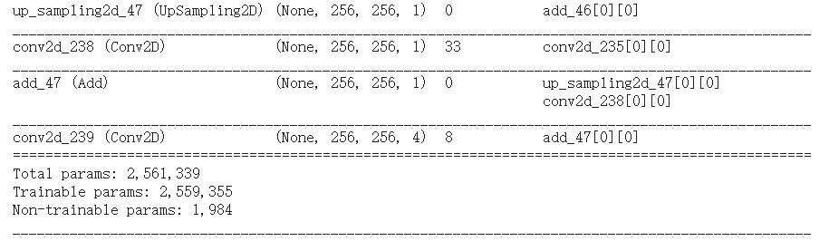
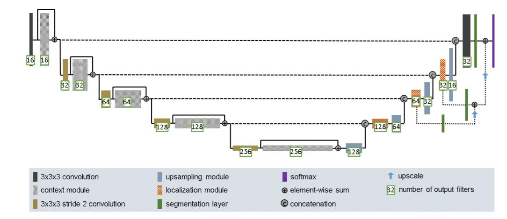

# Introduction
This project is created by

* HoYin Tong (s4563609)

... **in Semester 2, 2020** @ **The University of Queensland**

This is a project realted to do a segment the OASIS brain data set with an Improved UNet with all labels having a minimum Dice
similarity coefficient of 0.9 on the test set.
Under the improved_unet file it will contain two python scripy, which call Script.py and model.py

Driver script = Script.py

Model script = model.py

## The problem:
Given three dataset (train, test, validate)
The goal of this problem is to perform a magnetic resonance image segmentation of the brain (aka outline the brain)
Here are the predict image with our unet with over 90% accuracy

### And a example output after training

# Requirement

* tensorflow = 2.3.0

* python = 3.7.7

Also need to create a file under C drive call content in order to load and save the dataset

# Split Data set
As I am using the preprocessed dataset
So the data have split to Train, Test, Validate
* Train contain 9664 images
* Test contain 544 images
* Validate contain 1120 images

## Algorithm
In this project, I have build a improved_unet base on this paper:https://arxiv.org/abs/1802.10508v1
This improved_unet have few important module

#### context module
* This module is build with 
* 2 Batch Normalization layer
* 2 Conv2D layer
* 1 Dropout (0.3)
* Connected by 3x3x3 convolutions with input stride 2 to reduce the resolution of the feature maps and allow for more features while decending down the aggregation pathway.
  
#### upsampling module
  * This module is build with
  * 1 UpSampling2D layer
  * 1 Conv2D layer
  * Upsample the low resolution feature maps.
  
#### localization module
  * This module is build with
  * 2 Conv2D layer
  * Designed to take features from lower levels of the network that encode contextual information at low spatial resolution and transfer that information to a higher spatial resolution
  
#### segmentation layer
  * This module is build with
  * 1 Conv2D layer
  * Combining them via elementwise summation to form the final network output.
  
### Here are the model summary

And the newwork architecture form the paper

# How to use it
You can clone this repo or download a zip file from here
Inorder to run it you will need those requirement listed above
Also there are some line can changed base on your computer performance 
* line 114, you may change the epochs to observe long-term performance of the improved_unet
