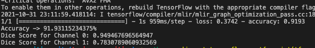

# Improved UNet on 2018 
- h

## Preprocessed ISICs 2018 Melanoma Dermoscopy Dataset

- jdf

The dataset have been split to 70% for training, 15% for validation and 15% for testing. I've decided

## Improved UNet Architecture
Inspired by the original UNet architecture, what was different was the additional layers of context and localisation module added. 

talk about batch norm, dropout sticking to 0.3 and change from original ReLU to LeakyReLU

## Results

Below are the plots of the training and validation accuracy and loss scores. An epoch of size 30 and a batch size of 2 was used for training. We've acheived a Dice coefficient score of 0.949 for Channel 0, and 0.783 for Channel 1. 

_Figure 343: Training Accuracy v.s. Validation Accuracy scores_

_Figure 343: Training Loss v.s. Validation Loss scores_

_Figure 343: Dice Coefficient scores for Channel 0 and 1_

## Dependencies
- Python 3.9.6
- Tensorflow 2.6.0
- matplotlib 3.4.3
- sklearn 1.0.1
- cv2 4.4.0
- Preprocessed ISICs 2018 Melanoma Dermoscopy Dataset (https://cloudstor.aarnet.edu.au/sender/?s=download&token=723595dd-15b0-4d1e-87b8-237a7fe282ff)

## References
F. Isensee, P. Kickingereder, W. Wick, M. Bendszus, and K. H. Maier-Hein, “Brain Tumor Segmentation
and Radiomics Survival Prediction: Contribution to the BRATS 2017 Challenge,” Feb. 2018. [Online].
Available: https://arxiv.org/abs/1802.10508v1