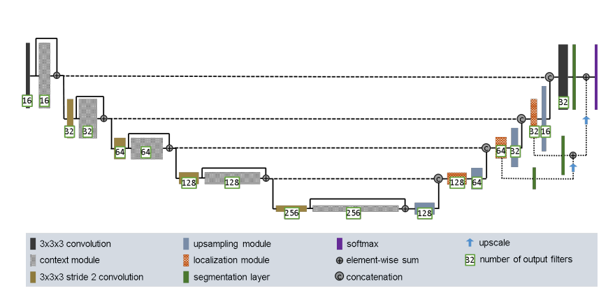
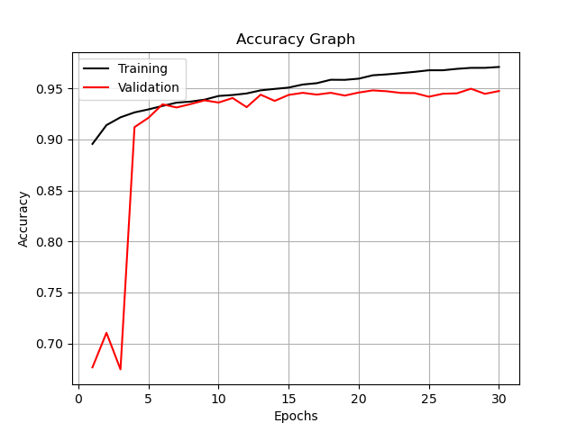
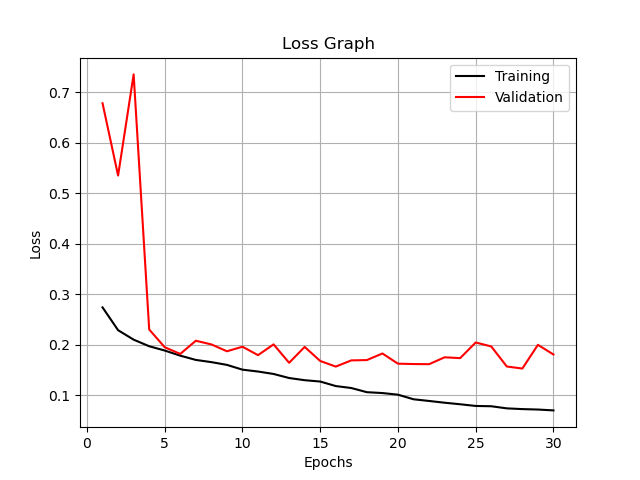
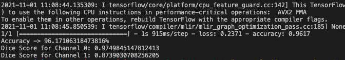
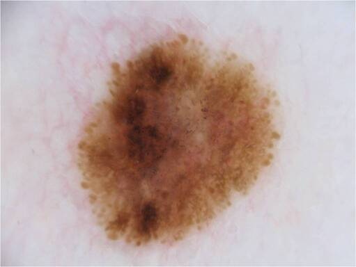

# Improved UNet on ISICs 2018 Melanoma Deroscopy Dataset

In this project, we'll be using a UNet convolutional neural network model to perform segmentation task on identifying skin lesion in images. Our expected dice coefficient scores for each channel should be a minimum of 0.8. 

## Preprocessed ISICs 2018 Melanoma Dermoscopy Dataset

The dataset consists of 2,597 images of lesions with their respective segmentation labels which contain a pixel value of 0, representing the areas outside the lesion, and pixel value of 255 for areas within the lesion. Below is an example of a pair of the original and segmented image of the lesion. 

 

_Figure 1: Original Image for ISIC_0000003_

 

_Figure 2: Segmented Image for ISIC_0000003_

### Data pre-processing

The dimensions of the images in the dataset have an aspect ratio of 1:0.75. The original and mask images have been resized to a dimension of 96 x 128, in respect to the aspect ratio, before encoding the pixel values for the mask images to either 0 or 1 values. Orignal images will maintain their pixel values. 

For the segmented gray-scaled mask images, we have ensured to have the pixel values either 0 or 1, with utilising the midpoint of 128. Pixel values below 128 will be changed to 0, vice versa. 

The dataset have been split to 70% for training, 15% for validation and 15% for testing. 

## Improved UNet Architecture

_Figure 3: Improved Unet Architecture_

Inspired by the original UNet architecture, with an introduction of the context and localisation module. 

As we can see above, the model architecture is similar to the ordinary Unet model, with the encoding section on the left and decoding on the right. The context module on each encoding layer follows to have two 3x3 convolution layers with a dropout layer of 0.3 in between the layers, using LeakyReLU as our activation. Likewise for other conv2d layers. An improvement was added with an additonal batch normalization before the dropout layer. The localisation module follows to have a 3x3 convolution followed by a 1x1 convolution which halves the feature maps. 

For the upsampling module, we used Conv2D Transpose with a stride of 2. To upscale the images, we used UpSampling2D with size of (2, 2). Finally on the last step of decoding, softmax activation was used. 

## Results

Below are the plots of the training and validation accuracy and loss scores. An epoch of size 30 and a batch size of 2 was used for training. 

_Figure 4: Training Accuracy v.s. Validation Accuracy scores_

_Figure 5: Training Loss v.s. Validation Loss scores_

_Figure 6: Dice Coefficient scores for Channel 0 and 1_

For both channels, we can see that we have acheived a dice coefficient score of above 0.8. We can evaluate by comparing between the orignal, mask and predicted images below. 

  

_Figure 7: Orignal, Masked and Predicted images (from left to right)_

## Dependencies
- Python 3.9.6
- Tensorflow 2.6.0
- matplotlib 3.4.3
- sklearn 1.0.1
- cv2 4.4.0
- Preprocessed ISICs 2018 Melanoma Dermoscopy Dataset (https://cloudstor.aarnet.edu.au/sender/?s=download&token=723595dd-15b0-4d1e-87b8-237a7fe282ff)

## References
F. Isensee, P. Kickingereder, W. Wick, M. Bendszus, and K. H. Maier-Hein, “Brain Tumor Segmentation
and Radiomics Survival Prediction: Contribution to the BRATS 2017 Challenge,” Feb. 2018. [Online].
Available: https://arxiv.org/abs/1802.10508v1