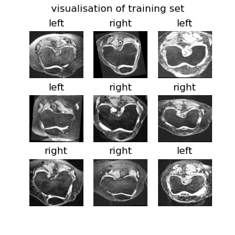

# COMP3710 Pattern Recognition Report
#### George Mulhearn (s4532094)

## Purpose
The purpose of this project is to create and assess the performance of a binary
classifier of the AKOA Knee dataset. This dataset contains 18600 png formatted
xray images of left and right knees from 101 unique patients.

## Implementation
The implementation of classification solution is divided into two parts/files;
`laterality_classifier.py` and `driver.py`.
### LateralityClassifier Class
The LateralityClassifier class is what builds the Tensorflow Keras CNN model
capable of binary classification of laterality in these images. The class
has two keras model options, the normal model and an overly simplified model
(for comparision purposes). 

#### Normal Model Architecture
NOTE: the usage of dropout and exact dropout rate for these dropout layers
is defined in the init parameters of the class.
```
_________________________________________________________________
Layer (type)                 Output Shape              Param #   
=================================================================
input_1 (InputLayer)         [(None, 228, 260, 1)]     0         
_________________________________________________________________
average_pooling2d (AveragePo (None, 57, 65, 1)         0         
_________________________________________________________________
conv2d (Conv2D)              (None, 57, 65, 32)        320       
_________________________________________________________________
conv2d_1 (Conv2D)            (None, 57, 65, 64)        18496     
_________________________________________________________________
max_pooling2d (MaxPooling2D) (None, 28, 32, 64)        0         
_________________________________________________________________
flatten (Flatten)            (None, 57344)             0         
_________________________________________________________________
dropout (Dropout)            (None, 57344)             0         
_________________________________________________________________
dense (Dense)                (None, 128)               7340160   
_________________________________________________________________
dropout_1 (Dropout)          (None, 128)               0         
_________________________________________________________________
dense_1 (Dense)              (None, 1)                 129       
=================================================================
Total params: 7,359,105
Trainable params: 7,359,105
Non-trainable params: 0
```

#### Simplified Model Architecture
```
_________________________________________________________________
Layer (type)                 Output Shape              Param #   
=================================================================
input_1 (InputLayer)         [(None, 228, 260, 1)]     0         
_________________________________________________________________
flatten (Flatten)            (None, 59280)             0         
_________________________________________________________________
dense (Dense)                (None, 1)                 59281     
=================================================================
Total params: 59,281
Trainable params: 59,281
Non-trainable params: 0
```

#### Dependencies
* Tensorflow
* Keras

### Driver
The driver python file is where all dataset processing, usage of the 
LateralityClassifier class and performance analysis takes place.

#### Process
When ran as the main file, the driver does the following:
* Downloads the AKOA dataset from the cloudstor URL (if it isn't already 
downloaded).
* Processes the image files, splitting them into training and validation,
 determining the classification label from the file name and ensuring minimal
 data leakage across the sets.*
* Performs initial dataset inspection: prints ratio of each class, and 
 visualises random images from each set paired with their labels.
 


* Creates an instance of LateralityClassifier, creates a keras model from it,
 compiles, and trains this model on the processed data.
* Performance over epochs of training is plotted
* Calculation of MSE and classification accuracy on the validation set is
 printed
* Visualisation of predictions and their actual labels is shown for inspection


#####*Solving Data Leakage
This dataset is especially vulnerable to data leakage as there is only 101
unique patient x-rays in entire set, meaning there is roughly 180 images for
each patient, many of which visually appear extremely similar, meaning if the
full set is just randomly shuffled, almost identical x-ray images are bound to
be present in both training and validation sets.. thus leakage.

To mitigate this effect, during the processing of the dataset, patients are
uniquely identified by the filename, and an extra processing step is done to
ensure that the training and validation set do not contain any images from the
same unique patient.

## Results
