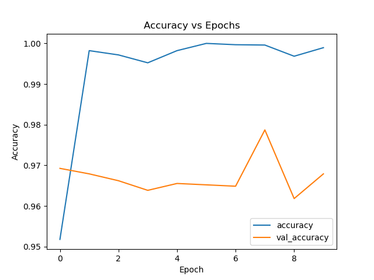

# OAI AKOA Dataset Laterality Classification

*description of the algorithm and the problem that it solves (approximately a paragraph), how it works in a paragraph and a figure/visualisation.*
*description and explanation of the working principles of the algorithm implemented and the problem it solves*


## Pre-requisites
* Python 3.5-3.8
* Tensorflow 2.1.0
  * If using Python 3.8, Tensorflow 2.2 or later is required.
* Matplotlib 3.3.2 (for plots)

## Usage
### cnn.py
The Convolutional Neural Network module can be used in external scripts by importing the class `CNNModel` from *cnn.py* and using 

```python
model = CNNModel(num_classes=<num_classes>)
```
where *<num_classes>* is the number of classes your data contains.

### classify_laterality.py
The driver script *classify_laterality.py* can be run from the cmd line using

```
>python classify_laterality.py <path_to_data_folder>
```

where *<path_to_data_folder>* is the path to the OAI AKOA data folder e.g. *"C:\Users\\<user\>\\.keras\datasets\AKOA_Analysis"*.

## Examples
An example usage of the driver script on the OAI AKOA dataset produces the following
```
_________________________________________________________________
Layer (type)                 Output Shape              Param #
=================================================================
conv_block (ConvBlock)       multiple                  9568
_________________________________________________________________
conv_block_1 (ConvBlock)     multiple                  55424
_________________________________________________________________
conv_block_2 (ConvBlock)     multiple                  221440
_________________________________________________________________
flatten (Flatten)            multiple                  0
_________________________________________________________________
dense (Dense)                multiple                  11878528
_________________________________________________________________
dropout_3 (Dropout)          multiple                  0
_________________________________________________________________
dense_1 (Dense)              multiple                  258
=================================================================
Total params: 12,165,218
Trainable params: 12,165,218
Non-trainable params: 0
_________________________________________________________________
Epoch 1/10
2020-11-02 16:51:19.488335: I tensorflow/core/kernels/data/shuffle_dataset_op.cc:172] Filling up shuffle buffer (this may take a while): 5606 of 12360
2020-11-02 16:51:29.488152: I tensorflow/core/kernels/data/shuffle_dataset_op.cc:172] Filling up shuffle buffer (this may take a while): 11134 of 12360
2020-11-02 16:51:31.735819: I tensorflow/core/kernels/data/shuffle_dataset_op.cc:221] Shuffle buffer filled.
387/387 [==============================] - ETA: 0s - loss: 0.1058 - accuracy: 0.9518 
Epoch 00001: saving model to training\ckpt01.ckpt
387/387 [==============================] - 37s 95ms/step - loss: 0.1058 - accuracy: 0.9518 - val_loss: 0.1579 - val_accuracy: 0.9693
Epoch 2/10
386/387 [============================>.] - ETA: 0s - loss: 0.0053 - accuracy: 0.9982 
Epoch 00002: saving model to training\ckpt01.ckpt
387/387 [==============================] - 35s 90ms/step - loss: 0.0053 - accuracy: 0.9982 - val_loss: 0.3417 - val_accuracy: 0.9679
Epoch 3/10
386/387 [============================>.] - ETA: 0s - loss: 0.0076 - accuracy: 0.9972     
Epoch 00003: saving model to training\ckpt01.ckpt
387/387 [==============================] - 34s 89ms/step - loss: 0.0076 - accuracy: 0.9972 - val_loss: 0.3153 - val_accuracy: 0.9662
Epoch 4/10
386/387 [============================>.] - ETA: 0s - loss: 0.0189 - accuracy: 0.9952     
Epoch 00004: saving model to training\ckpt01.ckpt
387/387 [==============================] - 35s 91ms/step - loss: 0.0189 - accuracy: 0.9952 - val_loss: 0.2524 - val_accuracy: 0.9639
Epoch 5/10
386/387 [============================>.] - ETA: 0s - loss: 0.0057 - accuracy: 0.9982     
Epoch 00005: saving model to training\ckpt01.ckpt
387/387 [==============================] - 36s 92ms/step - loss: 0.0057 - accuracy: 0.9982 - val_loss: 0.2695 - val_accuracy: 0.9655
Epoch 6/10
386/387 [============================>.] - ETA: 0s - loss: 1.8707e-04 - accuracy: 1.0000 
Epoch 00006: saving model to training\ckpt01.ckpt
387/387 [==============================] - 35s 91ms/step - loss: 1.8695e-04 - accuracy: 1.0000 - val_loss: 0.3639 - val_accuracy: 0.9652
Epoch 7/10
386/387 [============================>.] - ETA: 0s - loss: 0.0022 - accuracy: 0.9997
Epoch 00007: saving model to training\ckpt01.ckpt
387/387 [==============================] - 36s 93ms/step - loss: 0.0022 - accuracy: 0.9997 - val_loss: 0.3479 - val_accuracy: 0.9649
Epoch 8/10
386/387 [============================>.] - ETA: 0s - loss: 6.8052e-04 - accuracy: 0.9996
Epoch 00008: saving model to training\ckpt01.ckpt
387/387 [==============================] - 35s 91ms/step - loss: 6.8008e-04 - accuracy: 0.9996 - val_loss: 0.1887 - val_accuracy: 0.9787
Epoch 9/10
386/387 [============================>.] - ETA: 0s - loss: 0.0153 - accuracy: 0.9969
Epoch 00009: saving model to training\ckpt01.ckpt
387/387 [==============================] - 35s 90ms/step - loss: 0.0154 - accuracy: 0.9968 - val_loss: 0.4792 - val_accuracy: 0.9618
Epoch 10/10
386/387 [============================>.] - ETA: 0s - loss: 0.0036 - accuracy: 0.9989
Epoch 00010: saving model to training\ckpt01.ckpt
387/387 [==============================] - 36s 92ms/step - loss: 0.0036 - accuracy: 0.9989 - val_loss: 0.4388 - val_accuracy: 0.9679
Training set:
387/387 - 9s - loss: 7.6011e-07 - accuracy: 1.0000
Validation set:
93/93 - 2s - loss: 0.4388 - accuracy: 0.9679
Test set:
105/105 - 2s - loss: 0.0041 - accuracy: 0.9991
```




## Dataset Splitting


## Authors
Khang Nguyen
