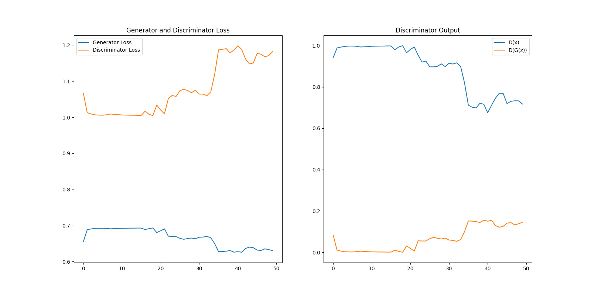
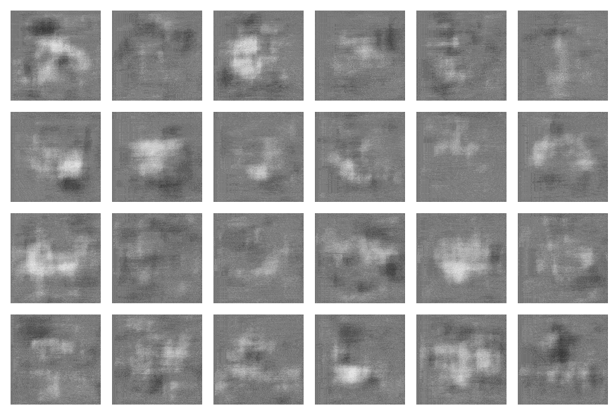

# OASIS Brain DCGAN

TensorFlow implementation of a [Deep Convolutional Generative Adversarial
Network][dcgan] (DCGAN) that generates images based on the [OASIS][oasis] brain data set.

The model has been designed with distributed training in mind. Specifically,
it uses [`MirroredStrategy`][tf-mirroredstrategy] which creates a replica of the
model on each GPU to enable multi-GPU training on a machine.

## Dependencies

|Library   |Version|
|----------|-------|
|tensorflow|2.3.0  |
|matplotlib|3.3.2  |
|numpy     |1.19.4 |

`matplotlib` is used to visualize and plot the loss functions and discriminator
outputs. `numpy` is used in the image preprocessing and output stages. 

## Configuration
See `utils.py` for the configuration settings.

## Running

The following steps assume a Linux environment and [`pipenv`][pipenv].

1. Use the following script to download the dataset

```bash
# Navigate to this directory
cd PatternFlow/recognition/ldgrp-OasisDCGAN
# Download the dataset
wget https://cloudstor.aarnet.edu.au/plus/s/n5aZ4XX1WBKp6HZ/download
# Unzip
unzip download
# Create a directory for our (unprocessed) input data
mkdir data
# Move the segmented images to the directory
mv keras_png_slices_data/keras_png_slices_seg*/* data
# Remove files and folders
rm -rf download keras_png_slices_data
```

2. Run `pipenv install` to create the virtual environment and install 
dependencies.
3. Run `pipenv shell` to active the virtual environment.
4. Run `python process_images.py <SIZE> --count=<COUNT> --shards=<SHARDS> --output=<OUTPUT_DIR>` to preprocess the images. 
5. Setup `config.json` to configure the driver script. See `utils.Config` for
all possible settings.
6. Run `python driver.py --config=<CONFIG_FILE>`.

The main part of the driver script is below
```python
with strategy.scope():
    gan = GAN(config)

    # Print model information
    gan.generator.summary()
    gan.discriminator.summary()

    # Train
    gan.train(dataset, config.epochs)

    # Save the model
    gan.generator.save(config.output_dir / 'models' / 'generator')
    gan.discriminator.save(config.output_dir / 'models' / 'discriminator')
```

## Running on SLURM

This model is able to take advantage of multi-GPU machines. A sample
script is available at `resources/slurm_job.sh`. UQ students can access the
Goliath compute cluster. The following script will use 4x NVIDIA K80s to run
train the GAN.

```
sbatch slurm_job.sh
```

## Algorithm

The model was trained on resized 128x128 images from the **segmented** OASIS brain
dataset. A similar training set can be recovered by running the command
```
python process_images.py 128 --output input128
```
and running `driver.py` with the config in `resources/config.json`.
```
python driver.py --config=resources/config.json
```

|Parameter| |
|---------|-|
|image_size|128|
|kernel_size|5|
|generator_beta1 (adam optimizer)|0.5|
|generator_lr (learning rate)|6e-05|
|discriminator_beta1 (adam optimizer)|0.5|
|discriminator_lr (learning_rate)|4e-05|
|epochs|50|
|batch_size|128|
|momentum|0.8|
|dropout|0.25|




## Network Architecture

### Generator
| Layer | Output Shape |
|-------|--------------|
|Dense|(None, 4096)|
|Reshape|(None, 4, 4, 256)|
|UpSampling2D||
|Conv2D|(None, 8, 8, 128)|
|BatchNorm||
|LeakyReLU||
|UpSampling2D||
|Conv2D|(None, 16, 16, 64)|
|BatchNorm||
|LeakyReLU||
|UpSampling2D||
|Conv2D|(None, 32, 32, 32)|
|BatchNorm||
|LeakyReLU||
|UpSampling2D||
|Conv2D|(None, 64, 64, 16)|
|BatchNorm||
|LeakyReLU||
|UpSampling2D||
|Conv2D|(None, 128, 128, 4)|
|BatchNorm||
|LeakyReLU||
|UpSampling2D||
|Conv2D|(None, 128, 128, 1)|
|Activation(tanh)||

### Discriminator
| Layer | Output Shape |
|-------|--------------|
|Conv2D|(None, 64, 64, 32)|
|BatchNorm||
|LeakyReLU||
|Dropout||
|Conv2D|(None, 32, 32, 64)|
|BatchNorm||
|LeakyReLU||
|Dropout||
|Conv2D|(None, 16, 16, 128)|
|BatchNorm||
|LeakyReLU||
|Dropout||
|Conv2D|(None, 8, 8, 256)|
|BatchNorm||
|LeakyReLU||
|Dropout||
|Flatten|(None, 16384)|
|Dense(tanh)|(None, 1)|

## Author
Name: Leo Orpilla III

Student: 45295517

## Resources

- [TensorFlow DCGAN Tutorial][tf-dcgan]
- [TensorFlow Distributed Training Guide][tf-distributed]
- [PyTorch DCGAN Tutorial][torch-dcgan]
- [Unsupervised Representation Learning with Deep Convolutional Generative Adversarial Networks][dcgan-paper]
- [Keep Calm and train a GAN][keep-calm]


[keep-calm]: https://medium.com/@utk.is.here/keep-calm-and-train-a-gan-pitfalls-and-tips-on-training-generative-adversarial-networks-edd529764aa9
[dcgan-paper]:https://arxiv.org/abs/1511.06434
[torch-dcgan]: https://pytorch.org/tutorials/beginner/dcgan_faces_tutorial.html
[tf-distributed]: https://www.tensorflow.org/guide/distributed_training
[tf-dcgan]: https://www.tensorflow.org/tutorials/generative/dcgan
[dcgan]:https://arxiv.org/abs/1511.06434
[oasis]:https://cloudstor.aarnet.edu.au/plus/s/n5aZ4XX1WBKp6HZ
[tf-mirroredstrategy]: https://www.tensorflow.org/api_docs/python/tf/distribute/MirroredStrategy
[pipenv]: https://pipenv.pypa.io/en/latest/install/#installing-pipenv