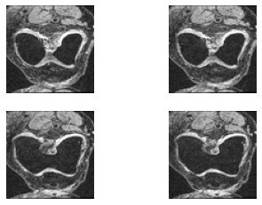
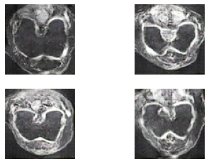
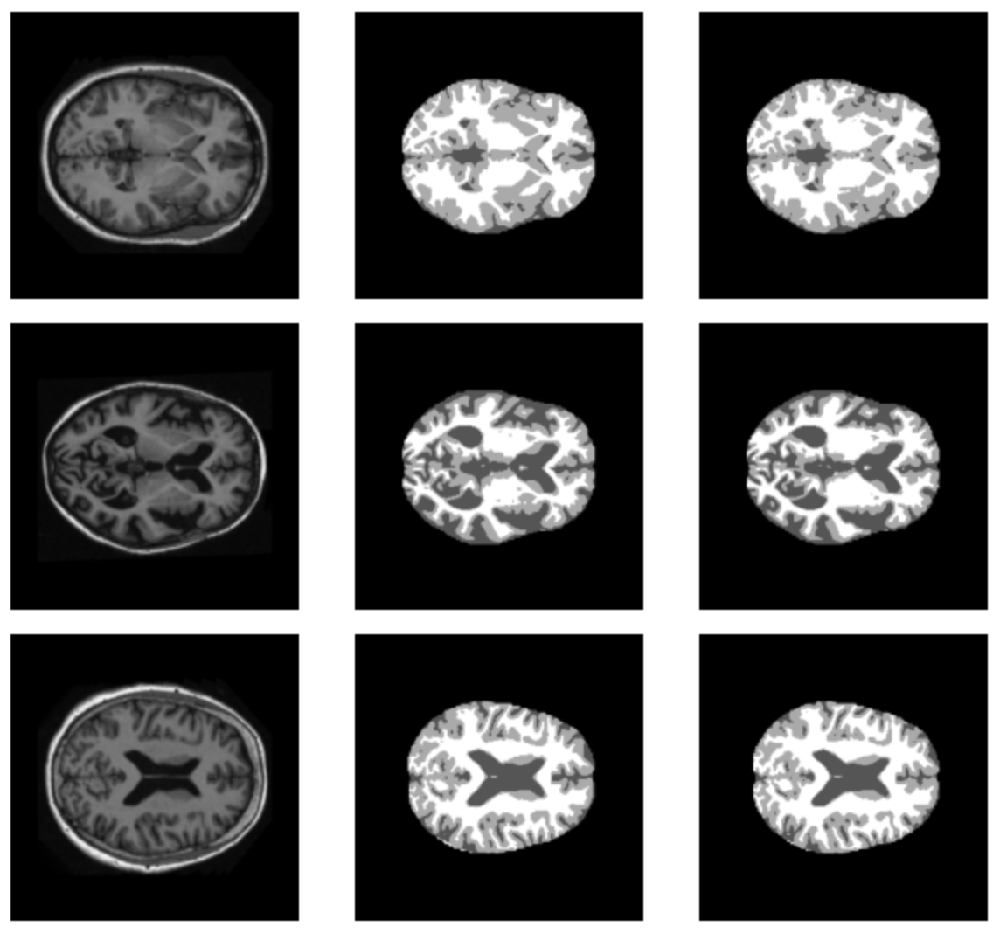
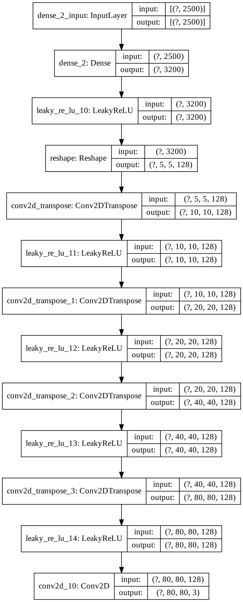
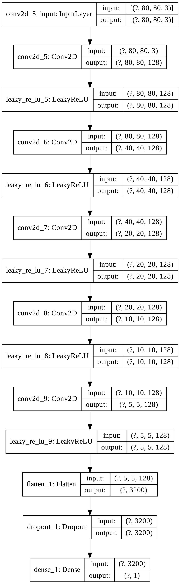
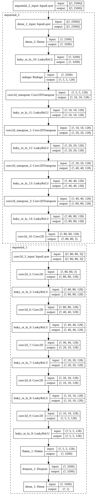

# **COMP3710 Report**
The report is to build the generative model of OAI AKOA knee dataset using DCGAN algorithm. The structure of the model is presented in the appendix in the form of images (call plot _model function of tensorflow). Before fixing this difficult problem, I build an Improved Unet for problem 1 (segmentation of OASIS brain dataset). The structure and result of Unet is shown in appendix, too.

>## **Dependencies:**
- Python = 3.7
- Tensorflow = 2.3.0
- IPython
- Matplotlib
- PIL
- zipfile
- glob

>## **Problem Discription:**

Problem 6 is to use DCGAN to develop a generative model of the OAI AKOA knee dataset to create reasonably clear image. DCGAN is an optimization of traditional GAN. I have already contacted the construction of the GAN model during Demo2. This time I completed DCGAN on the basis of GAN. The structure of generator, discriminator and gan model is attached in appendix. According to the DCGAN paper, the key points of my model design include:

1. Use convolutional layers instead of fully connected layers
2. Use step-size convolution instead of upsampling, which improves the stability of GAN training and the quality of generated results
3. Use leakyRELU instead of RELU to prevent gradient sparseness
4. The output layer of the generator uses tanh
5. Use adam optimizer to train GAN, set the learning rate to 0.0002
6. I try to add batch normalization function into generator and discriminator. But the performance is bad. So in the end I did not use this function.
7. Save the model design part separately in Model_DCGAN.py, and call the model in DCGAN_OAI.py.

>## **Data Split:**

I use 15000 images to train the model. During training, the batch size is set to be 128. In each batch, half to it is used to generate real samples. While half to it is used to generate fake samples. Finally, form a batch of weight updates together. Here is the true images:

>## **Evaluation Method:**

I used the built-in SSIM function of tensorflow. It just needs to pass in the tensors of the two sets of images to be compared to get the result.

>## **Output and Performance:**

After 50 epochs based on 15000 images, the prediction result is plot as follow:

This prediction images are clear and similar to the original ones. However, the SSIM result is not good enough which is 0.28. Output is shown as follow:

*SSIM is:  tf.Tensor(0.27565268, shape=(), dtype=float32)*

# **Appendix**

>**1. Improved unet for segmentation of OASIS dataset**

**Problem Discription:**

The aim of this problem is to use improved unet to complete the segmentation of the brain MRI images. Improved Unet is a optimization of  Unet. It introduces many new modules, such as location module, context module and segmentation layer. Besides, it uses leaky ReLu instead of ReLu. One thing worth noting is that there are three segmentation layers, and their results are added to get the final output. The dimensions of these three segmentation layers are different. So first upsampling to unify the dimensions, and then add them.

**Data Split:**

I use the same data split method to traditional Unet. According to the OASIS dataset. According to the OASIS data set, I transfer data from different folders to train, test and validation variables. Use train dataset and validation dataset to fit the model. Then the train loss and accuracy of each epoch, as well as the validation loss and accuracy is printed as output.

**Evaluation Method:**

I write a function to cumpute the dice similarity coefficient at the end of the model. At the beginning, I took this evaluation function as a parameter of metrics. But it doesn't work (System hint: unknown metric function). So I keep using accuracy during compile step and write seperate function to evaluate at the end.

**Output and Performance:**

After 10 epochs, the dice similarity coefficient is: 0.9778, meets the requirements of 0.9. The output of dice similarity coefficient is as below. 

*Dice similarity coefficient is:  tf.Tensor(0.9777626, shape=(), dtype=float32)*

Example of prediction visualisation is as follow:

> 2.**Structure of DCGAN**
1. Generator

2. Discriminator

3. Gan

