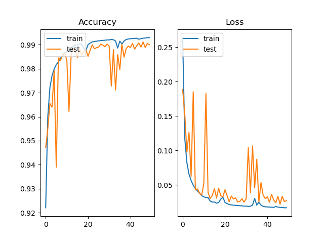

Segmentation of MR images of the male pelvis using UNet3D
---
## The data
The 3D Medical Radiation Images (MRIs) being segmented in this model 
have been made available by the CSIRO and were collected as part of a radiation 
therapy study from the Calvary Mater Newcastle Hospital, available at 
[https://data.csiro.au/collection/csiro:51392v2](https://data.csiro.au/collection/csiro:51392v2).
The collection also contains the segmentation masks for the MRIs. 

The goal of this model is to segment the MRIs into the background, body, bones, 
bladder, rectum and prostate.

The dataset consists of 211 MRIs and masks from 38 different patients (labelled 
as cases) with weekly images taken over up to 8 weeks.  To try and prevent data 
leakage a random number generator was used to split the dataset by case, this way 
the same patient would not appear in more than one set.  The samples were 
split to use approximately 70% of the images for training, 
20% for validation and 10% for testing. This resulted in the split:

| Validation Case Sample | Test Case Sample | Training Case Sample |
|------------------------|------------------|-------------------|
| Case 17 | Case 5| Remaining Cases
| Case 20| Case 11 |
| Case 23 | Case 25 |
| Case 29 | |
| Case 33 | |

## The model

This segmenting 3D UNet is a fully convolutional model which has an encoder 
path using pooling to contract and a decoder path using transpose to upsample 
the image. This is combined with skip connections between the layers in each 
path which help to preserve finer detail which may otherwise be lost.

The architecture of this UNet3D model is based on Çiçek et al. “3D U-Net: 
Learning Dense Volumetric Segmentation from Sparse Annotation”[[1](#References)]
below.

The number of filters in this model has been reduced to start at 8 due to 
availablity of computational resources.
In the encoder section each layer consists of two 3 x 3 x 3 3D convolutions 
with ReLu activation, with a single batch normalisation between and finally a 
max pooling of 2 x 2 x 2 with strides of size 2.  
In the decoder section each layer consists of a Conv3DTranspose of 2 x 2 x 2 
with strides of size 2 followed by a concatenation with the equivalent encoder 
layer.  Then two convolutions of 3 x 3 x 3 with ReLu activation with a batch 
normalisation between.
Finally, a convolution of 1 x 1 x 1 is applied with softmax activation to reduce
the number of channels to six, one for each of the segments.
The model uses the Adam optimiser and categorical crossentropy loss function.

The problem this model seeks to solve is to accurately segment 3D images.  These 
MRIs are very large and contain a lot of data.  Research using MRIs and even 
regular medical use can generate a large number of images.  Segmenting these by 
hand is a very time-consuming business and having a model perform a first pass 
on this type of data can save a great deal of time.

## Performance

Over 50 epochs the model consistently obtains a Dice similarity coefficient 
for each category of at least 0.70 on the test set.  The larger elements tend to 
be segmented with greater accuracy than the rectum and prostate. For example the 
dice similarity coefficients achieved in one run were:

| Segment | Dice Similarity Coefficient |
|---|---|
| Body: |  0.9849485216620109 |
| Bones: |  0.9090635175485707 |
| Bladder: |  0.9352509428441844 |
| Rectum: |  0.7969458456948727 |
| Prostate: |  0.7683444222281232 |
| Overall (including background): |  0.9900667955775251 |

An example slice of one test case, the matching mask from the dataset and the 
model's prediction:

Training and testing performance of the model's accuracy and loss over 50 epochs.

## Requirements

The model was trained and run on the University of Queensland High Performance 
Computing Cluster utilising an NVIDIA P100 with 16 GB of VRAM.  Due to the size of 
the MRIs, this amount of memory is required to process the images.  The model can 
be run on a GPU with less by reducing the number of starting filters in model 
from 8 to 4, however this will negatively impact the performance of the model.

This model was run on Python 3.9.7 and requires the following packages:
* Numpy 1.21.2
* Tensorflow-gpu 2.4.1
* Matplotlib 3.4.3
* SimpleITK 2.1.1

## References
[1] Çiçek, A. Abdulkadir, S. S. Lienkamp, T. Brox, and O. Ronneberger, “3D U-Net: Learning Dense
Volumetric Segmentation from Sparse Annotation,” in Medical Image Computing and Computer-Assisted In-
tervention – MICCAI 2016, ser. Lecture Notes in Computer Science, S. Ourselin, L. Joskowicz, M. R. Sabuncu,
G. Unal, and W. Wells, Eds. Cham: Springer International Publishing, 2016, pp. 424–432.
