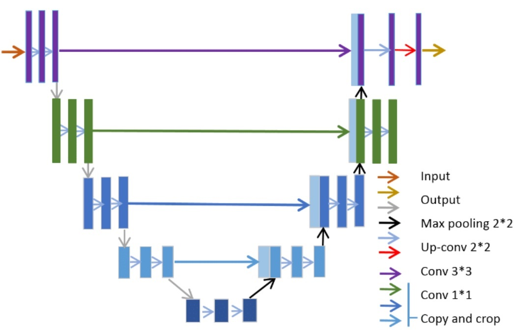
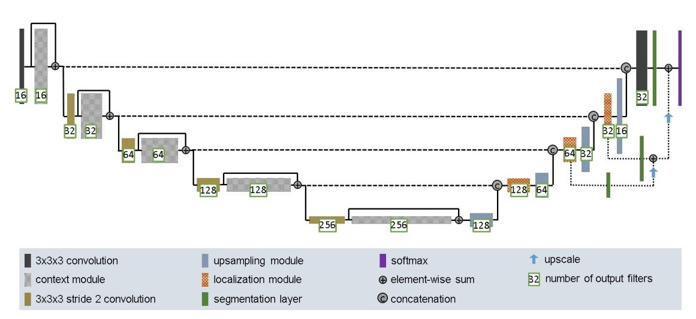
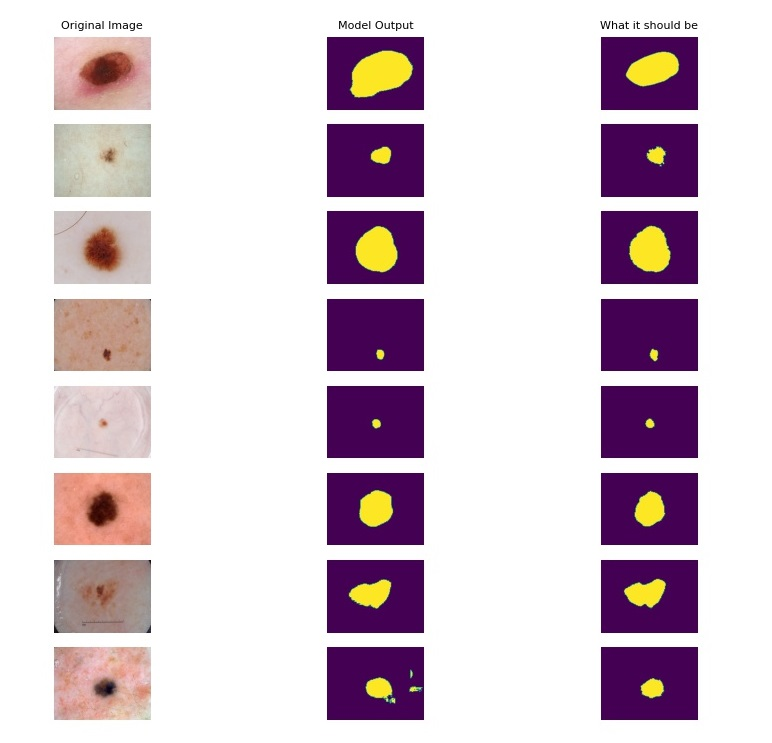
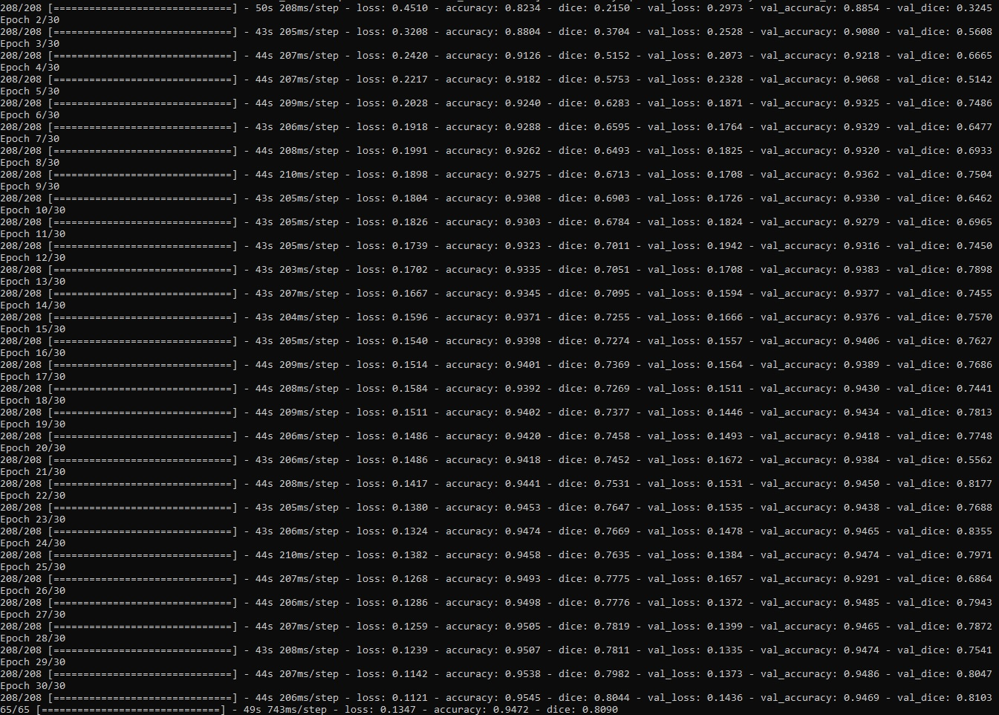
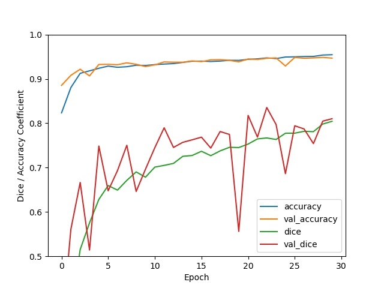
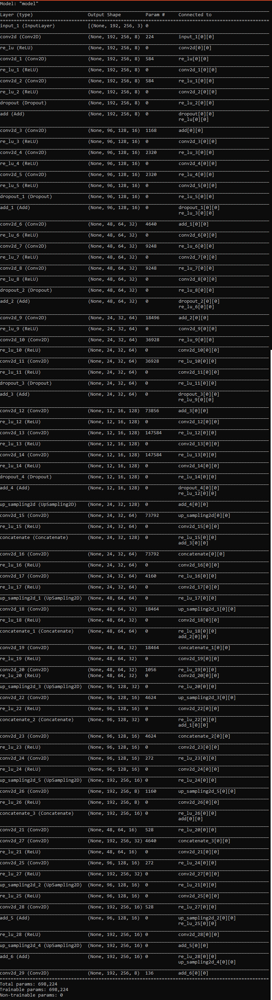

# Task 1 - Segment the ISICs data set with the Improved UNet

### Defined in Isensee et al. with all labels having a minimum dice similarity of 0.8 on the test set.  

## Problem Description and Dataset Information

The dataset used in this task is the ISICs 2018 dataset containing 2594 images and 12970 corresponding ground truth response masks. The challenge itself aims to improve melanoma diagnosis by investing in the development of deep learning and tasks individuals with developing algorithms and models which aid the diagnosis, detection and segmentation of melanoma. 
In this implementation, task 1 of the competition has been the focus whereby melanoma lesion segmentation is the goal with the output of the model having an average dice smilarity above 0.8 across predicted results.

The algorithm implemented solves the problem of more effective melanoma detection and diagnosis by identifying with a higher degree of accuracy problematic lesion areas through use of deep learning to recognise patterns among images that can be used as markers for melanoma detection.  

## UNET structure and Improved UNET

A typical UNET model structure can be found in figure 1 below. This image shows 9 main blocks, with each block having a different role across the model. Loosely the model can be broken into two categories, feature extraction and downsampling, and localisation and upsampling. Typically an input image is taken and progressively features are extracted to a desired model depth (1024 filter depth) and then localisation occurs back to the starting filter level. An extraction and downsampling block involves two 3x3 Relu convolutions about the subject filter level followed by a downsampling layer (stride change or maxpooling). A typical localisation and upsampling block involves two 3x3 Relu convolutions followed by a 2x2 convolution layer. The advantages of a UNET model is the time to training and accuracy on image sets as well as their ability to understand partially coherent features at a high resolution. They are thus a good application in diagnostic medical imaging. 

*Figure 1 - Typical Unet Structure*

The model implemented in this task is the improved UNET model taken from (Isensee et al, 2018)(1).

There are several key distinctions made in this model relative to the typical UNET described above and figure 2 shows this model. 
The key distinctions are concatenation blocks, to regulate neuronal learning and the use of LeakyRelu layers over Relu layers in a typical UNET to account for sparse gradients within imaging. Furthermore the strategic use of segmentation layers provides a unique form of deep supervision relative to the base UNET structure (1).  

*Figure 2 - Improved Unet Structure*

## Model Results

Below you will find example model output and results relative to predicted test sets in figure 3, 4 and 5. You will also be able to see the model summary showing the model implemented in figure 6. 

*Figure 3 - Model Output*

*Figure 4 - Results from execution shows a validated dice similarity greater than 0.80 during evaluation of the test set as well as a validated dice similarity above 0.80 in the final epochs.*

*Figure 5 - Plot showing the dice similarity at associated epoch number*

*Figure 6 - Model Summary output*

## Interesting Observations and Potential Future Improvements

From the results output shown in figure 3. You will observe that most of the model output (middle column) matches quite well the ground truth image on the far right, except for image 8 (1 from the bottom). For this image the model has determined that the problematic area includes the slightly inflamed region below and to the right of the brown spot. It would probably take a doctor or skin specialist to determine whether this is inclusive of the problematic area and whether or not our model is doing the correct thing. However for the puposes of this project it has been assumed the output is incorrect and that the deviated region from the ground truth is incorrectly highlighted. As such here I will propose mechanisms that can cater for this issue. 

From looking at the image it seems as though some slightly discouloured inflamed and red regions surrounding the brown dot have been included. To handle this our model will need to recognise these regions as non problematic and not diagnose normal skin behaviour as problematic. Asssuming this red region to be non-problematic. My solution to handle this (which has not been implemented here because it was not required) would be to train an additional UNET model (improved or not) surrounding normal skin behaviuor (model A). Then parse this model through this current implementation (model B) which recognises and labels problematic skin lesions. At the model diagnostic step (labelling) compute the difference between model B and model A tensors for the same reference image. In our subject image described earlier what this should do is remove the inflamed red region we are assuming to be normal skin behaviour because our model A should have recognised this. In the case where there is no substantial difference (within some value range) we would take the results of model B (this implementation).  

Why do I feel this is an appropriate way of handling this?  

From my observations running my model relative to the ISICs set, I have observed that these cases do arise with a non-trivial frequency, usually about one per output. The problematic area is still correctly labeled however relative to the truth it includes additional areas. By subtracting the model output we are essentially cross referencing two models trained to recognise different subsets of our diagnostic subject group where the group is defined as the set of [non problematic areas : problematic areas] and should lead to a higher degree of accuracy as we define a model for recognising each part of our group.

## Test / Training / Validation split
Currently the initial training and ground data sets are split 20% into test sets and 80% into training set. Of this remaining 80%, 20% is further split into a validation set (slightly smaller than the test set). Images are shuffled with the same random seed prior to segmentation and thus splitting is random at the below fixed proportions. 

_Breakdown_ 

* Training images - 64% of original data sets for ground and training.
* Test images - 20% of originial data sets for ground and training.
* Validation images - 16% of original data sets for ground and training. 

The above proportions were used due to similar proportions being used in modern research papers consulted. 

## Dependencies

### To use the project.py file (model generation)
The following libraries must be installed  

* Python 3.8.8
* Tensorflow 2.6.0

### To use the execute.py file (driver file)
The following libraries must be installed

* Python 3.8.8
* Tensorflow 2.6.0 -- includes keras
* numpy 1.19.5
* Scikit-learn 0.24.1
* Matplotlib 3.3.4
* Pillow 8.2.0

The execute script is dependant on the training images and ground truth images being downloaded and stored locally. These sets can be downloaded from the ISICs website. The location of the sets must be referenced within the execute.py file script with the appropriate strings. 

## Usage

project.py

To use the improved UNET model the project.py file must be stored locally and imported within the file wishing to use the model. Following import, the model can be referenced by using the UNET() function. 

_Example_

	import project as p

	model = p.UNET()

The UNET() function returns a UNET model for use in the associated file. 

execute.py

To use the execute script all the libraries mentioned above must be installed. The file can simply be called within a standard dos or linux setup using "execute.py" on the command line. 
	
This script will segment the training and ground truth sets into associated test, validation and training sets. It will create the model and it will then evaluate and return example output. 

Furthermore to run the execute file, load up an anaconda instance (with dependencies installed) and run the following command.   

_Example_
	
	C:\> execute.py
	
	or
	
	C:\> python execute.py

## References

1) Isensee, F. et al., 2018. Brain Tumor Segmentation and Radiomics Survival Prediction: Contribution to the BRATS 2017 Challenge. Brainlesion: Glioma, Multiple Sclerosis, Stroke and Traumatic Brain Injuries, 10670, pp.287–297.R

2) Hoorali, F., Khosravi, H. & Moradi, B., 2020. Automatic Bacillus anthracis 	bacteria detection and segmentation in microscopic images using UNet. Journal of microbiological methods, 177, p.106056.

3) Piao, S. & Liu, J., 2019. Accuracy Improvement of UNet Based on Dilated  Convolution. Journal of physics. Conference series, 1345(5), p.52066.
  