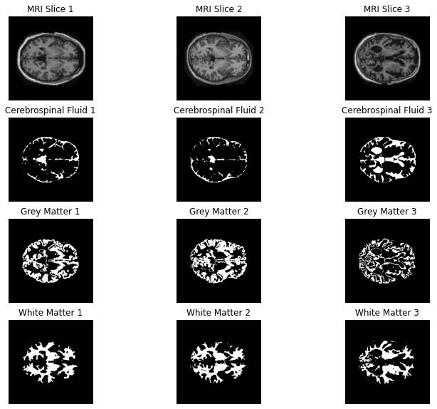
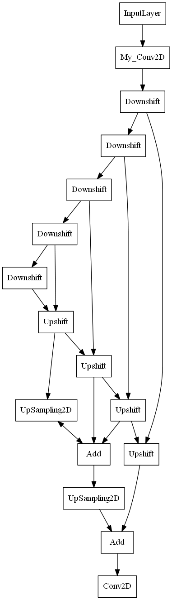
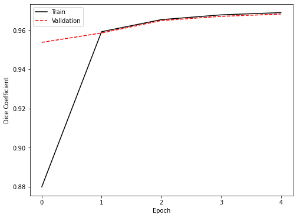
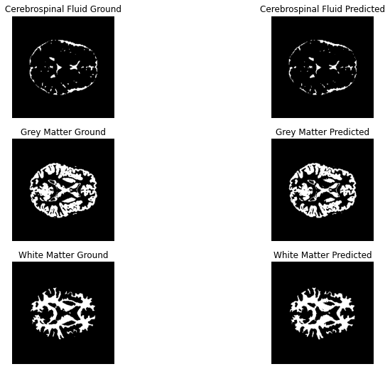

## OASIS MRI Segmentation
This folder contains:

* `driver.py` - Driver module which processes data, compiles and trains a model as well as visualizes results
along the way.
* `input_line.py` - Module containing functions for the data input line.
* `layers.py` - Module containing subclassed layers for the model.
* `model.py` - Module containing subclassed model.
* `metrics.py` - Module containing custom metric and loss functions.
* `OASIS_seg.ipynb` - Contents of all modules displayed as a cohesive Jupyter Notebook.

as well as some images of output from `driver.py`. Dependencies include:

* `tensorflow`.
* From `tensorflow.keras.optimizers`, Adam.
* From `tensorflow.keras`, backend.
* `matplotlib.pyplot`.
* `pydot` (only for generating the model graph).
* `pydotplus` (only for generating the model graph).
* `glob`.
* From `itertools`, product.

all of which are included in the `myenv.yml` file of the `s4353631` folder.
The recognition task I approached was a semantic segmentation 
of the OASIS brain MRI library, with the 3D scans separated into 256X256 2D images. Three sample images are shown below 
along with their ground truth segmentation masks. Note that these are 2D MRI slices taken from three separate brains.

My network architecture of choice was an [improved UNet](https://arxiv.org/abs/1802.10508). 
A standard Unet consists of a convolutional autoencoder with residual connections added between ingoing and outgoing 
layers of the same size feature space. In addition to this underlying frame my UNet was augmented with segmentation 
layers, which provided further context aggregation by combining upsampled segmentations from all outgoing layers. 
The ingoing and outgoing layers were implemented as `Downshift` and `Upshift` subclasses of the `tf.keras.layers.Layer` 
class. In the case of the `Downshift` subclass this allowed for the incorporation of a context module passing to a 
stride 2X2 convolution, while the `Upshift` combines an upsampling module with a localization module as described 
[here](https://arxiv.org/abs/1802.10508). Both `Downshift` and `Upshift` subclasses are subsumed by a subclassed 
`My_UNet` model and are themselves composed primarily of highly flexible, again subclassed `My_Conv2D` convolutional 
layers. Lower level details are included in the relevant docstrings, including in-depth descriptions of each module.

The `My_Conv2D` layers are key to the network's success, providing a very high level of flexibility while facilitating 
the easy construction of performant autoencoding models. Particularly important is the standard `My_Conv2D` configuration, 
including leaky ReLU activation, uniform Kaiming (He) initialization (optimized for the leaky ReLU activations) and 
pre-activation batch normalization. The loss function employed for training was a 
[smoothed Jaccard distance](https://journals.plos.org/ploscompbiol/article/file?type=supplementary&id=info:doi/10.1371/journal.pcbi.1006388.s002), 
trained with a batch size of 2 over an 85% (4832 images), 10% (560 images), 5% (272 images) train, test, validation split. 
This train-heavy split was chosen so as to prevent the need for data augmentation or similar measures, given the common 
failure of such segmentation models to generalize. Training with the Adam optimizer over the swiftly decaying learning rate 
schedule implemented in `driver.py` and `OASIS_seg.ipynb`, `My_Unet` was able to reliably achieve a dice coefficient on the 
validation set of ~0.95 after a single epoch. The training (over 5 epochs as in the implementation) below resulted in a 
reliable mean test set dice coefficient of ~0.96. Similar results were achievable with a much smaller network of only 
3 `Downshift` layers, indicating the effectiveness of the architecture's residual design as well as its ability to learn efficient 
feature mappings.

Below are ground truth and modelled segmentations as a result of the training implemented.

The robustness of `My_UNet` in combination with its simple construction from arbitrarily many `Downshift` and `Upshift` layers 
could make it an interesting candidate for research into the generalizability of such segmentation models. While these models 
perform admirably on the test, validation and test sets, they often fail when applied to images from a different MRI machine 
for example. Perhaps a high level of data augmentation and increased regularization (here L2 regularization was incorporated into 
the design of `My_Conv2D` but not used) could yield intriguing results.
