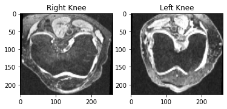
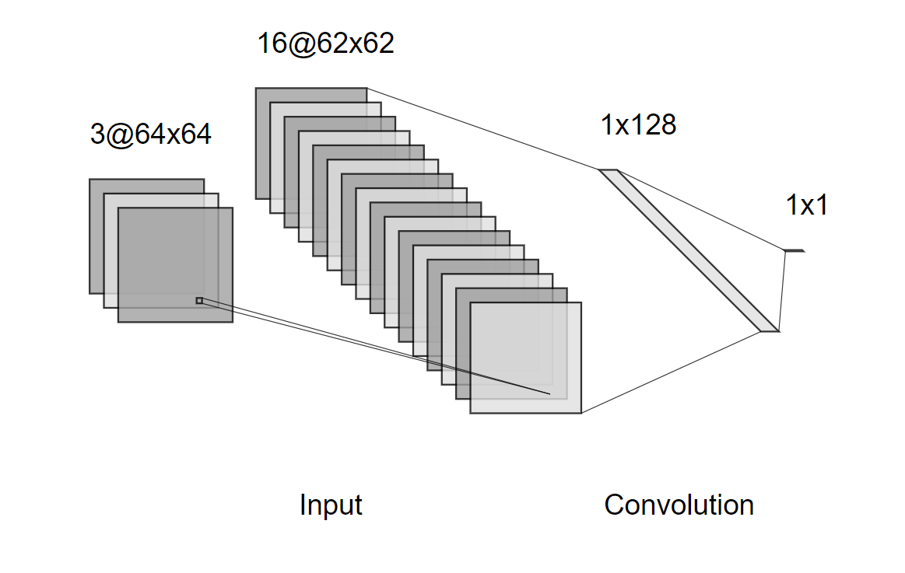
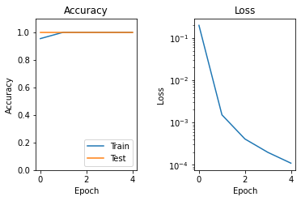

# Classifying Knee Laterality with a CNN
This is the recognition project component of COMP3710.

s4361465 Kelsey McGahan 

Given a database of MRI images of left and right knees I was able 
to build a Convolutional Neural Network (CNN) that performed binary
classification. The data was supplied and preprocessed by the course
and was sourced from the 
[Osteoarthritis Initiative](https://nda.nih.gov/oai/). 

The images were labelled with their sidedness in the filename. 
The dataset contained 18680 images with an approx. 40/60 split
of left/right images. The images were (228, 260) and RGB. The 
pixel values are between 0 and 1. 
Before training the model I re-sized the images to (64,64) to 
decrease training time. 
Below are example of left and right knees prior to 
re-sizing.

# Train-Test Splits
The dataset was split into training and testing using
sklearn.train_test_split(). 

I experimented with how much of the data is required for 
testing (see table below) by varying the test % and 
observing the convergence to Validation and Training 
Accuracy within 5 epochs. This is because if I were to 
allocate too much data to train than was necessary, then
I am at risk of overfitting the model. 

Test % | Validation Accuracy | Training Accuracy 
--------|---------------------|-------------
 25%    | 1.0                 | 1.0               
 60%    | 1.0                 | 1.0               
 70%    | 1.0                 | 1.0               
 80%    | 0.9996              | 1.0               
 90%    | 0.9979              | 1.0               

From the table you can see that I was able to achieve 
convergence to 100% validation and training accuracy 
within 5 epochs, with 
as little as 30% of the dataset for training. This 
corresponds to approximately 5600 images. 

# The CNN Model
I used a convolution neural network with input of 64x64 images with 3 
channels. This then feeds into a convolution with filter size (3, 3)
with depth 16. This then leads into a Flatten layer, 
then 2 Dense layers, withe the last one with an output of 1. 
As the output is either 0 or 1 (left or right) the 
activation function is sigmoid and the loss function
is binary_crossentropy. Relu was used as the activation function 
for the hidden layers as it works well with this classification
style problem. 

Note that the diagram was generated using: 
http://alexlenail.me/NN-SVG/LeNet.html

The summary of the model given through tensorflow is as below:

    Model: "sequential_8"
    _________________________________________________________________
    Layer (type)                 Output Shape              Param #   
    =================================================================
    conv2d_8 (Conv2D)            (None, 62, 62, 16)        448       
    _________________________________________________________________
    flatten_8 (Flatten)          (None, 61504)             0         
    _________________________________________________________________
    dense_16 (Dense)             (None, 128)               7872640   
    _________________________________________________________________
    dense_17 (Dense)             (None, 1)                 129       
    =================================================================
    Total params: 7,873,217
    Trainable params: 7,873,217
    Non-trainable params: 0

# Output Accuracy and Loss Plots
Example plots of the Accuracy and Loss after training the
model for 5 epochs. 

## Dependencies
* Jupyter Notebook
* Tensorflow (2.1.0)
* Python (3.7.9)
* matplotlib (3.3.1)
* numpy (1.19.1)
* cv2 (4.4.0)
* wget (3.2)
* sklearn (0.23.2)

## Files in Repository
* ``Driver-Script.ipynb`` - Interactive notebook to import, 
unzip, pre-process the data, then call the model and plot results.
* ``Classify_Knee_Laterality_Model.py`` - Tensorflow model.
* ``README.md`` -  This file.
* ``readmeImages/*`` - Images for this README.