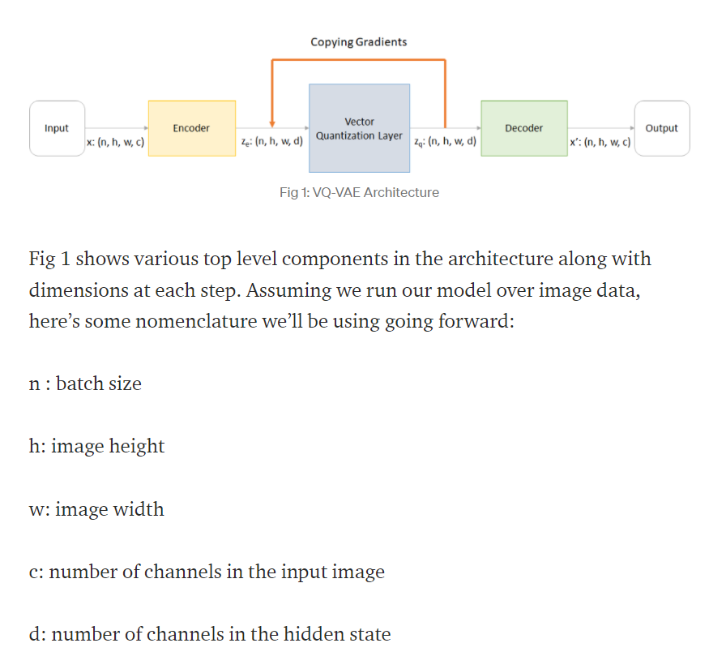
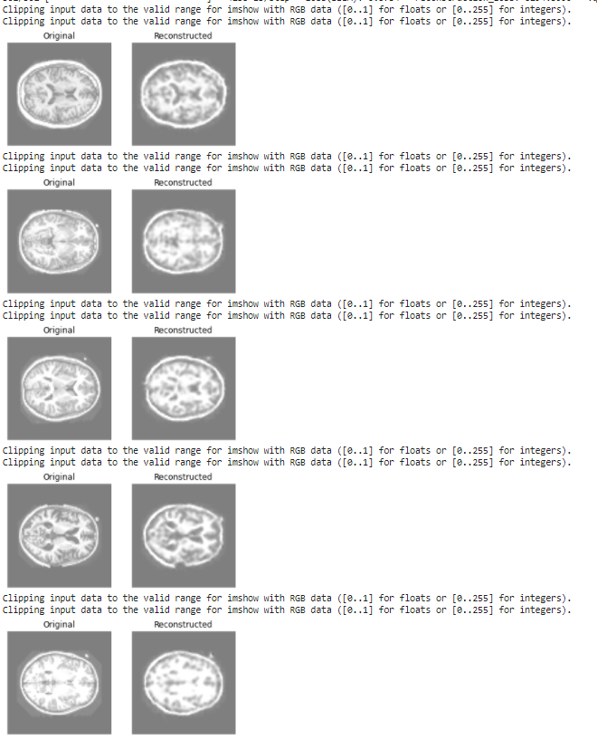
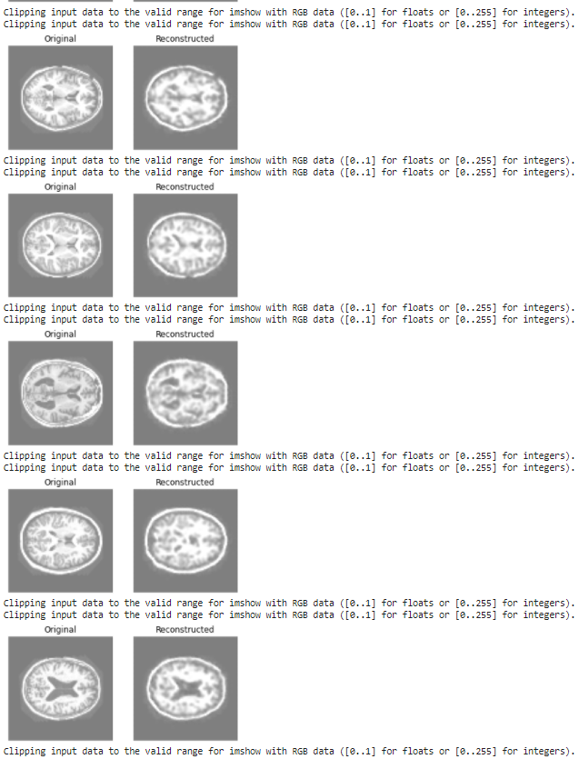
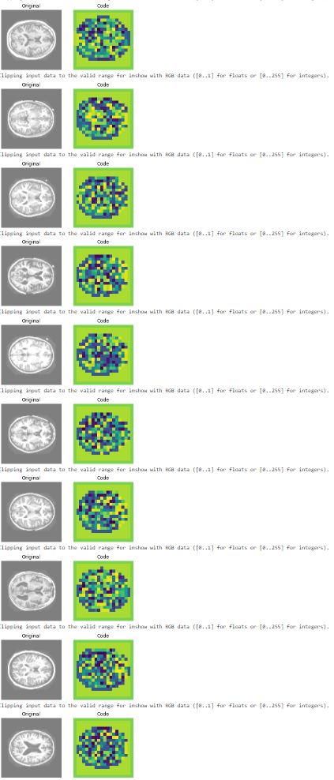

# VQVAE Model based Generator 

## VQ-VAE Model Description and Suitability for OASIS dataset.
### The VQVAE model has 3 components. It's a variational autoencoder with an encoder, decoder and vector quantizer (as shown below).

#### Above image from: https://shashank7-iitd.medium.com/understanding-vector-quantized-variational-autoencoders-vq-vae-323d710a888a

### VQVAE model adds a (continuous latent distribution. It extends the standard autoencoders by adding a list of vectors with indexes that are used to quantize the bottleneck/differences of the autoencoder i.e. the output of the encoder network is compared to all the vectors within the vector quantizer and the vector with least Euclidean distance difference is fed to the decoder. 

### The OASIS dataset, a neuroimaging dataset, consisting of over 9K MRI images from brain study participants, was fit using a VQVAE model. This model can fit complex data distributions very easily and can subsequently differentiate different types of data points in the latent space. Hence, using a VQVAE model on the OASIS dataset makes it easier to distinguish between the MRI scan images. 

## Dependencies/Challenges 
*	Down-sampling of image size due to limitation of Colab resources (RAM) 
*	Choosing appropriate dimensions for model layers accordingly to the data
*	Using SSIM as the loss function for model fit and evaluating model performance 

## OASIS Dataset Results (Includes visualisations)
* Model was trained for 10 epochs. Images were downsampled (shape:80,80,3) 
* Highest average SSIM score: 0.84  
* Reconstructed images from test data (results): 

* Discrete code visualisation 

## Training and testing data split justification
* The sourced OASIS dataset had already divided its images into training, validation and testing sets (segmented and not segmented). The segmented training set was used to train the model and the segmented validation set was used to test the model.

## References
* README.md information: https://shashank7-iitd.medium.com/understanding-vector-quantized-variational-autoencoders-vq-vae-323d710a888a
* Laoding images/extracting image information: https://colab.research.google.com/github/keras-team/keras-io/blob/master/examples/vision/ipynb/oxford_pets_image_segmentation.ipynb?authuser=2#scrollTo=Nw6C51plO7cD
* Model: https://keras.io/examples/generative/vq_vae/
* Other: https://www.youtube.com/watch?v=YV9D3TWY5Zo&ab_channel=DigitalSreeni ; https://www.youtube.com/watch?v=c27SHdQr4lw&t=360s&ab_channel=PaulHand ; https://www.youtube.com/watch?v=52G6WhBDQ3c&ab_channel=DeepFoundations
