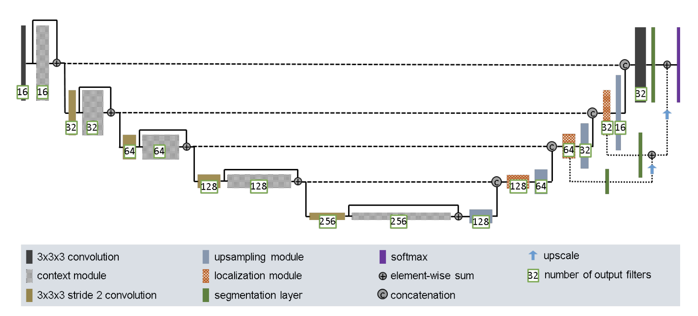
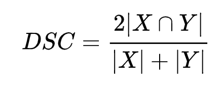
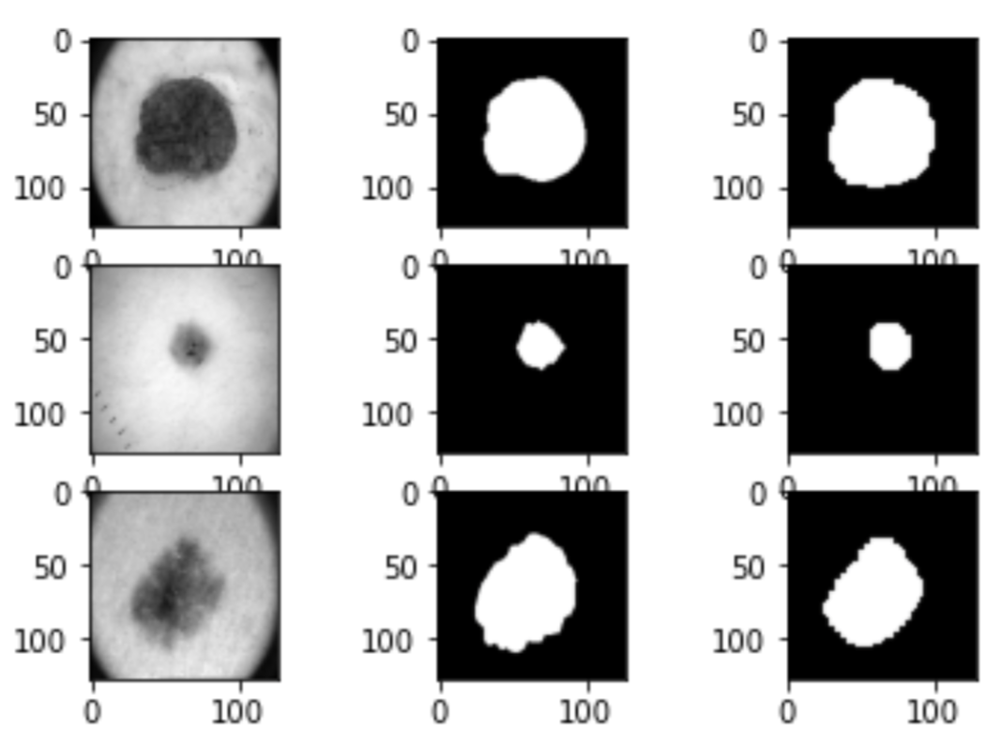
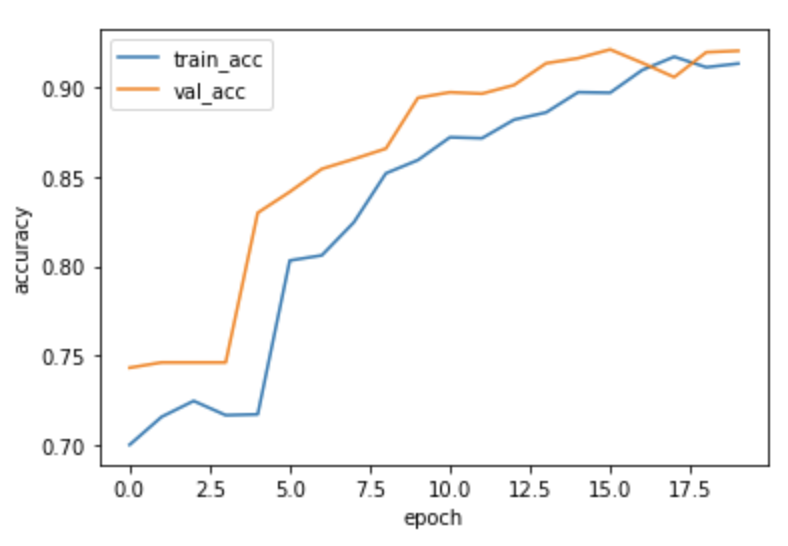
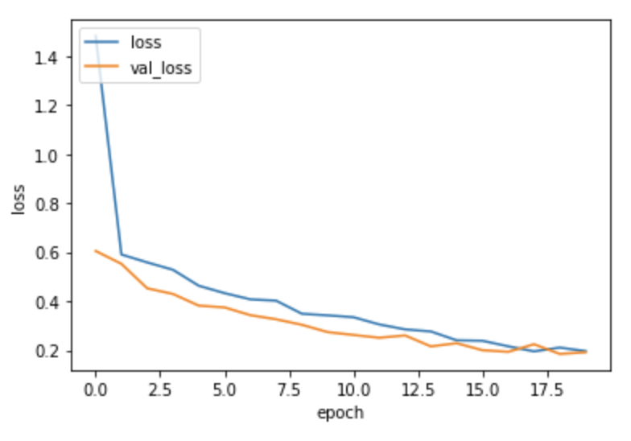

<br>
<h2>
Segment the ISICs data set with the Improved UNet 
</h2>
<b>Created by Anqi Yan, S4413599</b>
<br><br>
<h3>
Introduction
</h3>
<p>
This project uses Improved UNet to segment the ISICs dataset into foreground and
background segmentations. The ISICs dataset contains skin disease images which contains
some cutaneous tumors on the skin and its segmentation images. The Improved UNet will take the actual skin disease images
as input and take its segmentation images as output to fit the Improved UNet model. 
Then use the trained model to segment the cutaneous tumors on the test skin images
into foreground and background. 
Finally. This model aims to achieve above 80% of Dice Similarity Coefficient.<br><br>
</p>
<br>
<h3>Improved UNet</h3>
The project used Improved UNet model which is derived from the U-Net to do the segmentation.

<p align = "center">
    
    The Improved UNet diagram shows above. 
</p>
<br>
Key components in the improved UNet<br>
* The CONTEXT module is a pre-activation residual block
which contains 3*3*3 convolutional layers and a dropout layer with 
0.3 drop rate<br>
* The upsampling module contains a upsampling2D layer and a 3*3*3 convolution
layer<br>
* The Localization module contains a 3*3*3 convolutional and a 1*1*1
convolution layer<br>
* The activation function used in the model is Leaky Relu with the slope 10^-2<br>
<h3>
Metrics
</h3>
Dice Similarity Coefficient(DSC) used to measure the similarities between the predicted
dataset and actual segmentation dataset. The algorithm uses DSC as the metric<br>
<p align = "center">
    <br>
    The Dice Similarity Coefficient formula shows above 
</p>

<h3>
<br>
Training result of 20 epochs<br>
</h3>
<br>

```sh
Epoch 1/20
20/20 [==============================] - 38s 2s/step - loss: 0.6971 - DSC: 0.3374 - accuracy: 0.6762 - val_loss: 0.6821 - val_DSC: 0.3235 - val_accuracy: 0.7589
Epoch 2/20
20/20 [==============================] - 38s 2s/step - loss: 0.6370 - DSC: 0.3141 - accuracy: 0.7216 - val_loss: 0.5083 - val_DSC: 0.2926 - val_accuracy: 0.7589
Epoch 3/20
20/20 [==============================] - 37s 2s/step - loss: 0.5066 - DSC: 0.3840 - accuracy: 0.7216 - val_loss: 0.4092 - val_DSC: 0.4110 - val_accuracy: 0.7589
Epoch 4/20
20/20 [==============================] - 36s 2s/step - loss: 0.5064 - DSC: 0.4322 - accuracy: 0.7507 - val_loss: 0.3894 - val_DSC: 0.4896 - val_accuracy: 0.8213
Epoch 5/20
20/20 [==============================] - 36s 2s/step - loss: 0.4115 - DSC: 0.5369 - accuracy: 0.8187 - val_loss: 0.3387 - val_DSC: 0.5974 - val_accuracy: 0.8735
Epoch 6/20
20/20 [==============================] - 36s 2s/step - loss: 0.3461 - DSC: 0.6134 - accuracy: 0.8553 - val_loss: 0.2646 - val_DSC: 0.6813 - val_accuracy: 0.8960
Epoch 7/20
20/20 [==============================] - 37s 2s/step - loss: 0.3031 - DSC: 0.6730 - accuracy: 0.8775 - val_loss: 0.3281 - val_DSC: 0.6314 - val_accuracy: 0.9056
Epoch 8/20
20/20 [==============================] - 38s 2s/step - loss: 0.3244 - DSC: 0.6570 - accuracy: 0.8815 - val_loss: 0.2337 - val_DSC: 0.7113 - val_accuracy: 0.9165
Epoch 9/20
20/20 [==============================] - 38s 2s/step - loss: 0.2668 - DSC: 0.7200 - accuracy: 0.8992 - val_loss: 0.2316 - val_DSC: 0.7821 - val_accuracy: 0.9185
Epoch 10/20
20/20 [==============================] - 36s 2s/step - loss: 0.2420 - DSC: 0.7413 - accuracy: 0.9049 - val_loss: 0.2593 - val_DSC: 0.7607 - val_accuracy: 0.9113
Epoch 11/20
20/20 [==============================] - 36s 2s/step - loss: 0.2361 - DSC: 0.7522 - accuracy: 0.9082 - val_loss: 0.2527 - val_DSC: 0.6870 - val_accuracy: 0.9177
Epoch 12/20
20/20 [==============================] - 36s 2s/step - loss: 0.2203 - DSC: 0.7619 - accuracy: 0.9125 - val_loss: 0.2145 - val_DSC: 0.7715 - val_accuracy: 0.9190
Epoch 13/20
20/20 [==============================] - 36s 2s/step - loss: 0.1993 - DSC: 0.7868 - accuracy: 0.9205 - val_loss: 0.2046 - val_DSC: 0.7651 - val_accuracy: 0.9243
Epoch 14/20
20/20 [==============================] - 36s 2s/step - loss: 0.2142 - DSC: 0.7727 - accuracy: 0.9217 - val_loss: 0.2327 - val_DSC: 0.7495 - val_accuracy: 0.9192
Epoch 15/20
20/20 [==============================] - 36s 2s/step - loss: 0.2176 - DSC: 0.7705 - accuracy: 0.9166 - val_loss: 0.1991 - val_DSC: 0.7684 - val_accuracy: 0.9251
Epoch 16/20
20/20 [==============================] - 36s 2s/step - loss: 0.1803 - DSC: 0.8041 - accuracy: 0.9273 - val_loss: 0.1826 - val_DSC: 0.8018 - val_accuracy: 0.9296
Epoch 17/20
20/20 [==============================] - 36s 2s/step - loss: 0.1634 - DSC: 0.8227 - accuracy: 0.9331 - val_loss: 0.1797 - val_DSC: 0.8084 - val_accuracy: 0.9301
Epoch 18/20
20/20 [==============================] - 36s 2s/step - loss: 0.1610 - DSC: 0.8254 - accuracy: 0.9332 - val_loss: 0.1766 - val_DSC: 0.8044 - val_accuracy: 0.9309
Epoch 19/20
20/20 [==============================] - 37s 2s/step - loss: 0.1586 - DSC: 0.8285 - accuracy: 0.9354 - val_loss: 0.1762 - val_DSC: 0.8070 - val_accuracy: 0.9322
Epoch 20/20
20/20 [==============================] - 36s 2s/step - loss: 0.1498 - DSC: 0.8305 - accuracy: 0.9390 - val_loss: 0.1763 - val_DSC: 0.7936 - val_accuracy: 0.9282
```

<h2>
Images output sample
</h2>
<p align="center"> 
	
</p>
Above image shows the test image, the segmentation image and predicted image segmentation.
<br>
<br>
<h2>
Result Graphs
</h2>
<h4>
Train accuracy and validation accuracy
</h4>
<p align="center"> 
	
</p>

<h4>
Train loss and Validation loss
</h4>
<p align="center">
	
</p>


<h3>
Dependencies
</h3>
* Python <br>
* Matplotlib <br>
* Tensorflow <br>
* Sklearn <br>

<h3>
Conclusion
</h3>
The improved UNet achieves the 83.05% on the Dice Similarity Coefficient after 20 epochs. It
could segment the test data with high accuracy.